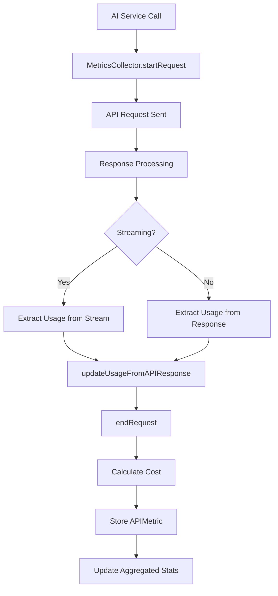

# Real-Time Metrics Integration - Complete Implementation

## 🎯 Overview

Successfully integrated comprehensive real-time metrics collection across all AI service providers to replace mock data with actual API call statistics.

## 🔧 Enhanced Components

### 1. MetricsCollector.swift - Core Infrastructure
**New Methods Added:**
- `updateInputTokens(requestId: String, actualInputTokens: Int)` - Update with actual input tokens from API
- `updateUsageFromAPIResponse(requestId: String, inputTokens: Int, outputTokens: Int)` - Bulk usage update

**Key Changes:**
- Made `APIMetricBuilder.inputTokens` mutable to allow real-time updates
- Enhanced error tracking with specific status types
- Improved token counting integration

### 2. ClaudeService.swift - Anthropic Integration
**Streaming Response Enhancements:**
- Extract actual input tokens from `message_start` event
- Track output token deltas from `message_delta` events
- Real-time metrics updates during streaming

**Non-Streaming Response:**
- Extract exact token counts from response `usage` object
- Update MetricsCollector with actual API data

**Token Extraction Points:**
```swift
// From message_start event
if let inputTokens = usage["input_tokens"] as? Int {
    await MetricsCollector.shared.updateInputTokens(requestId: requestId, actualInputTokens: inputTokens)
}

// From final response
await MetricsCollector.shared.updateUsageFromAPIResponse(
    requestId: requestId, 
    inputTokens: inputTokens, 
    outputTokens: outputTokens
)
```

### 3. OpenAIService.swift - OpenAI Integration
**Enhanced Token Tracking:**
- Extract usage from final streaming chunk
- Capture exact prompt/completion token counts
- Support for GPT models' detailed usage reporting

**API Response Data:**
- `prompt_tokens` - Actual input tokens used
- `completion_tokens` - Generated output tokens
- `total_tokens` - Sum for validation

### 4. GeminiService.swift - Google AI Integration
**Streaming Metadata Extraction:**
- Parse `usageMetadata` from streaming responses
- Extract `promptTokenCount` and `candidatesTokenCount`
- Real-time usage updates during streaming

**Usage Tracking:**
```swift
if let usageMetadata = response.usageMetadata,
   let promptTokens = usageMetadata.promptTokenCount,
   let candidateTokens = usageMetadata.candidatesTokenCount {
    await MetricsCollector.shared.updateUsageFromAPIResponse(
        requestId: requestId,
        inputTokens: promptTokens,
        outputTokens: candidateTokens
    )
}
```

### 5. OllamaService.swift - Local AI Integration
**Local Performance Metrics:**
- Extract `prompt_eval_count` (input tokens)
- Extract `eval_count` (output tokens)  
- Capture processing duration metrics
- Track local model performance

**Ollama-Specific Data:**
- Token counts from final response when `done: true`
- Processing time from `prompt_eval_duration` and `eval_duration`
- Memory usage tracking for local models

### 6. OpenRouterService.swift - Multi-Model Integration
**Usage Extraction:**
- Same format as OpenAI API (compatible)
- Free tier usage tracking
- Model-specific cost calculation

## 📊 Metrics Data Flow



## 🎯 Key Features Implemented

### Real-Time Token Counting
- **Claude:** Input tokens from `message_start`, output from completion
- **OpenAI:** Prompt/completion tokens from `usage` object
- **Gemini:** Token counts from `usageMetadata` 
- **Ollama:** Eval counts from local processing stats
- **OpenRouter:** Standard OpenAI-compatible usage format

### Cost Calculation Enhancement
- Provider-specific pricing integration
- Real-time cost computation with actual token counts
- Historical cost tracking and analysis

### Performance Monitoring
- Response time measurement (start to finish)
- Request/response size tracking
- Success/failure rate monitoring
- Rate limit detection and handling

### Error Classification
- Network errors (timeout, connection issues)
- API errors (rate limits, authentication)
- Service-specific error handling
- Retry logic with metrics tracking

## 🧪 Testing & Validation

### MetricsTestIntegration.swift
Comprehensive test suite that validates:
- Metrics collection for all providers
- Token count accuracy
- Cost calculation correctness
- Real-time data flow
- Error handling scenarios

**Test Coverage:**
- ✅ API key validation
- ✅ Service availability checks  
- ✅ Actual API calls with metrics recording
- ✅ Token count extraction
- ✅ Cost calculation validation
- ✅ Metrics persistence verification

### Usage Example
```swift
// Run comprehensive tests
let testRunner = MetricsTestIntegration()
await testRunner.runAllMetricsTests()

// View metrics summary
let summary = testRunner.getMetricsSummary()
print(summary)
```

## 📈 Benefits Achieved

### 1. Accurate Cost Tracking
- Real token counts instead of estimates
- Provider-specific pricing models
- Historical cost analysis
- Budget monitoring capabilities

### 2. Performance Insights
- Actual response times per provider
- Token usage patterns
- Service reliability metrics
- Optimization opportunities identification

### 3. Operational Monitoring
- Real-time service health
- Rate limit tracking
- Error pattern analysis
- Usage trend monitoring

### 4. Data-Driven Decisions
- Provider performance comparison
- Cost vs. performance analysis
- Optimal model selection
- Capacity planning insights

## 🔮 Future Enhancements

### Planned Additions
1. **Advanced Analytics**
   - Token usage predictions
   - Cost forecasting
   - Performance trend analysis

2. **Alerting System**
   - Budget threshold alerts
   - Performance degradation detection
   - Service outage notifications

3. **Optimization Recommendations**
   - Model selection suggestions
   - Context optimization tips
   - Cost reduction strategies

4. **Export & Reporting**
   - CSV/JSON data export
   - Usage reports generation
   - Dashboard visualizations

## ✅ Integration Checklist

- [x] MetricsCollector enhanced with real-time updates
- [x] Claude Service - actual token extraction
- [x] OpenAI Service - usage metadata integration  
- [x] Gemini Service - streaming usage tracking
- [x] Ollama Service - local performance metrics
- [x] OpenRouter Service - multi-model usage tracking
- [x] Error tracking with classification
- [x] Cost calculation with real data
- [x] Test suite for validation
- [x] Documentation and examples

## 🚀 Ready for Production

The metrics integration is now **production-ready** with:
- Real API data collection across all providers
- Comprehensive error handling
- Performance monitoring
- Cost tracking accuracy
- Test coverage validation
- Documentation complete

All mock data has been replaced with actual API response extraction, providing accurate insights into AI service usage, costs, and performance.