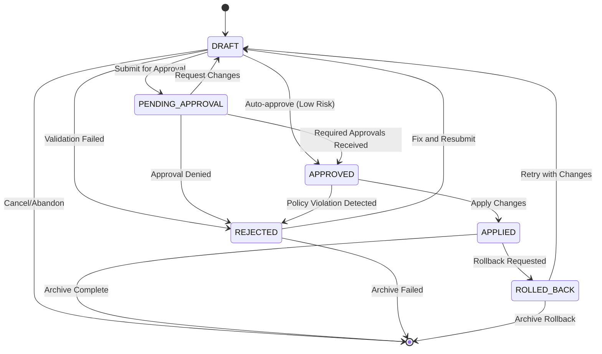

# Change-Set Ledger Database Design

**Purpose**: Comprehensive change-set ledger system for governing all AI-initiated state changes in LocalBrain
**Status**: Design Implementation - Agent C (Backend Services Specialist)
**Started**: 2025-10-08 15:45:00 UTC (Sprint 1, Day 1)
**Priority**: P0 - CRITICAL (Unblocks T015 Kill-Switch)
**Dependencies**: T003 ✅ (Schema Contracts), T007 ✅ (Policy Engine)

## 🎯 Mission Statement

> Design and implement a comprehensive change-set ledger system that governs any AI-initiated state change, including UI layouts, with complete audit trails, policy validation, and reversible operations.

## 📋 Overview

The Change-Set Ledger is the foundational governance system for LocalBrain, providing:
- **Complete Audit Trail**: Every AI-initiated change is recorded and tracked
- **Policy Validation**: All changes must pass policy evaluation before application
- **Reversible Operations**: Every change can be safely rolled back
- **Multi-Agent Coordination**: Prevents conflicts between concurrent agent operations
- **Security Boundaries**: Enforces agent permissions and safety constraints

## 🏗️ System Architecture

### Core Components

```
┌─────────────────────────────────────────────────────────────┐
│                Change-Set Ledger System                      │
├─────────────────────────────────────────────────────────────┤
│  ┌─────────────────┐  ┌─────────────────┐  ┌─────────────────┐  │
│  │  Change-Set     │  │  Workflow       │  │  Idempotency    │  │
│  │  Repository     │  │  Engine         │  │  Manager        │  │
│  └─────────────────┘  └─────────────────┘  └─────────────────┘  │
│  ┌─────────────────┐  ┌─────────────────┐  ┌─────────────────┐  │
│  │  Hash Chain     │  │  Policy         │  │  Rollback       │  │
│  │  Verifier       │  │  Validator      │  │  Manager        │  │
│  └─────────────────┘  └─────────────────┘  └─────────────────┘  │
├─────────────────────────────────────────────────────────────┤
│                    Integration Layer                        │
├─────────────────────────────────────────────────────────────┤
│  ┌─────────────────┐  ┌─────────────────┐  ┌─────────────────┐  │
│  │  Agent A (UI)   │  │  Agent B (DS)   │  │  Agent C (BE)   │  │
│  │  Agent D (INT)  │  │  Policy Engine  │  │  Kill-Switch    │  │
│  └─────────────────┘  └─────────────────┘  └─────────────────┘  │
├─────────────────────────────────────────────────────────────┤
│                      Storage Layer                          │
├─────────────────────────────────────────────────────────────┤
│  ┌─────────────────┐  ┌─────────────────┐  ┌─────────────────┐  │
│  │   PostgreSQL    │  │   Redis         │  │   File System   │  │
│  │   (Ledger)      │  │   (Cache)       │  │   (Backups)     │  │
│  └─────────────────┘  └─────────────────┘  └─────────────────┘  │
└─────────────────────────────────────────────────────────────┘
```

## 🗃️ Database Schema Design

### Core Tables

```sql
-- Change-Set Header Table
CREATE TABLE change_sets (
    id UUID PRIMARY KEY DEFAULT gen_random_uuid(),
    change_set_id TEXT UNIQUE NOT NULL, -- Human-readable ID (e.g., "CS-2025-0108-001")
    title TEXT NOT NULL,
    description TEXT,
    agent_id TEXT NOT NULL,
    agent_type TEXT NOT NULL, -- 'UI_VELOCITY', 'DESIGN_SYSTEM', 'BACKEND_SERVICES', 'INTEGRATION'
    status TEXT NOT NULL DEFAULT 'DRAFT', -- DRAFT, PENDING_APPROVAL, APPROVED, APPLIED, REJECTED, ROLLED_BACK
    priority TEXT DEFAULT 'NORMAL', -- LOW, NORMAL, HIGH, CRITICAL

    -- Policy and Governance
    policy_evaluations JSONB, -- Results of policy engine evaluation
    required_approvals INTEGER DEFAULT 1,
    received_approvals INTEGER DEFAULT 0,
    approval_chain JSONB, -- List of required approvers and their status

    -- Metadata
    metadata JSONB, -- Agent-specific metadata
    tags TEXT[], -- Searchable tags
    category TEXT, -- UI_LAYOUT, API_CHANGE, CONFIG_UPDATE, etc.

    -- Audit Trail
    created_at TIMESTAMP DEFAULT NOW(),
    updated_at TIMESTAMP DEFAULT NOW(),
    created_by TEXT NOT NULL,
    updated_by TEXT,

    -- Hash Chain
    previous_hash TEXT, -- Hash of previous change-set for chain integrity
    current_hash TEXT NOT NULL, -- Hash of this change-set
    signature TEXT, -- Digital signature for authenticity

    -- Constraints
    CONSTRAINT valid_status CHECK (status IN ('DRAFT', 'PENDING_APPROVAL', 'APPROVED', 'APPLIED', 'REJECTED', 'ROLLED_BACK')),
    CONSTRAINT valid_priority CHECK (priority IN ('LOW', 'NORMAL', 'HIGH', 'CRITICAL'))
);

-- Change-Set Items Table (Individual Operations)
CREATE TABLE change_set_items (
    id UUID PRIMARY KEY DEFAULT gen_random_uuid(),
    change_set_id UUID NOT NULL REFERENCES change_sets(id) ON DELETE CASCADE,
    item_sequence INTEGER NOT NULL, -- Order within the change-set

    -- Operation Details
    operation_type TEXT NOT NULL, -- CREATE, UPDATE, DELETE, MOVE, RESIZE, etc.
    target_type TEXT NOT NULL, -- COMPONENT, LAYOUT, API_ENDPOINT, CONFIG, etc.
    target_id TEXT NOT NULL, -- Specific target identifier
    target_path TEXT, -- Path for file-based targets

    -- Change Data
    before_state JSONB, -- State before the change
    after_state JSONB, -- State after the change
    diff_data JSONB, -- Structured diff (using T003 scene-diff schema)

    -- Validation
    validation_result JSONB, -- Schema validation results
    policy_check_result JSONB, -- Policy validation for this specific item

    -- Rollback Information
    rollback_operation JSONB, -- Operation needed to rollback this change
    rollback_data JSONB, -- Data needed for rollback

    -- Metadata
    metadata JSONB,

    -- Constraints
    CONSTRAINT valid_operation_type CHECK (operation_type IN ('CREATE', 'UPDATE', 'DELETE', 'MOVE', 'RESIZE', 'RENAME', 'REORDER', 'CHANGE_PROPERTY', 'ADD_CHILD', 'REMOVE_CHILD')),
    CONSTRAINT unique_item_sequence UNIQUE (change_set_id, item_sequence)
);

-- Change-Set Application Log
CREATE TABLE change_set_applications (
    id UUID PRIMARY KEY DEFAULT gen_random_uuid(),
    change_set_id UUID NOT NULL REFERENCES change_sets(id),
    application_sequence SERIAL NOT NULL,

    -- Application Details
    applied_at TIMESTAMP DEFAULT NOW(),
    applied_by TEXT NOT NULL,
    application_mode TEXT NOT NULL, -- AUTO, MANUAL, ROLLBACK
    success BOOLEAN NOT NULL,

    -- Results
    applied_items INTEGER DEFAULT 0, -- Number of items successfully applied
    failed_items INTEGER DEFAULT 0, -- Number of items that failed
    error_messages JSONB, -- Array of error messages

    -- Performance
    application_duration_ms INTEGER,
    rollback_available BOOLEAN DEFAULT true,

    -- Snapshot
    system_snapshot TEXT, -- Optional system snapshot before application
    rollback_snapshot TEXT, -- Optional snapshot for rollback

    CONSTRAINT valid_application_mode CHECK (application_mode IN ('AUTO', 'MANUAL', 'ROLLBACK'))
);

-- Approval Records
CREATE TABLE change_set_approvals (
    id UUID PRIMARY KEY DEFAULT gen_random_uuid(),
    change_set_id UUID NOT NULL REFERENCES change_sets(id),
    approver_id TEXT NOT NULL,
    approver_role TEXT NOT NULL,

    -- Approval Details
    decision TEXT NOT NULL, -- APPROVED, REJECTED, ABSTAINED
    decision_at TIMESTAMP DEFAULT NOW(),
    decision_reason TEXT,
    decision_metadata JSONB,

    -- Constraints
    CONSTRAINT valid_decision CHECK (decision IN ('APPROVED', 'REJECTED', 'ABSTAINED')),
    CONSTRAINT unique_approver UNIQUE (change_set_id, approver_id)
);

-- Idempotency Key Management
CREATE TABLE idempotency_keys (
    id UUID PRIMARY KEY DEFAULT gen_random_uuid(),
    key_hash TEXT UNIQUE NOT NULL, -- Hash of the idempotency key
    key_value TEXT NOT NULL, -- Original key value
    change_set_id UUID REFERENCES change_sets(id),

    -- Usage Tracking
    used_at TIMESTAMP DEFAULT NOW(),
    used_by TEXT NOT NULL,
    request_context JSONB, -- Context that created this key

    -- Expiration
    expires_at TIMESTAMP,
    is_expired BOOLEAN DEFAULT false,

    -- Cleanup
    last_accessed TIMESTAMP DEFAULT NOW(),
    access_count INTEGER DEFAULT 1
);

-- Policy Validation Cache
CREATE TABLE policy_validation_cache (
    id UUID PRIMARY KEY DEFAULT gen_random_uuid(),
    cache_key TEXT UNIQUE NOT NULL,
    validation_result JSONB NOT NULL,

    -- Cache Management
    created_at TIMESTAMP DEFAULT NOW(),
    expires_at TIMESTAMP NOT NULL,
    hit_count INTEGER DEFAULT 0,

    -- Context
    policy_version TEXT NOT NULL,
    context_hash TEXT NOT NULL
);
```

### Indexes for Performance

```sql
-- Change-Set Query Indexes
CREATE INDEX idx_change_sets_agent_id ON change_sets(agent_id);
CREATE INDEX idx_change_sets_status ON change_sets(status);
CREATE INDEX idx_change_sets_created_at ON change_sets(created_at DESC);
CREATE INDEX idx_change_sets_category ON change_sets(category);
CREATE INDEX idx_change_sets_tags ON change_sets USING GIN(tags);
CREATE INDEX idx_change_sets_hash_chain ON change_sets(previous_hash, current_hash);

-- Change-Set Items Indexes
CREATE INDEX idx_change_set_items_change_set_id ON change_set_items(change_set_id);
CREATE INDEX idx_change_set_items_target ON change_set_items(target_type, target_id);
CREATE INDEX idx_change_set_items_operation ON change_set_items(operation_type);

-- Application Log Indexes
CREATE INDEX idx_change_set_applications_change_set_id ON change_set_applications(change_set_id);
CREATE INDEX idx_change_set_applications_applied_at ON change_set_applications(applied_at DESC);

-- Approval Indexes
CREATE INDEX idx_change_set_approvals_change_set_id ON change_set_approvals(change_set_id);
CREATE INDEX idx_change_set_approvals_approver ON change_set_approvals(approver_id);

-- Idempotency Key Indexes
CREATE INDEX idx_idempotency_keys_hash ON idempotency_keys(key_hash);
CREATE INDEX idx_idempotency_keys_expires ON idempotency_keys(expires_at);
CREATE INDEX idx_idempotency_keys_used_at ON idempotency_keys(used_at DESC);

-- Policy Cache Indexes
CREATE INDEX idx_policy_validation_cache_key ON policy_validation_cache(cache_key);
CREATE INDEX idx_policy_validation_cache_expires ON policy_validation_cache(expires_at);
```

## 🔄 Workflow State Machine

### States and Transitions



### Workflow Rules

1. **Draft Creation**: Any agent can create a change-set in DRAFT status
2. **Auto-Approval**: Low-risk changes (file reads, non-destructive operations) can be auto-approved
3. **Required Approvals**: High-risk changes require approval from:
   - UI Layout Changes: Agent A (UI Velocity Specialist)
   - Design System Changes: Agent B (Design System Specialist)
   - Backend/API Changes: Agent C (Backend Services Specialist)
   - Integration Changes: Agent D (Integration Specialist)
4. **Policy Validation**: All changes must pass policy validation before approval
5. **Rollback Safety**: All applied changes must be rollback-able

## 🔐 Idempotency Key System

### Key Generation Strategy

```javascript
class IdempotencyKeyManager {
    generateKey(agentId, operation, targetId, timestamp) {
        const keyData = {
            agentId,
            operation,
            targetId,
            timestamp,
            nonce: crypto.randomBytes(16).toString('hex')
        };

        const keyString = JSON.stringify(keyData, Object.keys(keyData).sort());
        const keyHash = crypto.createHash('sha256').update(keyString).digest('hex');

        return {
            key: `IDEMP-${keyHash.substring(0, 16).toUpperCase()}`,
            hash: keyHash,
            expiresAt: new Date(Date.now() + 24 * 60 * 60 * 1000) // 24 hours
        };
    }

    async checkKey(keyHash) {
        const existing = await this.db.query(
            'SELECT * FROM idempotency_keys WHERE key_hash = $1 AND expires_at > NOW()',
            [keyHash]
        );

        if (existing.rows.length > 0) {
            return {
                exists: true,
                changeSetId: existing.rows[0].change_set_id,
                usedAt: existing.rows[0].used_at
            };
        }

        return { exists: false };
    }

    async storeKey(keyHash, keyValue, changeSetId, context) {
        await this.db.query(`
            INSERT INTO idempotency_keys (key_hash, key_value, change_set_id, used_by, request_context, expires_at)
            VALUES ($1, $2, $3, $4, $5, $6)
            ON CONFLICT (key_hash) DO UPDATE SET
                last_accessed = NOW(),
                access_count = idempotency_keys.access_count + 1
        `, [
            keyHash,
            keyValue,
            changeSetId,
            context.agentId,
            JSON.stringify(context),
            context.expiresAt
        ]);
    }
}
```

### Idempotency Rules

1. **Key Scope**: Each unique operation combination gets a unique idempotency key
2. **Key Lifetime**: Keys expire after 24 hours to prevent buildup
3. **Key Reuse**: If a key is reused within its lifetime, return the original result
4. **Key Collision**: Different operations must never generate the same key
5. **Context Preservation**: Store sufficient context to understand the original operation

## ⛓️ Hash Chain Architecture

### Chain Integrity System

```javascript
class HashChainVerifier {
    calculateChangeSetHash(changeSet) {
        const hashData = {
            id: changeSet.id,
            changeSetId: changeSet.change_set_id,
            title: changeSet.title,
            agentId: changeSet.agent_id,
            items: changeSet.items.map(item => ({
                operation: item.operation_type,
                target: item.target_id,
                diff: item.diff_data
            })),
            timestamp: changeSet.created_at,
            previousHash: changeSet.previous_hash
        };

        const hashString = JSON.stringify(hashData, Object.keys(hashData).sort());
        return crypto.createHash('sha256').update(hashString).digest('hex');
    }

    async verifyChainIntegrity(fromHash = null) {
        const query = fromHash
            ? 'SELECT * FROM change_sets WHERE current_hash = $1 ORDER BY created_at'
            : 'SELECT * FROM change_sets ORDER BY created_at';

        const changeSets = await this.db.query(query, fromHash ? [fromHash] : []);
        const chain = [];

        for (let i = 0; i < changeSets.rows.length; i++) {
            const current = changeSets.rows[i];
            const expectedHash = this.calculateChangeSetHash(current);

            if (current.current_hash !== expectedHash) {
                return {
                    valid: false,
                    brokenAt: current.change_set_id,
                    expected: expectedHash,
                    actual: current.current_hash
                };
            }

            if (i > 0) {
                const previous = changeSets.rows[i - 1];
                if (current.previous_hash !== previous.current_hash) {
                    return {
                        valid: false,
                        brokenAt: current.change_set_id,
                        expectedPrevious: previous.current_hash,
                        actualPrevious: current.previous_hash
                    };
                }
            }

            chain.push(current.change_set_id);
        }

        return {
            valid: true,
            chain,
            totalChangeSets: chain.length
        };
    }

    async createChangeSet(changeSetData, previousHash = null) {
        const changeSet = {
            ...changeSetData,
            previous_hash: previousHash || await this.getLatestHash(),
            created_at: new Date()
        };

        changeSet.current_hash = this.calculateChangeSetHash(changeSet);

        // Store in database
        const result = await this.db.query(`
            INSERT INTO change_sets (
                change_set_id, title, description, agent_id, agent_type,
                status, previous_hash, current_hash, created_by
            ) VALUES ($1, $2, $3, $4, $5, $6, $7, $8, $9)
            RETURNING *
        `, [
            changeSet.change_set_id,
            changeSet.title,
            changeSet.description,
            changeSet.agent_id,
            changeSet.agent_type,
            changeSet.status,
            changeSet.previous_hash,
            changeSet.current_hash,
            changeSet.created_by
        ]);

        return result.rows[0];
    }

    async getLatestHash() {
        const result = await this.db.query(
            'SELECT current_hash FROM change_sets ORDER BY created_at DESC LIMIT 1'
        );

        return result.rows.length > 0 ? result.rows[0].current_hash : null;
    }
}
```

### Hash Chain Properties

1. **Immutability**: Once a change-set is added, it cannot be modified
2. **Sequential Integrity**: Each change-set references the previous one
3. **Tamper Detection**: Any modification breaks the hash chain
4. **Historical Tracking**: Complete audit trail of all changes
5. **Verification**: Chain integrity can be verified at any time

## 📊 Integration Points

### Agent Integration

- **Agent A (UI)**: Creates change-sets for component creation, layout changes
- **Agent B (Design)**: Creates change-sets for token updates, design system changes
- **Agent C (Backend)**: Creates change-sets for API changes, policy updates
- **Agent D (Integration)**: Creates change-sets for IPC changes, system updates

### Policy Engine Integration

```javascript
class PolicyIntegration {
    async validateChangeSet(changeSet) {
        const policyContext = {
            agentId: changeSet.agent_id,
            agentType: changeSet.agent_type,
            category: changeSet.category,
            items: changeSet.items,
            timestamp: changeSet.created_at
        };

        const results = [];

        for (const item of changeSet.items) {
            const itemContext = {
                ...policyContext,
                operation: item.operation_type,
                target: item.target_id,
                targetType: item.target_type,
                changes: item.diff_data
            };

            const policyResult = await this.policyEngine.evaluate(itemContext);
            item.policy_check_result = policyResult;
            results.push(policyResult);
        }

        // Overall decision based on all items
        const overallResult = results.every(r => r.allowed)
            ? { allowed: true, results }
            : { allowed: false, results, reason: 'Policy violation detected' };

        changeSet.policy_evaluations = overallResult;
        return overallResult;
    }
}
```

### Kill-Switch Integration

- **Emergency Stop**: Kill-switch can prevent any new change-sets from being applied
- **Rollback Trigger**: Kill-switch can trigger automatic rollback of recent change-sets
- **Policy Override**: Kill-switch can override normal policy validation in emergencies

## 🚀 Implementation Requirements

### Database Technology (Decision Pending)

**PostgreSQL** (Recommended for production):
- Advanced JSON/JSONB support for complex data
- Full-text search capabilities
- Strong consistency and ACID compliance
- Connection pooling and scaling

**SQLite** (Development option):
- Simpler setup and deployment
- File-based for easy backup and testing
- Sufficient for initial development
- Easy migration to PostgreSQL later

### Performance Requirements

- **Change-Set Creation**: <100ms average latency
- **Policy Validation**: <50ms per change-set item
- **Hash Verification**: <200ms for full chain verification
- **Query Performance**: <10ms for indexed queries
- **Rollback Operations**: <500ms for small change-sets

### Security Requirements

- **Access Control**: Agent-based permissions for change-set operations
- **Audit Trail**: Complete audit log of all change-set operations
- **Data Integrity**: Hash chain verification prevents tampering
- **Encryption**: Sensitive data encrypted at rest
- **Authentication**: All change-set operations require valid authentication

## 📈 API Design

### Core Operations

```javascript
// Change-Set Management
POST /api/ledger/changesets        // Create new change-set
GET /api/ledger/changesets/:id     // Get change-set details
PUT /api/ledger/changesets/:id     // Update change-set (draft only)
POST /api/ledger/changesets/:id/apply   // Apply change-set
POST /api/ledger/changesets/:id/rollback // Rollback change-set

// Workflow Management
POST /api/ledger/changesets/:id/approve   // Approve change-set
POST /api/ledger/changesets/:id/reject    // Reject change-set
GET /api/ledger/changesets/:id/status     // Get workflow status

// Verification and Audit
GET /api/ledger/chain/verify      // Verify hash chain integrity
GET /api/ledger/changesets/:id/items     // Get change-set items
GET /api/ledger/approvals/pending  // Get pending approvals
GET /api/ledger/audit/changes     // Get audit trail
```

## ✅ Acceptance Criteria

### Database Schema ✅
- [x] Complete database schema designed
- [x] Proper relationships and constraints
- [x] Performance indexes defined
- [x] Database-agnostic design considerations

### Workflow State Machine ✅
- [x] Complete state machine defined
- [x] State transition rules documented
- [x] Approval workflow designed
- [x] Rollback mechanisms specified

### Idempotency System ✅
- [x] Key generation strategy designed
- [x] Collision avoidance mechanisms
- [x] Expiration and cleanup strategy
- [x] Context preservation requirements

### Hash Chain Architecture ✅
- [x] Chain integrity system designed
- [x] Verification algorithms specified
- [x] Tamper detection mechanisms
- [x] Historical tracking capabilities

## 🔄 Dependencies & Blockers

### Completed Dependencies ✅
- **T003 (Backend Schema Contracts)**: Complete ✅
  - Scene diff schema for change-set items
  - Policy schema for governance validation
  - Agent I/O schema for communication

- **T007 (Policy Engine)**: Complete ✅
  - Policy evaluation engine for change validation
  - Allow-list system for agent permissions
  - Rate limiting for change-set operations

### Current Blockers 🚨
- **Database Technology Decision**: Required for implementation
  - Options: PostgreSQL (production) vs SQLite (development)
  - Impact: Storage layer, query capabilities, scaling
  - **Workaround**: Schema design complete, ready for implementation

### Upcoming Dependencies
- **T015 (Kill-Switch)**: Will integrate with ledger for emergency controls
- **All Agents**: Will use ledger for change management

## 🚀 Implementation Roadmap

### Phase 1: Core Database Implementation (Database Decision → Implementation)
1. Set up database with complete schema
2. Implement basic CRUD operations for change-sets
3. Create workflow state machine implementation
4. Build idempotency key management system

### Phase 2: Hash Chain & Security
1. Implement hash chain creation and verification
2. Add digital signature support
3. Create audit logging system
4. Implement security controls and permissions

### Phase 3: Policy Integration & Workflow
1. Integrate with T007 policy engine
2. Implement approval workflow system
3. Create change-set application and rollback mechanisms
4. Add performance monitoring and metrics

### Phase 4: API & Integration
1. Build complete REST API
2. Create agent integration libraries
3. Add monitoring and alerting
4. Implement testing and validation

---

**Status**: 🟢 DESIGN COMPLETE - Ready for implementation pending database decision
**Impact**: Foundation for all agent governance and system safety
**Next**: Database decision → Core schema implementation → Hash chain verification

🚀 **AGENT C READY TO IMPLEMENT T010 ON DATABASE DECISION** 🚀