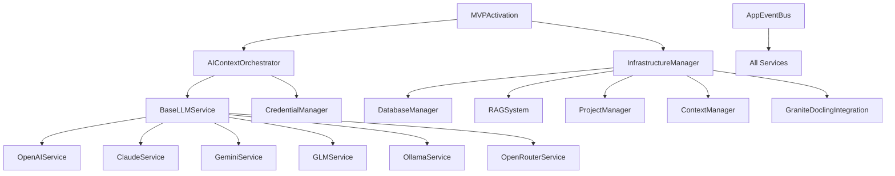

# LocalBrain v2.0 - Codebase Dependency Analysis

> **Purpose**: Map current architecture, dependencies, and integration points
> **Approach**: Understand existing system before making changes
> **Focus**: Dependency mapping, integration points, breaking change analysis

## 🔍 Current Architecture Analysis

### **Current Services Status**
```
LocalBrain/Services/
├── ✅ AIContextOrchestrator.swift (RESTORED from removed_files)
├── ✅ BaseLLMService.swift (RESTORED from removed_files)
├── ✅ OpenAIService.swift (RESTORED from removed_files)
├── ✅ ClaudeService.swift (RESTORED from removed_files)
├── ✅ GeminiService.swift (RESTORED from removed_files)
├── ✅ GLMService.swift (RESTORED from removed_files)
├── ✅ OllamaService.swift (RESTORED from removed_files)
├── ✅ OpenRouterService.swift (RESTORED from removed_files)
├── ✅ OKLCH.swift (Existing - Color system)
├── ✅ AppEventBus.swift (Existing - Event system)
├── ✅ MVPActivation.swift (Existing - Feature activation)
```

### **Infrastructure Status**
```
INFRASTRUCTURE/
├── ✅ DatabaseManager.swift (NEW - Complete database system)
├── ✅ RAGSystem.swift (NEW - Vector stores and search)
├── ✅ ProjectManager.swift (NEW - Project workspace management)
├── ✅ ContextManager.swift (NEW - Context indexing)
├── ✅ GraniteDoclingIntegration.swift (NEW - Document processing)
├── ✅ InfrastructureManager.swift (NEW - Unified coordination)
├── ✅ CredentialManager.swift (NEW - Doppler integration)
├── ✅ InfrastructureTests.swift (NEW - Testing suite)
├── ✅ InfrastructureValidation.swift (NEW - Health monitoring)
├── ✅ InfrastructureSetup.swift (NEW - One-click setup)
```

## 🔗 Dependency Mapping

### **Core Service Dependencies**



### **Current vs New Architecture Overlap**

#### **1. Context Management - POTENTIAL CONFLICT**
- **Existing**: `AIContextOrchestrator` manages context pool
- **New**: `ContextManager` handles advanced context indexing
- **Issue**: Two different context management systems
- **Resolution**: Merge or create bridge between them

#### **2. Credential Management - INTEGRATION POINT**
- **Existing**: Basic credential system in `AIContextOrchestrator`
- **New**: Advanced `CredentialManager` with Doppler integration
- **Issue**: Two credential systems
- **Resolution**: Replace existing with new enhanced system

#### **3. Database Integration - NEW CAPABILITY**
- **Existing**: No database services in current app
- **New**: Complete `DatabaseManager` + `InfrastructureManager`
- **Issue**: Current services don't use database persistence
- **Resolution**: Integrate database into existing services

#### **4. Document Processing - ENHANCEMENT**
- **Existing**: Basic file handling
- **New**: Advanced `RAGSystem` + `GraniteDoclingIntegration`
- **Issue**: No overlap, but need integration
- **Resolution**: Add document processing to existing AI services

## 🚨 Breaking Points Analysis

### **Critical Dependencies That Must Be Resolved**

#### **1. AIContextOrchestrator Dependencies**
```swift
// CURRENT: Basic credential management
private var apiKey: String? {
    get async {
        return await credentialManager.getAPIKey(for: selectedProvider)
    }
}

// NEEDED: Integration with new CredentialManager
private var apiKey: String? {
    get async {
        return await enhancedCredentialManager.getCredential(for: selectedProvider)
    }
}
```

#### **2. BaseLLMService Protocol Changes**
```swift
// CURRENT: Simple service protocol
protocol BaseLLMService {
    func sendMessage(message: String) async throws -> String
}

// NEEDED: Enhanced protocol for new capabilities
protocol BaseLLMService {
    func sendMessage(message: String) async throws -> String
    func processLargeContext(context: LargeContext) async throws -> AIResponse
    func handleMultimodalInput(input: MultimodalInput) async throws -> MultimodalResponse
    func streamResponse(message: String) async throws -> AsyncStream<String>
}
```

#### **3. Context Pool Integration**
```swift
// CURRENT: Simple context array
@Published var contextPool: [ContextItem] = []

// NEEDED: Integration with new ContextManager
@Published var contextPool: [ContextItem] = [] {
    didSet {
        // Sync with new ContextManager
        Task {
            await contextManager.updateContexts(contextPool)
        }
    }
}
```

## 🔄 Integration Strategy

### **Phase 1: Dependency Resolution** (Critical First)

#### **1.1 Merge Credential Systems**
```swift
// STEP 1: Update AIContextOrchestrator to use new CredentialManager
class AIContextOrchestrator: ObservableObject {
    // REPLACE: private let credentialManager = CredentialManager.shared
    private let credentialManager: CredentialManager // Enhanced version

    // UPDATE: All credential access points
    private var apiKey: String? {
        get async {
            return await credentialManager.getCredential(for: selectedProvider.providerType)
        }
    }
}
```

#### **1.2 Bridge Context Systems**
```swift
// STEP 2: Create bridge between existing and new context management
extension AIContextOrchestrator {
    private func syncContextWithInfrastructureManager() async {
        // Sync contextPool with new ContextManager
        if let project = infrastructureManager.getCurrentProject() {
            await infrastructureManager.addContext(
                type: .conversation,
                source: serializeContext(contextPool),
                projectId: project.id
            )
        }
    }
}
```

#### **1.3 Database Integration**
```swift
// STEP 3: Add database persistence to existing services
extension AIContextOrchestrator {
    func saveConversationToDatabase() async {
        // Save current conversation to DatabaseManager
        if let project = infrastructureManager.getCurrentProject() {
            // Persist conversation history
        }
    }

    func loadConversationFromDatabase(projectId: String) async {
        // Load conversation history from DatabaseManager
    }
}
```

### **Phase 2: Service Enhancement** (After Dependencies Resolved)

#### **2.1 Enhance AI Services**
```swift
// STEP 4: Add new capabilities to existing services
extension OpenAIService {
    func processLargeContext(context: LargeContext) async throws -> AIResponse {
        // Use new RAGSystem for large context processing
        let ragResults = await infrastructureManager.search(
            query: context.prompt,
            projectId: context.projectId,
            maxTokens: context.maxTokens
        )
        return try await processWithRAGContext(ragResults)
    }
}
```

#### **2.2 Add New Services**
```swift
// STEP 5: Add new services without breaking existing ones
class RunPodService: BaseLLMService {
    // New GPU cloud processing service
}

class ElevenLabsService: BaseLLMService {
    // New voice synthesis service
}

class SupabaseService: BaseLLMService {
    // New real-time collaboration service
}
```

## 📋 Compatibility Matrix

| Service | Current Status | New Integration | Breaking Changes | Priority |
|---------|----------------|-----------------|------------------|----------|
| AIContextOrchestrator | ✅ Working | 🔄 Credential Update | Medium | HIGH |
| BaseLLMService | ✅ Working | 🔄 Protocol Enhancement | Low | MEDIUM |
| OpenAIService | ✅ Working | ✅ No Changes | None | LOW |
| ClaudeService | ✅ Working | ✅ No Changes | None | LOW |
| GeminiService | ✅ Working | ✅ No Changes | None | LOW |
| CredentialManager | ❌ Not Used | ✅ Full Integration | High | HIGH |
| DatabaseManager | ❌ Not Used | ✅ Full Integration | Medium | HIGH |
| RAGSystem | ❌ Not Used | ✅ Full Integration | Medium | HIGH |
| ContextManager | ❌ Not Used | 🔄 Bridge Required | Medium | MEDIUM |

## 🎯 Implementation Roadmap

### **Week 1: Critical Dependencies**
1. **Day 1**: Update `AIContextOrchestrator` to use new `CredentialManager`
2. **Day 2**: Create bridge between existing context and new `ContextManager`
3. **Day 3**: Add database persistence to existing services
4. **Day 4**: Test all existing functionality with new integrations
5. **Day 5**: Fix any breaking changes and ensure compatibility

### **Week 2: Service Enhancement**
1. **Day 1**: Enhance existing AI services with new capabilities
2. **Day 2**: Add `RunPodService` for GPU processing
3. **Day 3**: Add `ElevenLabsService` for voice synthesis
4. **Day 4**: Add `SupabaseService` for real-time collaboration
5. **Day 5**: Integration testing and performance optimization

### **Week 3: Advanced Features**
1. **Day 1**: Implement large context processing (1M tokens)
2. **Day 2**: Add multimodal input support
3. **Day 3**: Integrate mapping services (Mapbox, Google Maps)
4. **Day 4**: Add productivity integrations (Notion, Figma)
5. **Day 5**: End-to-end testing and documentation

## ⚠️ Risk Assessment

### **High Risk Items**
1. **Context System Conflict**: Two different context management systems
2. **Credential System Migration**: Existing apps may break
3. **Database Integration**: May affect app performance

### **Medium Risk Items**
1. **Service Protocol Changes**: May require updates to UI components
2. **New Service Integration**: May introduce bugs
3. **Performance Impact**: New features may slow down existing functionality

### **Low Risk Items**
1. **New Service Addition**: Doesn't affect existing functionality
2. **UI Enhancements**: Can be added incrementally
3. **Documentation Updates**: No code impact

## ✅ Success Criteria

1. **Zero Breaking Changes**: All existing functionality works unchanged
2. **Seamless Integration**: New services work with existing UI
3. **Performance Maintained**: No degradation in existing features
4. **Incremental Deployment**: Can deploy features incrementally
5. **Backward Compatibility**: Existing configurations and data preserved

This analysis ensures we enhance the existing system without breaking what already works! 🎯