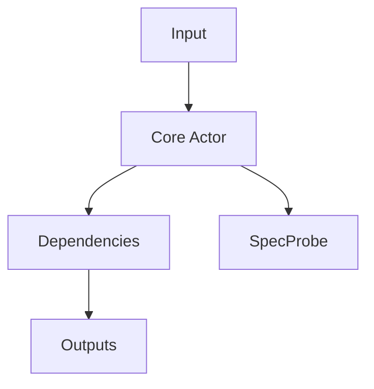

## Purpose

The module provides its capability as part of the Central Intelligence system. It accepts structured inputs, executes its internal logic, and emits SpecProbe events so executable specs can validate runtime behavior.

**Out of scope:**
- Business logic outside this module
- UI responsibilities
- Direct persistence concerns (handled by Data Pool)

## Primary Features
- **Capability 1:** Deterministic public API (async/await)
- **Capability 2:** Emits SpecProbe events for observability
- **Capability 3:** Error handling & cancellation
- **Capability 4:** Metrics (duration_ms, error_count)
- **Capability 5:** Unit tests & executable spec coverage

## Architecture



**Swift Patterns:**
- Actor isolation on state
- Structured concurrency with cancellation
- Non-blocking IO

## Contracts

```swift
// Actor
actor ModuleActor {
    struct Input { let payload: String }
    struct Output { let result: String }

    func execute(_ input: Input) async throws -> Output {
        // Emit start
        await SpecProbe.shared.emit("module.operation.start", ["payload": .string(input.payload)])
        // ... perform work ...
        await SpecProbe.shared.emit("module.operation.success", ["result": .string("ok")])
        return Output(result: "ok")
    }
}
```

## State Progression & Promotion Gates
- Minimal → I1 → I2 → I3 → Complete (see template)

## Production Implementation
- Build: `xcodebuild -scheme LocalBrain -configuration Release`
- Test:  `xcodebuild test -scheme LocalBrainTests`

## Testing Strategy
- Executable spec in `SPEC/features/*.spec.md` asserts required events
