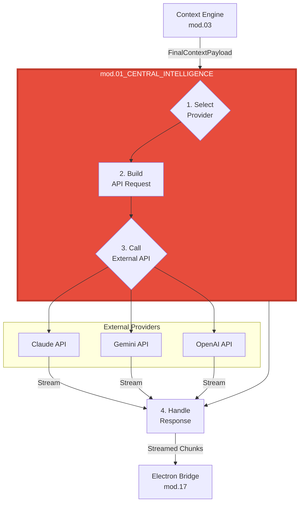

# ===== MODULE IDENTITY =====
title: "Central Intelligence - Conversational AI Core"
module_id: "mod.01_central_intelligence"
type: "module"
category: "backend"

# ===== SYSTEMATIC SCAFFOLDING =====
lifecycle: "dev"
state: "minimal"
seat: "mvp"

# ===== AVAILABILITY AND ACCESS =====
phase_availability: "always"
priority: "critical"
agent_accessible: true
user_configurable: true

# ===== PROMOTION GATES =====
promotion_gates:
  to_intermediate_i1:
    - "Can successfully route a request to at least two different AI providers."
    - "Handles streaming responses correctly."
    - "Conversation history is maintained during a session."
  to_complete:
    - "Implements dynamic, multi-factor provider selection (cost, latency, capability)."
    - "Provider health checks and basic failover are active."
    - "Full conversation history is passed to the Context Engine for memory."

# ===== OBSERVABILITY =====
observability:
  metrics:
    - "central_intelligence.request.duration_ms"
    - "central_intelligence.provider.selection_total"
    - "central_intelligence.streaming.chunk_latency_ms"
  alerts:
    - "central_intelligence.provider.api_error_rate_high"
    - "central_intelligence.provider.all_unavailable"
  dashboards:
    - "central_intelligence_provider_usage"

# ===== SECURITY REQUIREMENTS =====
security:
  authentication_required: true
  authorization_level: "system"
  data_classification: "confidential"
  encryption_in_transit: true
  audit_logging: true

# ===== TECHNICAL METADATA =====
dependencies: ["mod.03_context_engine", "mod.14_unified_credential_manager"]
integrations: ["mod.17_electron_bridge"]
last_updated: "2025-10-06"
version: "1.0.0"
maintainer: "Gemini/Lech"

# ===== AGENTIC INTEGRATION =====
agent_capabilities:
  can_read: true
  can_write: false
  can_propose_changes: false
  requires_approval: false
---

# 01. Central Intelligence - Conversational AI Core

## Purpose

To act as the application's user-facing conversational AI core and intelligent AI provider router. It manages the real-time conversation loop, receives the final context payload from the `Context Engine`, and routes the request to the optimal AI provider to get a response.

**Out of Scope:**
-   Managing the RAG/vector store or assembling the context payload (delegated to `mod.03_CONTEXT_ENGINE`).
-   Gathering real-time environmental data (delegated to `mod.02_CONTEXT_GATHERER`).
-   Orchestrating high-level tasks or agent lifecycles (delegated to `mod.12_THE_QUEEN`).

---

## Primary Features

-   **Multi-Provider Routing:** Intelligently selects the best AI provider (Claude, Gemini, OpenAI, etc.) for a given request based on a multi-factor scoring algorithm (cost, latency, capabilities, user preference).
-   **Streaming Response Handling:** Manages the asynchronous, streaming nature of modern LLM APIs, relaying chunks back to the UI in real-time.
-   **Conversation History Management:** Maintains the turn-by-turn history of the current conversation, providing it to the `Context Engine` for long-term memory ingestion.
-   **Formatted API Request Building:** Constructs the provider-specific JSON request body, correctly formatting the system prompt, user prompt, and context.
-   **Provider Failover:** Implements basic failover logic to retry a request with a different provider if the primary one fails.

---

## Architecture

Central Intelligence is the final backend module in the prompt-processing pipeline. It receives a fully-formed context payload, makes the external API call, and streams the response back.



**Components:**
-   **Provider Selector:** A service that scores and selects the optimal provider based on `ProviderSelectionCriteria` (task complexity, cost, latency).
-   **Provider Adapters:** A set of classes, one for each AI provider, that implement a common `LLMServiceProtocol`. Each adapter knows how to format the request and parse the response for its specific API.
-   **Stream Manager:** Handles the lifecycle of the streaming connection, including initiation, chunk processing, and termination.

---

## Contracts

The primary API for this module is a method to initiate a streaming response.

```typescript
// API exposed to other backend modules (primarily TheQueen)

interface AIRequest {
  prompt: string;
  // The complete, packed context from the Context Engine
  contextPayload: FinalContextPayload; 
  conversationHistory: Turn[];
  preferredProvider?: string; // Optional user override
}

// The output is a stream of text chunks
type AIResponseStream = AsyncGenerator<string, void, void>;

interface CentralIntelligenceAPI {
  /**
   * Takes a prompt and context, and returns a stream of the AI's response.
   */
  streamResponse(request: AIRequest): AIResponseStream;
}
```

---

## State Progression & Promotion Gates

### Current State: minimal

### Minimal State
**Definition:** Can route to a hardcoded default provider and handle a stream.
**Requirements:**
- [ ] Implements `streamResponse`.
- [ ] Can successfully make an API call to one provider (e.g., Ollama) and stream its response.
- [ ] Correctly includes the context payload in the API request.

### Intermediate I1 State
**Definition:** Supports multiple providers with manual selection.
**Requirements:**
- [ ] All `minimal` requirements met.
- [ ] Implements adapters for at least 3 AI providers (e.g., Claude, Gemini, OpenAI).
- [ ] The UI can manually select which provider to use for a given request.
- [ ] Basic error handling is in place for API failures.

### Complete State
**Definition:** A fully intelligent, resilient, and optimized routing system.
**Requirements:**
- [ ] All `I1` requirements met.
- [ ] Implements the dynamic, multi-factor `ProviderSelectionService`.
- [ ] Implements automatic failover to a secondary provider on API error.
- [ ] Conversation history is correctly passed to the `Context Engine` for long-term memory storage after each turn.

---

## Production Implementation

This will be a TypeScript class in the Electron main process. It will be composed of smaller, single-responsibility services for each provider.

```typescript
// /electron-app/src/main/services/CentralIntelligence.ts

import { FinalContextPayload } from './ContextEngine';
import { ClaudeService } from './providers/ClaudeService';
import { OpenAIService } from './providers/OpenAIService';

export class CentralIntelligence implements CentralIntelligenceAPI {
  private providerServices: Record<string, LLMServiceProtocol>;

  constructor() {
    this.providerServices = {
      claude: new ClaudeService(),
      openai: new OpenAIService(),
      // ... other providers
    };
  }

  public async *streamResponse(request: AIRequest): AIResponseStream {
    const { prompt, contextPayload, preferredProvider } = request;

    // 1. Select the optimal provider
    const providerId = preferredProvider || this.selectOptimalProvider(request);
    const service = this.providerServices[providerId];

    if (!service) {
      yield `Error: Provider \"${providerId}\" not found.`;
      return;
    }

    // 2. Build the final prompt string
    const finalPrompt = `Context:\n${contextPayload.contextString}\n\nUser: ${prompt}`;

    try {
      // 3. Yield chunks from the selected provider's stream
      for await (const chunk of service.stream(finalPrompt)) {
        yield chunk;
      }
    } catch (error) {
      console.error(`API Error from ${providerId}:`, error);
      yield `Error from ${providerId}: ${error.message}`;
      // Here, we would trigger the failover logic
    }
  }

  private selectOptimalProvider(request: AIRequest): string {
    // In a real implementation, this would involve a scoring algorithm.
    // For now, we default to Claude.
    return 'claude';
  }
}
```

---

## Testing Strategy

1.  **Unit Test: Provider Selection**
    -   **Given:** A request that is long and requires nuanced reasoning.
    -   **When:** `selectOptimalProvider()` is called.
    -   **Then:** The selected provider should be `claude`.
2.  **Integration Test: API Call Formatting**
    -   **Given:** A prompt and a context payload.
    -   **When:** `streamResponse` is called with `claude` as the target.
    -   **Then:** The mocked `fetch` call must receive a request body that matches the Anthropic API specification (e.g., contains `system` and `messages` fields).
3.  **Integration Test: Streaming and Failover**
    -   **Given:** The primary provider (`claude`) is mocked to return an API error.
    -   **When:** `streamResponse` is called.
    -   **Then:** The `CentralIntelligence` module should catch the error and automatically retry the request with a secondary provider (e.g., `openai`).

---
