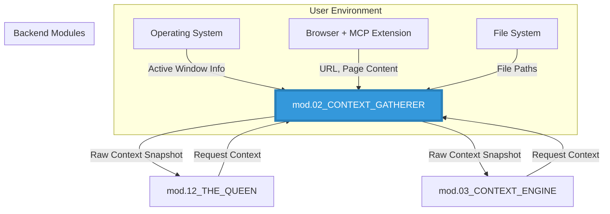

# ===== MODULE IDENTITY =====
title: "Context Gatherer - The See-What-I-See Layer"
module_id: "mod.02_context_gatherer"
type: "module"
category: "backend"

# ===== SYSTEMATIC SCAFFOLDING =====
lifecycle: "dev"
state: "minimal"
seat: "mvp"

# ===== AVAILABILITY AND ACCESS =====
phase_availability: "always"
priority: "high"
agent_accessible: true
user_configurable: true

# ===== PROMOTION GATES =====
promotion_gates:
  to_intermediate_i1:
    - "Can reliably get the active application and window title."
    - "Browser extension connection is stable."
    - "On-demand screenshot capture is functional."
  to_complete:
    - "All context sources (app, browser, files, screen) are integrated."
    - "Performance is optimized (< 200ms for a full context snapshot)."
    - "Security and privacy permissions are clearly defined and handled."

# ===== OBSERVABILITY =====
observability:
  metrics:
    - "context_gatherer.snapshot.duration_ms"
    - "context_gatherer.source.errors_total"
  alerts:
    - "context_gatherer.browser_mcp.disconnected"
    - "context_gatherer.permission.denied"
  dashboards:
    - "context_gatherer_health"

# ===== SECURITY REQUIREMENTS =====
security:
  authentication_required: false
  authorization_level: "system"
  data_classification: "highly_confidential"
  encryption_in_transit: true
  audit_logging: true
  input_validation: "strict"

# ===== TECHNICAL METADATA =====
dependencies: ["mod.17_electron_bridge"]
integrations: ["Chrome-MCP"]
last_updated: "2025-10-06"
version: "1.0.0"
maintainer: "Gemini/Lech"

# ===== AGENTIC INTEGRATION =====
agent_capabilities:
  can_read: true
  can_write: false
  can_propose_changes: false
  requires_approval: false
---

# 02. Context Gatherer - The See-What-I-See Layer

## Purpose

To act as the application's real-time sensor array. Its sole responsibility is to **gather** raw contextual information from the user's environment, fulfilling the "See What I See" requirement. It provides a snapshot of the user's current focus across different applications.

**Out of Scope:**
-   Interpreting, analyzing, or understanding the context it gathers.
-   Performing RAG or vector searches (delegated to `mod.03_CONTEXT_ENGINE`).
-   Storing context long-term (it provides a real-time snapshot).

---

## Primary Features

-   **Active Window Monitoring:** Identifies the current foreground application and its window title.
-   **Browser Content Extraction:** Interfaces with a browser extension (`Chrome-MCP`) to securely fetch the URL and content of the active tab.
-   **File System Awareness:** Uses an internal agent (`FileFinderAgent`) to identify recently accessed or relevant local files.
-   **On-Demand Screenshotting:** Provides a function to capture the current screen content as an image.

---

## Architecture

The Context Gatherer is a backend service running in the Electron main process. It uses various OS-level APIs and browser extension communication channels to assemble a snapshot of the user's current context. It exposes a single, simple API for other modules to query.



**Components:**
-   **App Monitor:** A small utility that uses platform-specific code to get the name of the active process and window.
-   **Browser Bridge:** Communicates with the Chrome MCP extension over a secure channel to request browser context.
-   **File Sensor:** Leverages the logic from `FileFinderAgent` to find relevant files.
-   **Screen Capturer:** Uses Electron's `desktopCapturer` API to take screenshots.

---

## Contracts

The module provides a primary method to fetch the complete, real-time context snapshot.

```typescript
// API exposed to other backend modules

/**
 * A snapshot of the user's real-time environment.
 * All fields are optional, as they may not be available or permitted.
 */
interface RawContextSnapshot {
  activeApplication?: {
    name: string;
    windowTitle: string;
  };
  browserContext?: {
    url: string;
    title: string;
    textContent?: string; // Only fetched on demand
  };
  fileContext?: {
    lastAccessedFile?: string; // path
    relevantProjectFiles?: string[]; // paths
  };
  screenshot?: {
    format: 'png' | 'jpeg';
    base64Data: string;
  };
}

interface ContextGathererAPI {
  /**
   * Asynchronously gathers the current context from all available sources.
   * @param options Flags to enable/disable specific, potentially slow, sources.
   */
  gatherRawContext(options: {
    includeBrowserContent: boolean;
    includeScreenshot: boolean;
  }): Promise<RawContextSnapshot>;
}
```

---

## State Progression & Promotion Gates

### Current State: minimal

### Minimal State
**Definition:** Can gather basic context from the active window.
**Requirements:**
- [ ] Implements `gatherRawContext`.
- [ ] Can successfully retrieve the active application name and window title.
- [ ] Handles permissions errors gracefully if access is denied.

### Intermediate I1 State
**Definition:** Integrates with the browser and can capture screenshots.
**Requirements:**
- [ ] All `minimal` requirements met.
- [ ] Establishes a stable connection to the Chrome MCP extension.
- [ ] Can retrieve the active tab's URL and title.
- [ ] Implements the on-demand screenshot functionality.

### Complete State
**Definition:** A performant and secure service that provides a rich, multi-source context snapshot.
**Requirements:**
- [ ] All `I1` requirements met.
- [ ] Integrates file system awareness.
- [ ] The `gatherRawContext` call completes in under 200ms (excluding optional content/screenshot).
- [ ] All data is handled securely, and user permissions are respected.

---

## Production Implementation

This service will be a TypeScript class instantiated in the Electron main process.

```typescript
// /electron-app/src/main/services/ContextGatherer.ts

import { desktopCapturer } from 'electron';
// Hypothetical libraries for active window and browser communication
import { getActiveWindow } from 'active-win';
import { ChromeMCPBridge } from './ChromeMCPBridge';

export class ContextGatherer implements ContextGathererAPI {
  private browserBridge: ChromeMCPBridge;

  constructor() {
    this.browserBridge = new ChromeMCPBridge();
  }

  public async gatherRawContext(options: { 
    includeBrowserContent: boolean; 
    includeScreenshot: boolean; 
  }): Promise<RawContextSnapshot> {
    const snapshot: RawContextSnapshot = {};

    try {
      const activeWindow = await getActiveWindow();
      if (activeWindow) {
        snapshot.activeApplication = {
          name: activeWindow.owner.name,
          windowTitle: activeWindow.title,
        };
      }
    } catch (e) { console.error('Could not get active window:', e); }

    // ... implementation for browser, files, and screenshot ...

    if (options.includeScreenshot) {
        // ... use desktopCapturer to get screenshot data ...
    }

    return snapshot;
  }
}
```

---

## Security & Compliance

This module is highly sensitive as it accesses the user's screen and application data.
-   **Permissions:** The application must explicitly request and receive user permission for "Screen Recording" and "Accessibility" access via macOS system prompts.
-   **Data Handling:** All gathered data is considered confidential and must not be stored long-term by this module. It should be held in memory only for the duration of the request.
-   **Browser Extension:** Communication with the browser extension must be over a secure, authenticated channel to prevent other processes from intercepting the data.

---

## Testing Strategy

1.  **Unit Test: Source Failure**
    -   **Given:** The user has denied Screen Recording permissions.
    -   **When:** `gatherRawContext({ includeScreenshot: true })` is called.
    -   **Then:** The method should handle the error gracefully and return a snapshot without the `screenshot` field, not throw an unhandled exception.
2.  **Integration Test: Browser Bridge**
    -   **Given:** The Chrome MCP extension is running.
    -   **When:** `gatherRawContext` is called while a specific URL is active in Chrome.
    -   **Then:** The returned `browserContext` must contain the correct URL and title.

---
