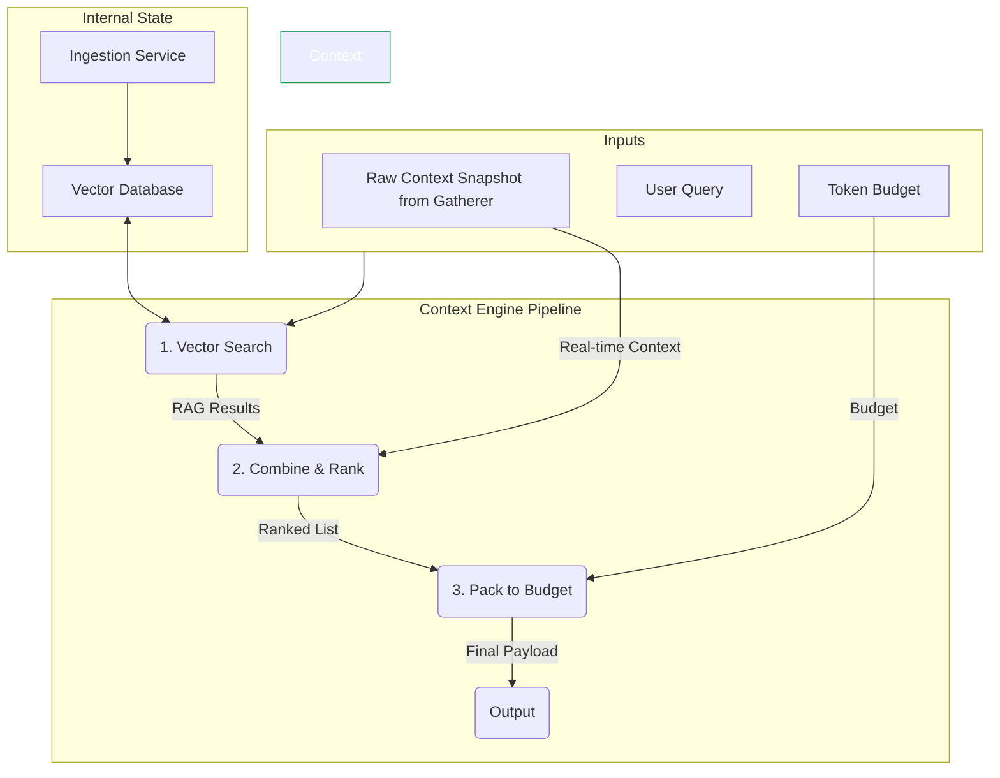

# ===== MODULE IDENTITY =====
title: "Context Engine - RAG & Memory Core"
module_id: "mod.03_context_engine"
type: "module"
category: "backend"

# ===== SYSTEMATIC SCAFFOLDING =====
lifecycle: "dev"
state: "minimal"
seat: "mvp"

# ===== AVAILABILITY AND ACCESS =====
phase_availability: "always"
priority: "critical"
agent_accessible: true
user_configurable: true

# ===== PROMOTION GATES =====
promotion_gates:
  to_intermediate_i1:
    - "Can ingest and vectorize documents into a persistent store."
    - "Performs basic vector search (RAG) over the stored memory."
    - "Packs a final context payload that respects a token budget."
  to_complete:
    - "Hybrid retrieval combines vector search with real-time context."
    - "Relevance ranking is sophisticated and tunable."
    - "Context selection and packing completes in < 100ms (p95)."

# ===== OBSERVABILITY =====
observability:
  metrics:
    - "context_engine.build.duration_ms"
    - "context_engine.rag_query.duration_ms"
    - "context_engine.packing.token_accuracy_percent"
  alerts:
    - "context_engine.vector_db.unavailable"
    - "context_engine.ingestion.failed"
  dashboards:
    - "context_engine_performance"

# ===== SECURITY REQUIREMENTS =====
security:
  authentication_required: false
  authorization_level: "system"
  data_classification: "highly_confidential"
  encryption_at_rest: true
  audit_logging: true

# ===== TECHNICAL METADATA =====
dependencies: ["mod.02_context_gatherer"]
integrations: ["mod.01_central_intelligence"]
last_updated: "2025-10-06"
version: "1.0.0"
maintainer: "Gemini/Lech"

# ===== AGENTIC INTEGRATION =====
agent_capabilities:
  can_read: true
  can_write: true
  can_propose_changes: false
  requires_approval: false
---

# 03. Context Engine - RAG & Memory Core

## Purpose

To act as the application's intelligent memory and context processing center. Its core responsibility is to take raw context from various sources (like the `Context Gatherer`) and use its long-term memory (RAG/Vector Store) to **select, rank, and pack** a final, token-budget-aware context payload ready for an AI model.

**Out of Scope:**
-   Gathering real-time context from the OS/browser (delegated to `mod.02_CONTEXT_GATHERER`).
-   Making the final API call to the AI provider (delegated to `mod.01_CENTRAL_INTELLIGENCE`).
-   Having a user interface.

---

## Primary Features

-   **Long-Term Vector Storage:** Manages a persistent vector database for all ingestible content.
-   **Document Ingestion ("Granite-Docling"):** Provides an API to chunk, vectorize, and store text content from documents, conversations, and other sources.
-   **Hybrid Context Retrieval (RAG):** Given a user query, performs a vector search to find relevant "memories" and combines them with the provided real-time context.
-   **Relevance Ranking:** Scores all available context items (RAG results, real-time context, conversation history) based on their relevance to the user's immediate query.
-   **Token-Budget Packing:** Assembles the highest-ranked context items into a final payload that strictly adheres to the specified token budget for the target AI model.

---

## Architecture

The Context Engine is a backend service that implements a full RAG pipeline. It receives raw data, queries its internal vector store, and produces a final, optimized context payload.



**Components:**
-   **Ingestion Service:** A background process that takes text, chunks it, generates vector embeddings using a local or remote model, and stores them in the Vector DB.
-   **Vector Database:** A local, file-based vector store (e.g., FAISS, HNSWLib) for efficient similarity searches.
-   **Retriever:** Performs the vector search and retrieves the top-k most relevant memory snippets.
-   **Ranker:** A scoring engine that ranks all context sources (RAG results, files, browser tabs) based on relevance to the query.
-   **Packer:** The final assembly step that greedily packs the highest-scoring items into the context window until the token budget is met.

---

## Contracts

The engine exposes two primary APIs: one for ingesting data, and one for building context.

```typescript
// API exposed to other backend modules

interface IngestionPayload {
  sourceId: string; // e.g., file path or URL
  textContent: string;
  metadata?: Record<string, any>;
}

interface FinalContextPayload {
  // The final string to be injected into the AI's system prompt.
  contextString: string; 
  
  metadata: {
    totalTokens: number;
    budget: number;
    itemsUsed: Array<{ source: string; tokens: number }>;
  };
}

interface ContextEngineAPI {
  /**
   * Ingests and vectorizes a piece of text content into the long-term memory.
   */
  ingest(payload: IngestionPayload): Promise<{ success: boolean }>;

  /**
   * The main method. Builds the final, budget-aware context payload.
   */
  buildContext(options: {
    query: string;
    rawContext: RawContextSnapshot; // From Context Gatherer
    tokenBudget: number;
  }): Promise<FinalContextPayload>;
}
```

---

## State Progression & Promotion Gates

### Current State: minimal

### Minimal State
**Definition:** Basic RAG pipeline with in-memory storage.
**Requirements:**
- [ ] Can ingest text and create simple term-frequency vectors.
- [ ] `buildContext` performs a basic cosine similarity search.
- [ ] Packs context until a token budget is met.
- [ ] Data is not persisted between application launches.

### Intermediate I1 State
**Definition:** Persistent RAG with real embeddings.
**Requirements:**
- [ ] All `minimal` requirements met.
- [ ] Integrates a local vector database (e.g., HNSWLib) for persistence.
- [ ] Uses a real embedding model (e.g., a local sentence-transformer) for ingestion.
- [ ] Implements a more sophisticated relevance ranking algorithm.

### Complete State
**Definition:** A highly optimized, hybrid context engine.
**Requirements:**
- [ ] All `I1` requirements met.
- [ ] Hybrid retrieval combines vector search with keyword-based search for better accuracy.
- [ ] The packing algorithm is intelligent enough to summarize or truncate large items to fit them into the budget.
- [ ] Performance is optimized to return context in < 100ms.

---

## Production Implementation

This will be a TypeScript class in the Electron main process, leveraging Node.js-compatible libraries for vector search.

```typescript
// /electron-app/src/main/services/ContextEngine.ts

import { HNSWLib } from 'langchain/vectorstores/hnswlib';
import { OpenAIEmbeddings } from '@langchain/openai';

export class ContextEngine implements ContextEngineAPI {
  private vectorStore: HNSWLib;

  private constructor(vectorStore: HNSWLib) {
    this.vectorStore = vectorStore;
  }

  public static async create(): Promise<ContextEngine> {
    // Initialize vector store from disk, or create if it doesn't exist
    const embeddings = new OpenAIEmbeddings(); // Or a local model
    const vectorStore = await HNSWLib.load('path/to/vectorstore', embeddings);
    return new ContextEngine(vectorStore);
  }

  public async ingest(payload: IngestionPayload): Promise<{ success: boolean }> {
    await this.vectorStore.addDocuments([
      { pageContent: payload.textContent, metadata: { source: payload.sourceId, ...payload.metadata } }
    ]);
    return { success: true };
  }

  public async buildContext(options: BuildContextOptions): Promise<FinalContextPayload> {
    const { query, rawContext, tokenBudget } = options;

    // 1. Perform RAG search
    const memoryResults = await this.vectorStore.similaritySearch(query, 5);

    // 2. Combine with raw context
    const allItems = [...memoryResults, ...this.transformRawContext(rawContext)];

    // 3. Rank all items (simplified for example)
    const rankedItems = allItems.sort((a, b) => (b.metadata.relevance || 0) - (a.metadata.relevance || 0));

    // 4. Pack into final context string within budget
    let contextString = '';
    let usedTokens = 0;
    for (const item of rankedItems) {
      const itemTokens = item.pageContent.length / 4; // Rough estimate
      if (usedTokens + itemTokens <= tokenBudget) {
        contextString += `\n--- Context from ${item.metadata.source} ---\n${item.pageContent}`;
        usedTokens += itemTokens;
      }
    }

    return { contextString, metadata: { /* ... */ } };
  }

  private transformRawContext(rawContext: RawContextSnapshot): any[] {
    // Convert snapshot from Gatherer into documents for ranking
    return [];
  }
}
```

---

## Testing Strategy

1.  **Unit Test: Ingestion**
    -   **Given:** A new text document.
    -   **When:** `ingest()` is called.
    -   **Then:** A subsequent vector search for a keyword in that document must return the ingested content.
2.  **Unit Test: Budget Packing**
    -   **Given:** A large set of context items totaling 20,000 tokens.
    -   **When:** `buildContext()` is called with a budget of 4,000 tokens.
    -   **Then:** The `totalTokens` in the returned metadata must be less than or equal to 4,000.
3.  **Integration Test: Full Pipeline**
    -   **Given:** A user query and a snapshot of raw context from the `Context Gatherer`.
    -   **When:** `buildContext()` is called.
    -   **Then:** The resulting `contextString` must contain both relevant information from the vector store (RAG) and the provided raw context.

---
