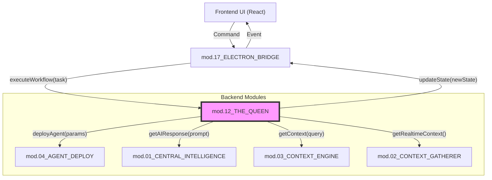

# ===== MODULE IDENTITY =====
title: "TheQueen - System Orchestrator"
module_id: "mod.12_the_queen"
type: "module"
category: "backend"

# ===== SYSTEMATIC SCAFFOLDING =====
lifecycle: "dev"
state: "minimal"
seat: "mvp"

# ===== AVAILABILITY AND ACCESS =====
phase_availability: "always"
priority: "critical"
agent_accessible: true
user_configurable: false

# ===== PROMOTION GATES =====
promotion_gates:
  to_intermediate_i1:
    - "Core workflow orchestration is functional"
    - "Agent lifecycle management (start/stop) is implemented"
    - "State machine correctly transitions between primary states"
  to_complete:
    - "Complex, multi-agent workflows are supported"
    - "System health monitoring and basic failover are active"
    - "Comprehensive audit trail for all orchestrated actions is in place"

# ===== OBSERVABILITY =====
observability:
  metrics:
    - "the_queen.workflow.duration_ms"
    - "the_queen.agent.lifecycle.events_total"
    - "the_queen.system_state.transitions_total"
  alerts:
    - "the_queen.workflow.failed"
    - "the_queen.agent.unresponsive"
  dashboards:
    - "the_queen_system_overview"

# ===== SECURITY REQUIREMENTS =====
security:
  authentication_required: true
  authorization_level: "system"
  data_classification: "confidential"
  encryption_in_transit: true
  audit_logging: true

# ===== TECHNICAL METADATA =====
dependencies: ["mod.01_central_intelligence", "mod.03_context_engine", "mod.04_agent_deploy"]
integrations: ["mod.17_electron_bridge"]
last_updated: "2025-10-06"
version: "1.0.0"
maintainer: "Gemini/Lech"

# ===== AGENTIC INTEGRATION =====
agent_capabilities:
  can_read: true
  can_write: true
  can_propose_changes: true
  requires_approval: true
---

# 12. TheQueen - System Orchestrator

## Purpose

To act as the central nervous system and master orchestrator of the entire LocalBrain application. It is the highest-level coordinator, responsible for managing the lifecycle of agents and tasks, and sequencing complex, multi-step workflows. It translates high-level user intents into concrete, multi-step plans that are executed by other specialized modules.

**Out of Scope:**
-   Directly interacting with AI models (delegated to `mod.01_CENTRAL_INTELLIGENCE`).
-   Gathering real-time context from the user's environment (delegated to `mod.02_CONTEXT_GATHERER`).
-   Managing the RAG/vector store (delegated to `mod.03_CONTEXT_ENGINE`).
-   Having a user interface (it is a pure backend module).

---

## Primary Features

-   **Workflow Orchestration:** Decomposes complex user requests into a sequence of steps to be executed by other modules.
-   **Agent Lifecycle Management:** Manages the lifecycle of agents, instructing the `Agent Deploy` module to start, stop, and monitor agents.
-   **System State Machine:** Acts as the single source of truth for the application's overall state (e.g., `idle`, `processing`, `executing_task`).
-   **Event Bus Hub:** Serves as the central hub for the application's event bus, routing events between different modules.
-   **Task Management:** Maintains a registry of active, pending, and completed background tasks.

---

## Architecture

TheQueen sits at the apex of the backend architecture. It receives commands from the UI via the Electron Bridge and delegates tasks to specialized modules. It does not perform tasks itself, but rather conducts the "orchestra" of other services.



**Components:**
-   **Workflow Engine:** A state machine that executes predefined workflow graphs. A request like "Summarize my open document" would trigger a workflow that first calls the `Context Gatherer` to get the document content, then calls `Central Intelligence` to perform the summarization.
-   **Agent Registry:** An in-memory dictionary tracking all active, inactive, and deploying agents and their statuses.
-   **Task Queue:** A queue for managing background tasks requested by the user or other agents.

---

## Contracts

TheQueen exposes a high-level API for the UI and other services to interact with.

```typescript
// API exposed to the Electron Bridge
interface TheQueenAPI {
  /**
   * The primary entry point for all user-initiated tasks.
   * @param request A high-level description of the user's goal.
   */
  executeUserRequest(request: UserRequest): Promise<void>;

  /**
   * Retrieves the current state of the entire application.
   */
  getSystemState(): Promise<SystemState>;

  /**
   * Retrieves the list of all active and pending tasks.
   */
  getTaskQueue(): Promise<Task[]>;
}

interface UserRequest {
  id: string;
  prompt: string;
  // Optional reference to UI-provided context items
  uiContext?: UIContextItem[]; 
}

interface SystemState {
  applicationState: 'idle' | 'processing' | 'error';
  activeTasks: number;
  activeAgents: number;
}
```

---

## State Progression & Promotion Gates

### Current State: minimal

### Minimal State
**Definition:** Basic workflow execution for a single, hardcoded task.
**Requirements:**
- [ ] Can receive a `UserRequest` from the bridge.
- [ ] Can execute a simple, linear workflow (e.g., Get Context -> Call AI).
- [ ] Can update the system state (`idle`, `processing`).
- [ ] Can delegate tasks to `Central Intelligence` and `Context Engine`.

### Intermediate I1 State
**Definition:** Dynamic workflow planning and agent lifecycle management.
**Requirements:**
- [ ] All `minimal` requirements met.
- [ ] Can dynamically plan a workflow based on user intent.
- [ ] Can issue `deployAgent` commands to the `Agent Deploy` module.
- [ ] Maintains a registry of active agents.

### Complete State
**Definition:** A robust orchestrator that can manage complex, parallel workflows and monitor system health.
**Requirements:**
- [ ] All `I1` requirements met.
- [ ] Supports parallel execution of tasks in a workflow.
- [ ] Implements basic health monitoring of dependent services.
- [ ] Provides a comprehensive audit trail of all orchestrated events.

---

## Production Implementation

TheQueen will be implemented as a singleton class in the Electron main process, written in TypeScript.

```typescript
// /electron-app/src/main/services/TheQueen.ts

import { CentralIntelligence } from './CentralIntelligence';
import { ContextEngine } from './ContextEngine';
import { AgentDeployer } from './AgentDeployer';

class TheQueen {
  private static instance: TheQueen;
  private state: SystemState = { applicationState: 'idle', activeTasks: 0, activeAgents: 0 };

  private constructor(
    private centralIntelligence: CentralIntelligence,
    private contextEngine: ContextEngine,
    private agentDeployer: AgentDeployer
  ) {
    // Initialize event listeners
  }

  public static getInstance(): TheQueen {
    if (!TheQueen.instance) {
      // Initialize dependencies
      const ci = new CentralIntelligence();
      const ce = new ContextEngine();
      const ad = new AgentDeployer();
      TheQueen.instance = new TheQueen(ci, ce, ad);
    }
    return TheQueen.instance;
  }

  public async executeUserRequest(request: UserRequest): Promise<void> {
    this.state.applicationState = 'processing';
    
    // 1. Plan the workflow based on the request prompt
    const workflow = this.planWorkflow(request.prompt);

    // 2. Execute the workflow
    for (const step of workflow.steps) {
      switch (step.type) {
        case 'getContext':
          const context = await this.contextEngine.getContext(step.params);
          // ... add context to workflow data
          break;
        case 'callAI':
          const response = await this.centralIntelligence.getAIResponse(step.params);
          // ... handle response
          break;
        case 'deployAgent':
          await this.agentDeployer.deployAgent(step.params);
          break;
      }
    }

    this.state.applicationState = 'idle';
  }

  private planWorkflow(prompt: string): Workflow {
    // Simple logic to determine workflow steps based on keywords
    if (prompt.toLowerCase().includes('analyze my code')) {
      return { steps: [{ type: 'getContext' }, { type: 'callAI' }] };
    }
    return { steps: [{ type: 'callAI' }] };
  }
}
```

---

## Testing Strategy

1.  **Unit Test: Workflow Planning**
    -   **Given:** A user prompt like "deploy an agent to watch my files".
    -   **When:** `planWorkflow()` is called.
    -   **Then:** The resulting workflow must contain a `deployAgent` step.
2.  **Integration Test: Full Workflow Execution**
    -   **Given:** TheQueen is initialized with mocked dependencies.
    -   **When:** `executeUserRequest()` is called with a complex prompt.
    -   **Then:** Verify that the mocked `ContextEngine`, `CentralIntelligence`, and `AgentDeployer` are called in the correct sequence with the correct parameters.
3.  **State Transition Test**
    -   **Given:** The application is `idle`.
    -   **When:** `executeUserRequest()` is called.
    -   **Then:** The system state must transition to `processing` and then back to `idle` upon completion.

---
