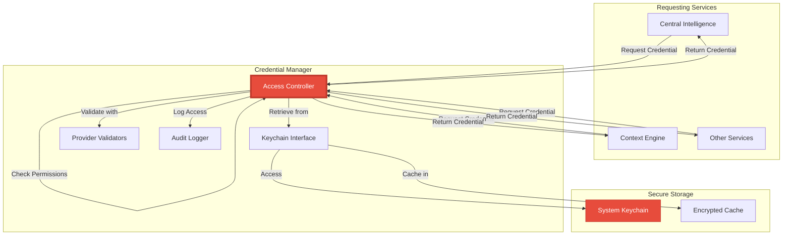

# ===== MODULE IDENTITY =====
title: "Unified Credential Manager - API Key & Token Management"
module_id: "mod.14_unified_credential_manager"
type: "module"
category: "backend"

# ===== SYSTEMATIC SCAFFOLDING =====
lifecycle: "dev"
state: "minimal"
seat: "mvp"

# ===== AVAILABILITY AND ACCESS =====
phase_availability: "always"
priority: "critical"
agent_accessible: false
user_configurable: true

# ===== PROMOTION GATES =====
promotion_gates:
  to_intermediate_i1:
    - "Securely stores API keys in system keychain."
    - "Provides encrypted credential retrieval."
    - "Supports multiple AI providers (Claude, OpenAI, Gemini)."
  to_complete:
    - "Implements credential rotation and auto-refresh."
    - "Supports team credential management."
    - "Provides audit logging for all credential access."

# ===== OBSERVABILITY =====
observability:
  metrics:
    - "credential_manager.access.total"
    - "credential_manager.rotation.frequency"
    - "credential_manager.validation.failure_rate"
  alerts:
    - "credential_manager.security.breach_detected"
    - "credential_manager.expired_credentials"
  dashboards:
    - "credential_manager_security"

# ===== SECURITY REQUIREMENTS =====
security:
  authentication_required: true
  authorization_level: "system"
  data_classification: "secret"
  encryption_at_rest: true
  encryption_in_transit: true
  audit_logging: true

# ===== TECHNICAL METADATA =====
dependencies: []
integrations: ["mod.01_central_intelligence", "mod.17_electron_bridge"]
last_updated: "2025-10-06"
version: "1.0.0"
maintainer: "Lech/Claude"

# ===== AGENTIC INTEGRATION =====
agent_capabilities:
  can_read: false
  can_write: false
  can_propose_changes: false
  requires_approval: true
---

# 14. Unified Credential Manager - API Key & Token Management

## Purpose

To act as the **secure, centralized credential management system** for all external service integrations. It provides safe storage, retrieval, and validation of API keys, tokens, and other sensitive credentials using platform-native secure storage mechanisms.

**Out of Scope:**
- Business logic that uses credentials (only provides them to authorized services)
- User authentication/login management (focuses on API keys, not user identities)
- Cloud-based credential synchronization (local secure storage only)

---

## Primary Features

- **Secure Key Storage:** Stores API keys and tokens in the system keychain (macOS Keychain, Windows Credential Manager, Linux libsecret).

- **Provider Abstraction:** Supports multiple AI providers with different credential formats and validation requirements.

- **Encrypted Retrieval:** Provides credentials to authorized services with end-to-end encryption.

- **Credential Validation:** Tests credentials against provider APIs to ensure they're valid and active.

- **Access Control:** Implements fine-grained permissions for which services can access which credentials.

- **Audit Logging:** Records all credential access, modifications, and security events for compliance.

---

## Architecture

The Unified Credential Manager operates as a secure backend service with privileged access to system storage.



**Credential Types Supported:**
- **API Keys:** Simple string tokens for service authentication
- **Bearer Tokens:** JWT or OAuth2 tokens with expiration
- **Client Credentials:** Client ID/secret pairs
- **Custom Credentials:** Provider-specific authentication formats

---

## Contracts

The credential manager provides a secure API for credential operations.

```typescript
// Credential types and interfaces
interface CredentialMetadata {
  id: string;
  provider: AIProvider;
  type: CredentialType;
  name: string;
  description?: string;
  createdAt: number;
  lastAccessed: number;
  expiresAt?: number;
  tags: string[];
}

enum CredentialType {
  API_KEY = 'api_key',
  BEARER_TOKEN = 'bearer_token',
  CLIENT_CREDENTIALS = 'client_credentials',
  CUSTOM = 'custom'
}

enum AIProvider {
  ANTHROPIC = 'anthropic',
  OPENAI = 'openai',
  GOOGLE = 'google',
  OLLAMA = 'ollama',
  OPENROUTER = 'openrouter'
}

interface StoredCredential {
  metadata: CredentialMetadata;
  encryptedData: string;
  checksum: string;
}

// Main API interface
interface CredentialManagerAPI {
  // Credential lifecycle
  storeCredential(credential: CredentialData): Promise<string>;
  getCredential(id: string, requester: string): Promise<string | null>;
  updateCredential(id: string, credential: CredentialData): Promise<void>;
  deleteCredential(id: string): Promise<void>;

  // Credential management
  listCredentials(filter?: CredentialFilter): Promise<CredentialMetadata[]>;
  validateCredential(id: string): Promise<CredentialValidationResult>;
  rotateCredential(id: string): Promise<void>;

  // Access control
  grantAccess(credentialId: string, serviceId: string): Promise<void>;
  revokeAccess(credentialId: string, serviceId: string): Promise<void>;
  hasAccess(credentialId: string, serviceId: string): Promise<boolean>;

  // Audit and security
  getAccessHistory(credentialId: string): Promise<AccessEvent[]>;
  exportCredentials(encrypted: boolean): Promise<string>;
  importCredentials(data: string, encrypted: boolean): Promise<void>;
}

// Supporting types
interface CredentialData {
  value: string;
  metadata: Omit<CredentialMetadata, 'id' | 'createdAt' | 'lastAccessed'>;
  additionalData?: Record<string, any>;
}

interface CredentialFilter {
  provider?: AIProvider;
  type?: CredentialType;
  tags?: string[];
  search?: string;
}

interface CredentialValidationResult {
  isValid: boolean;
  error?: string;
  expiresAt?: number;
  usageInfo?: {
    currentUsage: number;
    limit: number;
    resetDate: number;
  };
}

interface AccessEvent {
  timestamp: number;
  serviceId: string;
  action: 'read' | 'update' | 'delete';
  success: boolean;
  ipAddress?: string;
  userAgent?: string;
}

// Provider-specific validators
interface CredentialValidator {
  validate(credential: string): Promise<CredentialValidationResult>;
  getProviderName(): string;
  getRequiredFields(): string[];
}

class AnthropicCredentialValidator implements CredentialValidator {
  async validate(credential: string): Promise<CredentialValidationResult> {
    try {
      const response = await fetch('https://api.anthropic.com/v1/messages', {
        method: 'POST',
        headers: {
          'x-api-key': credential,
          'content-type': 'application/json',
          'anthropic-version': '2023-06-01'
        },
        body: JSON.stringify({
          model: 'claude-3-haiku-20240307',
          max_tokens: 1,
          messages: [{ role: 'user', content: 'test' }]
        })
      });

      if (response.ok) {
        const usage = response.headers.get('anthropic-ratelimit');
        return { isValid: true };
      } else {
        return {
          isValid: false,
          error: `API returned ${response.status}: ${response.statusText}`
        };
      }
    } catch (error) {
      return {
        isValid: false,
        error: `Network error: ${error.message}`
      };
    }
  }

  getProviderName(): string {
    return 'Anthropic Claude';
  }

  getRequiredFields(): string[] {
    return ['api_key'];
  }
}
```

---

## State Progression & Promotion Gates

### Current State: minimal

### Minimal State
**Definition:** Basic secure storage with manual credential management.
**Requirements:**
- [ ] Can store and retrieve API keys using system keychain
- [ ] Basic encryption for stored credentials
- [ ] Simple API for credential access by authorized services
- [ ] Support for at least 2 AI providers

### Intermediate I1 State
**Definition:** Full credential lifecycle management with validation.
**Requirements:**
- [ ] All `minimal` requirements met
- [ ] Credential validation against provider APIs
- [ ] Access control and permissions system
- [ ] Audit logging for all credential operations
- [ ] Support for all major AI providers

### Complete State
**Definition:** Enterprise credential management with advanced security.
**Requirements:**
- [ ] All `I1` requirements met
- [ ] Automatic credential rotation and refresh
- [ ] Credential usage monitoring and quota management
- [ ] Team credential sharing with role-based access
- [ ] Security alerts for suspicious access patterns
- [ ] Credential backup and recovery mechanisms

---

## Production Implementation

```typescript
// /src/main/services/CredentialManagerService.ts
import { Keychain } from 'node-keychain';
import { createHash, randomBytes, createCipheriv, createDecipheriv } from 'crypto';

export class CredentialManagerService implements CredentialManagerAPI {
  private keychain: Keychain;
  private validators: Map<AIProvider, CredentialValidator>;
  private accessCache: Map<string, { credential: string; expires: number }>;
  private encryptionKey: Buffer;

  constructor() {
    this.keychain = new Keychain({ service: 'orchestra-localbrain' });
    this.validators = new Map();
    this.accessCache = new Map();
    this.encryptionKey = this.getOrCreateEncryptionKey();
    this.initializeValidators();
  }

  private initializeValidators() {
    this.validators.set(AIProvider.ANTHROPIC, new AnthropicCredentialValidator());
    this.validators.set(AIProvider.OPENAI, new OpenAICredentialValidator());
    this.validators.set(AIProvider.GOOGLE, new GoogleCredentialValidator());
    // ... other providers
  }

  async storeCredential(credential: CredentialData): Promise<string> {
    const id = this.generateCredentialId();
    const metadata: CredentialMetadata = {
      id,
      provider: credential.metadata.provider,
      type: credential.metadata.type,
      name: credential.metadata.name,
      description: credential.metadata.description,
      createdAt: Date.now(),
      lastAccessed: Date.now(),
      expiresAt: credential.metadata.expiresAt,
      tags: credential.metadata.tags
    };

    const encryptedValue = this.encrypt(credential.value);
    const checksum = this.calculateChecksum(credential.value);

    const storedCredential: StoredCredential = {
      metadata,
      encryptedData: encryptedValue,
      checksum
    };

    await this.keychain.setPassword(id, JSON.stringify(storedCredential));
    await this.logAccessEvent(id, 'store', true, 'system');

    return id;
  }

  async getCredential(id: string, requester: string): Promise<string | null> {
    try {
      // Check access permissions
      if (!(await this.hasAccess(id, requester))) {
        await this.logAccessEvent(id, 'read', false, requester, 'Access denied');
        throw new Error(`Service ${requester} does not have access to credential ${id}`);
      }

      // Check cache first
      const cached = this.accessCache.get(id);
      if (cached && cached.expires > Date.now()) {
        await this.updateLastAccessed(id);
        return cached.credential;
      }

      // Retrieve from keychain
      const storedData = await this.keychain.getPassword(id);
      if (!storedData) {
        return null;
      }

      const storedCredential: StoredCredential = JSON.parse(storedData);

      // Decrypt and verify integrity
      const decryptedValue = this.decrypt(storedCredential.encryptedData);
      const calculatedChecksum = this.calculateChecksum(decryptedValue);

      if (calculatedChecksum !== storedCredential.checksum) {
        await this.logAccessEvent(id, 'read', false, requester, 'Checksum mismatch');
        throw new Error('Credential integrity check failed');
      }

      // Cache for future use (5 minutes)
      this.accessCache.set(id, {
        credential: decryptedValue,
        expires: Date.now() + 5 * 60 * 1000
      });

      await this.updateLastAccessed(id);
      await this.logAccessEvent(id, 'read', true, requester);

      return decryptedValue;

    } catch (error) {
      await this.logAccessEvent(id, 'read', false, requester, error.message);
      throw error;
    }
  }

  async validateCredential(id: string): Promise<CredentialValidationResult> {
    const credential = await this.getCredential(id, 'credential-manager');
    if (!credential) {
      return { isValid: false, error: 'Credential not found' };
    }

    const storedData = await this.keychain.getPassword(id);
    const storedCredential: StoredCredential = JSON.parse(storedData);

    const validator = this.validators.get(storedCredential.metadata.provider);
    if (!validator) {
      return { isValid: false, error: 'No validator for this provider' };
    }

    return await validator.validate(credential);
  }

  async grantAccess(credentialId: string, serviceId: string): Promise<void> {
    const accessKey = `access:${credentialId}:${serviceId}`;
    await this.keychain.setPassword(accessKey, JSON.stringify({
      grantedAt: Date.now(),
      grantedBy: 'user'
    }));
  }

  async hasAccess(credentialId: string, serviceId: string): Promise<boolean> {
    // System services always have access to their own credentials
    if (credentialId.startsWith(serviceId)) {
      return true;
    }

    const accessKey = `access:${credentialId}:${serviceId}`;
    try {
      const accessData = await this.keychain.getPassword(accessKey);
      return !!accessData;
    } catch {
      return false;
    }
  }

  private encrypt(data: string): string {
    const iv = randomBytes(16);
    const cipher = createCipheriv('aes-256-gcm', this.encryptionKey, iv);

    let encrypted = cipher.update(data, 'utf8', 'hex');
    encrypted += cipher.final('hex');

    const authTag = cipher.getAuthTag();
    return `${iv.toString('hex')}:${authTag.toString('hex')}:${encrypted}`;
  }

  private decrypt(encryptedData: string): string {
    const [ivHex, authTagHex, encrypted] = encryptedData.split(':');
    const iv = Buffer.from(ivHex, 'hex');
    const authTag = Buffer.from(authTagHex, 'hex');

    const decipher = createDecipheriv('aes-256-gcm', this.encryptionKey, iv);
    decipher.setAuthTag(authTag);

    let decrypted = decipher.update(encrypted, 'hex', 'utf8');
    decrypted += decipher.final('utf8');

    return decrypted;
  }

  private calculateChecksum(data: string): string {
    return createHash('sha256').update(data).digest('hex');
  }

  private generateCredentialId(): string {
    return `cred_${Date.now()}_${randomBytes(8).toString('hex')}`;
  }

  private async updateLastAccessed(id: string): Promise<void> {
    const storedData = await this.keychain.getPassword(id);
    const storedCredential: StoredCredential = JSON.parse(storedData);

    storedCredential.metadata.lastAccessed = Date.now();
    await this.keychain.setPassword(id, JSON.stringify(storedCredential));
  }

  private async logAccessEvent(
    credentialId: string,
    action: string,
    success: boolean,
    requester: string,
    error?: string
  ): Promise<void> {
    const event: AccessEvent = {
      timestamp: Date.now(),
      serviceId: requester,
      action: action as any,
      success,
      error
    };

    const logKey = `log:${credentialId}:${Date.now()}`;
    await this.keychain.setPassword(logKey, JSON.stringify(event));
  }

  private getOrCreateEncryptionKey(): Buffer {
    const keyName = 'master_encryption_key';

    try {
      const existingKey = this.keychain.getPassword(keyName);
      if (existingKey) {
        return Buffer.from(existingKey, 'hex');
      }
    } catch {
      // Key doesn't exist, create new one
    }

    const newKey = randomBytes(32);
    this.keychain.setPassword(keyName, newKey.toString('hex'));
    return newKey;
  }
}
```

---

## Testing Strategy

1. **Unit Test: Secure Storage**
   - **Given:** An API key to store
   - **When:** `storeCredential()` is called with the key
   - **Then:** The key should be encrypted and stored in system keychain

2. **Security Test: Access Control**
   - **Given:** A credential stored with access granted only to Service A
   - **When:** Service B tries to access the credential
   - **Then:** Access should be denied and logged

3. **Integration Test: Credential Validation**
   - **Given:** A valid API key for Anthropic
   - **When:** `validateCredential()` is called
   - **Then:** Should return `isValid: true` with usage information

4. **Security Test: Integrity Verification**
   - **Given:** A stored credential
   - **When:** The stored data is tampered with in keychain
   - **Then:** `getCredential()` should detect integrity violation and fail

---