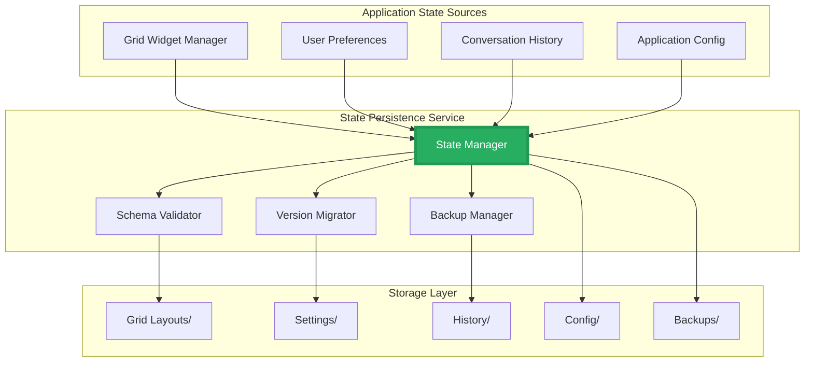

# ===== MODULE IDENTITY =====
title: "State Persistence - Application State Storage"
module_id: "mod.21_state_persistence"
type: "module"
category: "backend"

# ===== SYSTEMATIC SCAFFOLDING =====
lifecycle: "dev"
state: "minimal"
seat: "mvp"

# ===== AVAILABILITY AND ACCESS =====
phase_availability: "always"
priority: "critical"
agent_accessible: true
user_configurable: false

# ===== PROMOTION GATES =====
promotion_gates:
  to_intermediate_i1:
    - "Can persist and restore grid layouts to/from JSON files."
    - "Application settings are saved and loaded correctly."
    - "Conversation history persists across sessions."
  to_complete:
    - "Implements automatic backup and recovery system."
    - "Supports state versioning and migration."
    - "Data is encrypted at rest for security."

# ===== OBSERVABILITY =====
observability:
  metrics:
    - "state_persistence.save.duration_ms"
    - "state_persistence.load.duration_ms"
    - "state_persistence.storage.size_bytes"
  alerts:
    - "state_persistence.corruption_detected"
    - "state_persistence.quota_exceeded"
  dashboards:
    - "state_persistence_health"

# ===== SECURITY REQUIREMENTS =====
security:
  authentication_required: false
  authorization_level: "system"
  data_classification: "confidential"
  encryption_at_rest: true
  audit_logging: true

# ===== TECHNICAL METADATA =====
dependencies: []
integrations: ["mod.17_electron_bridge"]
last_updated: "2025-10-06"
version: "1.0.0"
maintainer: "Lech/Claude"

# ===== AGENTIC INTEGRATION =====
agent_capabilities:
  can_read: true
  can_write: true
  can_propose_changes: false
  requires_approval: false
---

# 21. State Persistence - Application State Storage

## Purpose

To act as the **centralized state storage system** for the entire application. It provides reliable persistence for all application state including grid layouts, user preferences, conversation history, and configuration settings, ensuring data survives application restarts and system crashes.

**Out of Scope:**
- Business logic implementation (stores data, doesn't process it)
- Real-time state synchronization between multiple instances
- Cloud backup/sync services (local storage only)

---

## Primary Features

- **Grid Layout Persistence:** Save and restore complete grid configurations including widget positions, sizes, and states.

- **User Settings Storage:** Persist application preferences, themes, key bindings, and UI configurations.

- **Conversation History:** Store chat conversations with metadata for context continuity.

- **Configuration Management:** Manage application configuration files and environment settings.

- **Backup & Recovery:** Automatic backup creation and recovery mechanisms for data protection.

- **State Migration:** Handle version upgrades and data format migrations seamlessly.

---

## Architecture

State Persistence operates as a file-based storage system with organized data directories and versioned schemas.



**Storage Structure:**
```
~/.orchestra-localbrain/
├── layouts/
│   ├── default.json
│   ├── workspace-1.json
│   └── mobile.json
├── settings/
│   ├── preferences.json
│   ├── themes.json
│   └── keybindings.json
├── history/
│   ├── conversations/
│   └── contexts/
├── config/
│   ├── app.json
│   └── environment.json
└── backups/
    ├── auto/
    └── manual/
```

---

## Contracts

The persistence service provides a simple but powerful API for state operations.

```typescript
// Base persistence interface
interface StatePersistenceAPI {
  // Basic CRUD operations
  save(key: string, data: any, options?: SaveOptions): Promise<void>;
  load<T>(key: string, schema?: SchemaValidator<T>): Promise<T | null>;
  delete(key: string): Promise<void>;
  exists(key: string): Promise<boolean>;

  // Batch operations
  saveBatch(operations: BatchOperation[]): Promise<void>;
  loadBatch<T>(keys: string[]): Promise<Map<string, T>>;

  // Backup operations
  createBackup(name?: string): Promise<string>;
  restoreBackup(backupId: string): Promise<void>;
  listBackups(): Promise<BackupInfo[]>;

  // Schema management
  validateData(data: any, schema: Schema): boolean;
  migrateData(data: any, fromVersion: string, toVersion: string): any;
}

// Specific state schemas
interface GridLayoutState {
  version: string;
  timestamp: number;
  layout: Record<string, LayoutItem>;
  instances: Record<string, WidgetInstance>;
  metadata: {
    name: string;
    description?: string;
    tags: string[];
  };
}

interface UserPreferencesState {
  version: string;
  theme: 'dark' | 'light' | 'auto';
  language: string;
  keyBindings: Record<string, string>;
  ui: {
    sidebarCollapsed: boolean;
    gridDensity: 'compact' | 'normal' | 'spacious';
    showGridLines: boolean;
  };
  privacy: {
    telemetryEnabled: boolean;
    crashReportingEnabled: boolean;
  };
}

interface ConversationHistoryState {
  version: string;
  conversations: ConversationEntry[];
  metadata: {
    totalCount: number;
    lastUpdated: number;
    totalTokens: number;
  };
}

// Options and types
interface SaveOptions {
  encrypt?: boolean;
  compression?: boolean;
  backup?: boolean;
}

interface BatchOperation {
  type: 'save' | 'delete';
  key: string;
  data?: any;
  options?: SaveOptions;
}

interface BackupInfo {
  id: string;
  name: string;
  timestamp: number;
  size: number;
  compressed: boolean;
  encrypted: boolean;
}
```

---

## State Progression & Promotion Gates

### Current State: minimal

### Minimal State
**Definition:** Basic file-based storage without validation.
**Requirements:**
- [ ] Can save and load JSON files to local filesystem
- [ ] Basic directory structure is created automatically
- [ ] Simple key-value API works for basic data types

### Intermediate I1 State
**Definition:** Reliable persistence with validation and error handling.
**Requirements:**
- [ ] All `minimal` requirements met
- [ ] Schema validation for all data types
- [ ] Automatic backup creation before major changes
- [ ] Error recovery and corruption detection
- [ ] Atomic write operations to prevent data loss

### Complete State
**Definition:** Enterprise-grade persistence with security and migration.
**Requirements:**
- [ ] All `I1` requirements met
- [ ] Data encryption at rest using system keychain
- [ ] Version migration system for seamless upgrades
- [ ] Configurable retention policies for backups
- [ ] Performance optimization for large datasets
- [ ] Data integrity checks and automatic repair

---

## Production Implementation

```typescript
// /src/main/services/StatePersistenceService.ts
import { promises as fs } from 'fs';
import { join, dirname } from 'path';
import { app } from 'electron';
import { createHash, randomBytes } from 'crypto';

export class StatePersistenceService implements StatePersistenceAPI {
  private dataDir: string;
  private backupsDir: string;
  private encryptionKey?: Buffer;

  constructor() {
    this.dataDir = join(app.getPath('userData'), 'data');
    this.backupsDir = join(this.dataDir, 'backups');
    this.initializeDirectories();
  }

  private async initializeDirectories() {
    const dirs = [
      this.dataDir,
      join(this.dataDir, 'layouts'),
      join(this.dataDir, 'settings'),
      join(this.dataDir, 'history'),
      join(this.dataDir, 'config'),
      this.backupsDir,
      join(this.backupsDir, 'auto'),
      join(this.backupsDir, 'manual')
    ];

    for (const dir of dirs) {
      await fs.mkdir(dir, { recursive: true });
    }
  }

  async save(key: string, data: any, options: SaveOptions = {}): Promise<void> {
    const filePath = this.getFilePath(key);
    const tempPath = `${filePath}.tmp`;

    try {
      // Create backup if requested
      if (options.backup && await this.exists(key)) {
        await this.createAutoBackup(key);
      }

      // Prepare data
      let serializedData = JSON.stringify({
        version: '1.0.0',
        timestamp: Date.now(),
        data: data
      }, null, 2);

      // Compress if requested
      if (options.compression) {
        serializedData = await this.compressData(serializedData);
      }

      // Encrypt if requested
      if (options.encrypt) {
        serializedData = await this.encryptData(serializedData);
      }

      // Atomic write
      await fs.writeFile(tempPath, serializedData, 'utf8');
      await fs.rename(tempPath, filePath);

    } catch (error) {
      // Cleanup temp file on error
      await fs.unlink(tempPath).catch(() => {});
      throw new Error(`Failed to save ${key}: ${error.message}`);
    }
  }

  async load<T>(key: string, schema?: SchemaValidator<T>): Promise<T | null> {
    const filePath = this.getFilePath(key);

    try {
      let data = await fs.readFile(filePath, 'utf8');

      // Decrypt if needed (detect encryption header)
      if (data.startsWith('encrypted:')) {
        data = await this.decryptData(data);
      }

      // Decompress if needed
      if (data.startsWith('compressed:')) {
        data = await this.decompressData(data);
      }

      const parsed = JSON.parse(data);

      // Validate against schema if provided
      if (schema && !schema.validate(parsed.data)) {
        throw new Error(`Data validation failed for ${key}`);
      }

      return parsed.data;

    } catch (error) {
      if (error.code === 'ENOENT') {
        return null;
      }
      throw new Error(`Failed to load ${key}: ${error.message}`);
    }
  }

  async createBackup(name?: string): Promise<string> {
    const backupId = name || `backup_${Date.now()}`;
    const backupPath = join(this.backupsDir, 'manual', `${backupId}.json`);

    // Create full backup
    const backupData = {
      version: '1.0.0',
      timestamp: Date.now(),
      type: 'full',
      data: await this.createFullBackup()
    };

    await fs.writeFile(backupPath, JSON.stringify(backupData, null, 2));
    return backupId;
  }

  async restoreBackup(backupId: string): Promise<void> {
    const backupPath = join(this.backupsDir, 'manual', `${backupId}.json`);
    const backupData = JSON.parse(await fs.readFile(backupPath, 'utf8'));

    if (backupData.type === 'full') {
      await this.restoreFullBackup(backupData.data);
    }
  }

  private async createAutoBackup(key: string): Promise<void> {
    const timestamp = Date.now();
    const backupPath = join(this.backupsDir, 'auto', `${key}_${timestamp}.json`);

    const originalData = await this.load(key);
    if (originalData) {
      await fs.writeFile(backupPath, JSON.stringify(originalData, null, 2));
    }
  }

  private getFilePath(key: string): string {
    // Determine subdirectory based on key prefix
    let subDir = '';
    if (key.startsWith('layout.')) subDir = 'layouts';
    else if (key.startsWith('settings.')) subDir = 'settings';
    else if (key.startsWith('history.')) subDir = 'history';
    else if (key.startsWith('config.')) subDir = 'config';

    const filename = key.replace(/^[^.]+\./, '');
    return join(this.dataDir, subDir, `${filename}.json`);
  }

  private async encryptData(data: string): Promise<string> {
    // Implementation using Node.js crypto
    return `encrypted:${data}`; // Placeholder
  }

  private async decryptData(encryptedData: string): Promise<string> {
    // Implementation using Node.js crypto
    return encryptedData.replace('encrypted:', ''); // Placeholder
  }

  private async compressData(data: string): Promise<string> {
    // Implementation using gzip/zlib
    return `compressed:${data}`; // Placeholder
  }

  private async decompressData(compressedData: string): Promise<string> {
    // Implementation using gzip/zlib
    return compressedData.replace('compressed:', ''); // Placeholder
  }
}

// Schema validator implementation
interface SchemaValidator<T> {
  validate(data: any): data is T;
}

class GridLayoutSchema implements SchemaValidator<GridLayoutState> {
  validate(data: any): data is GridLayoutState {
    return (
      typeof data === 'object' &&
      typeof data.version === 'string' &&
      typeof data.layout === 'object' &&
      typeof data.instances === 'object'
    );
  }
}
```

---

## Testing Strategy

1. **Unit Test: Save and Load**
   - **Given:** A grid layout state object
   - **When:** `save('layout.default', layoutState)` is called, then `load('layout.default')`
   - **Then:** The loaded data should match the original exactly

2. **Unit Test: Atomic Write**
   - **Given:** Disk space is full during save operation
   - **When:** `save()` is called
   - **Then:** The original file should remain unchanged (no corruption)

3. **Integration Test: Backup and Restore**
   - **Given:** Application state with multiple data types
   - **When:** `createBackup()` is called, then state is modified, then `restoreBackup()` is called
   - **Then:** All application data should be restored to the backup state

4. **Integration Test: Schema Migration**
   - **Given:** Data from an older app version
   - **When:** Migration is attempted
   - **Then:** Data should be successfully converted to current format

---