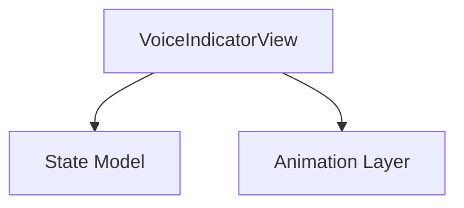

## Purpose
Provides the visual foundation for Voice Indicator – Animated Eyes with Audio Levels.

**Out of scope:**
- Business logic
- Data persistence

## Primary Features
- **Visual:** Minimal animated display, responds to state
- **Interaction:** Keyboard/mouse accessible
- **Accessibility:** VoiceOver labels and focus order

## Architecture

