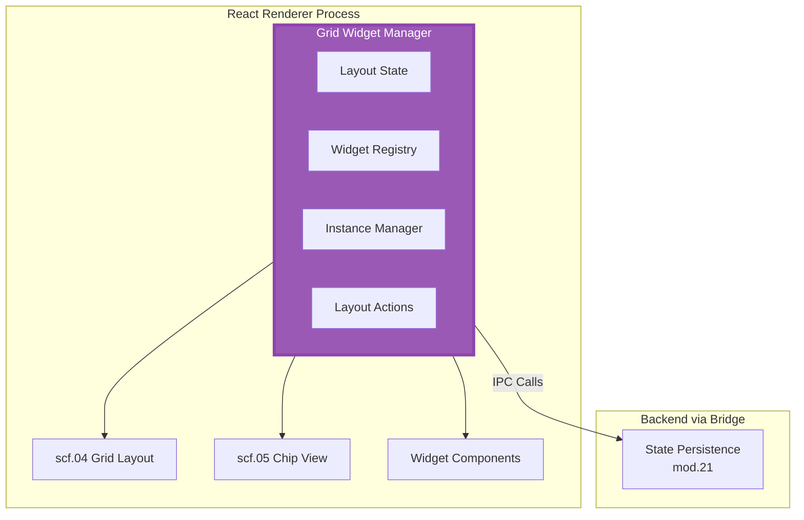

# ===== SCAFFOLD IDENTITY =====
title: "Grid Widget Manager - Layout State & Widget Registry"
scaffold_id: "2-scf.12_grid_widget_manager"
type: "scaffold"
category: "frontend-state"

# ===== SYSTEMATIC SCAFFOLDING =====
lifecycle: "dev"
state: "minimal"
seat: "mvp"

# ===== AVAILABILITY AND ACCESS =====
phase_availability: "always"
priority: "critical"
agent_accessible: true
user_configurable: true

# ===== PROMOTION GATES =====
promotion_gates:
  to_intermediate_i1:
    - "Can add, remove, and reposition widgets on the grid."
    - "Widget layout persists across application restarts."
    - "Basic collision detection prevents widget overlap."
  to_complete:
    - "Advanced grid packing algorithms auto-organize layout."
    - "Widgets can be resized and locked in place."
    - "Layout can be exported/imported as JSON configurations."

# ===== OBSERVABILITY =====
observability:
  metrics:
    - "grid_widget_manager.widget.count"
    - "grid_widget_manager.layout.change_frequency"
    - "grid_widget_manager.persistence.duration_ms"
  alerts:
    - "grid_widget_manager.persistence.failed"
    - "grid_widget_manager.layout.corruption_detected"
  dashboards:
    - "grid_widget_manager_layout_metrics"

# ===== SECURITY REQUIREMENTS =====
security:
  authentication_required: false
  authorization_level: "user"
  data_classification: "user_preferences"
  encryption_at_rest: true
  audit_logging: false

# ===== TECHNICAL METADATA =====
dependencies: ["mod.17_electron_bridge", "mod.21_state_persistence"]
integrations: ["scf.04_grid_layout", "scf.05_chip_view"]
last_updated: "2025-10-06"
version: "1.0.0"
maintainer: "Lech/Claude"

# ===== AGENTIC INTEGRATION =====
agent_capabilities:
  can_read: true
  can_write: true
  can_propose_changes: false
  requires_approval: false
---

# 2-scf.12. Grid Widget Manager - Layout State & Widget Registry

## Purpose

To act as the **single, unified authority** for the application's grid system. It combines grid layout state management with widget registration into one cohesive module, providing a clear source of truth for all widget-related operations in the UI.

**Out of Scope:**
- Rendering any UI components (delegates to React components like `scf.04_GRID_LAYOUT`)
- Direct filesystem operations (delegates to `mod.21_STATE_PERSISTENCE` via Electron Bridge)
- Widget business logic implementation (manages references, not functionality)

---

## Primary Features

- **Unified Grid State:** Maintains the complete layout state as a single object mapping widget instance IDs to their positions and dimensions (`{x, y, w, h}`).

- **Widget Registry:** Holds the authoritative list of all available widget types and their metadata (name, description, icon, default size, category).

- **Instance Management:** Tracks all active widget instances on the grid, including their type, current configuration, and runtime state.

- **Layout Actions:** Provides a clean API for grid operations (`addWidget`, `removeWidget`, `moveWidget`, `resizeWidget`, `lockWidget`).

- **Persistence Coordination:** Handles saving/loading the entire grid layout through the Electron Bridge to backend persistence services.

- **Collision Prevention:** Enforces layout rules to prevent widget overlap and maintain grid integrity.

---

## Architecture

The Grid Widget Manager is a pure state management store (Zustand/Redux) that lives in the React renderer process. It serves as the central hub for all grid-related operations.



**Core State Structure:**
```typescript
interface GridWidgetManagerState {
  // Layout: Mapping of instanceId → layout info
  layout: Record<string, {
    x: number;
    y: number;
    w: number;
    h: number;
    isLocked: boolean;
  }>;

  // Registry: All available widget types
  widgetRegistry: Record<string, {
    id: string;
    name: string;
    description: string;
    icon: string;
    defaultSize: { w: number; h: number };
    category: string;
  }>;

  // Instances: Active widgets on grid
  instances: Record<string, {
    instanceId: string;
    widgetTypeId: string;
    config: Record<string, any>;
    isActive: boolean;
  }>;

  // UI State
  selectedWidgetId: string | null;
  isDragging: boolean;
}
```

---

## Contracts

The manager provides actions for grid manipulation and queries for UI components.

```typescript
// Layout Actions
interface LayoutActions {
  addWidget: (widgetTypeId: string, position?: {x: number, y: number}) => string;
  removeWidget: (instanceId: string) => void;
  moveWidget: (instanceId: string, position: {x: number, y: number}) => void;
  resizeWidget: (instanceId: string, size: {w: number, h: number}) => void;
  lockWidget: (instanceId: string, isLocked: boolean) => void;
  selectWidget: (instanceId: string | null) => void;

  // Layout management
  packLayout: () => void; // Auto-organize widgets
  resetLayout: () => void;
  saveLayout: () => Promise<void>;
  loadLayout: () => Promise<void>;
}

// Widget Registry Queries
interface WidgetRegistryQueries {
  getAvailableWidgets: () => WidgetType[];
  getWidgetById: (id: string) => WidgetType | null;
  searchWidgets: (query: string) => WidgetType[];
}

// Instance Management
interface InstanceQueries {
  getActiveInstances: () => WidgetInstance[];
  getInstanceById: (id: string) => WidgetInstance | null;
  getInstancesByType: (typeId: string) => WidgetInstance[];
}
```

---

## State Progression & Promotion Gates

### Current State: minimal

### Minimal State
**Definition:** Basic grid functionality with manual widget placement.
**Requirements:**
- [ ] Can add widgets to grid at specific positions
- [ ] Can remove widgets from grid
- [ ] Can drag and drop widgets to new positions
- [ ] Layout persists across app restarts

### Intermediate I1 State
**Definition:** Advanced grid management with widget registry.
**Requirements:**
- [ ] All `minimal` requirements met
- [ ] Widget registry is populated with available widget types
- [ ] Can search and filter available widgets
- [ ] Basic collision detection prevents widget overlap
- [ ] Widget configurations can be edited via properties panel

### Complete State
**Definition:** Professional grid management with advanced features.
**Requirements:**
- [ ] All `I1` requirements met
- [ ] Layout packing algorithms auto-organize widgets
- [ ] Widgets can be resized by dragging corners/edges
- [ ] Widgets can be locked to prevent accidental movement
- [ ] Layout can be exported/imported as JSON
- [ ] Multiple layout presets can be saved and switched

---

## Production Implementation

```typescript
// /src/state/GridWidgetManager.ts
import { create } from 'zustand';
import { subscribeWithSelector } from 'zustand/middleware';

interface GridWidgetManagerStore extends LayoutActions, WidgetRegistryQueries, InstanceQueries {
  state: GridWidgetManagerState;
}

export const useGridWidgetManager = create<GridWidgetManagerStore>()(
  subscribeWithSelector((set, get) => ({
    state: {
      layout: {},
      widgetRegistry: {},
      instances: {},
      selectedWidgetId: null,
      isDragging: false,
    },

    // Layout Actions
    addWidget: (widgetTypeId: string, position = {x: 0, y: 0}) => {
      const widgetType = get().getWidgetById(widgetTypeId);
      if (!widgetType) return;

      const instanceId = `${widgetTypeId}_${Date.now()}`;
      const instance = {
        instanceId,
        widgetTypeId,
        config: {},
        isActive: true,
      };

      set((state) => ({
        instances: { ...state.instances, [instanceId]: instance },
        layout: {
          ...state.layout,
          [instanceId]: {
            x: position.x,
            y: position.y,
            w: widgetType.defaultSize.w,
            h: widgetType.defaultSize.h,
            isLocked: false,
          }
        },
      }));

      return instanceId;
    },

    removeWidget: (instanceId: string) => {
      set((state) => {
        const newInstances = { ...state.instances };
        const newLayout = { ...state.layout };
        delete newInstances[instanceId];
        delete newLayout[instanceId];
        return { instances: newInstances, layout: newLayout };
      });
    },

    moveWidget: (instanceId: string, position: {x: number, y: number}) => {
      if (get().state.layout[instanceId]?.isLocked) return;

      set((state) => ({
        layout: {
          ...state.layout,
          [instanceId]: { ...state.layout[instanceId], ...position }
        }
      }));
    },

    // ... other actions implementation

    // Widget Registry Queries
    getAvailableWidgets: () => {
      return Object.values(get().state.widgetRegistry);
    },

    getWidgetById: (id: string) => {
      return get().state.widgetRegistry[id] || null;
    },

    // ... other query implementations
  }))
);
```

---

## Testing Strategy

1. **Unit Test: Widget Addition**
   - **Given:** An empty grid and available widget types
   - **When:** `addWidget('chat_widget')` is called
   - **Then:** A new widget instance appears in the layout at position (0,0)

2. **Unit Test: Collision Detection**
   - **Given:** A widget at position (0,0) with size (2,2)
   - **When:** `addWidget('new_widget', {x: 1, y: 1})` is called
   - **Then:** The new widget should be placed at the next available position

3. **Integration Test: Persistence**
   - **Given:** A grid with multiple widgets
   - **When:** `saveLayout()` is called, then the app restarts and `loadLayout()` is called
   - **Then:** The grid layout should be exactly as saved

---