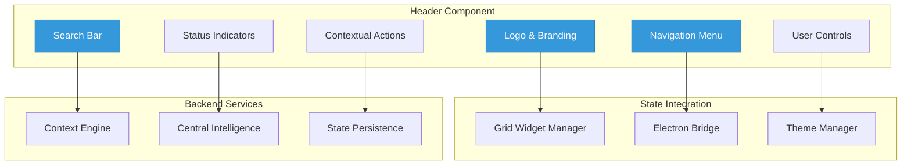

# ===== SCAFFOLD IDENTITY =====
title: "Header - Application Navigation & Controls"
scaffold_id: "scf.01_header"
type: "scaffold"
category: "frontend-component"

# ===== SYSTEMATIC SCAFFOLDING =====
lifecycle: "dev"
state: "minimal"
seat: "mvp"

# ===== AVAILABILITY AND ACCESS =====
phase_availability: "always"
priority: "high"
agent_accessible: true
user_configurable: true

# ===== PROMOTION GATES =====
promotion_gates:
  to_intermediate_i1:
    - "Displays application title and navigation elements."
    - "Provides access to main application functions."
    - "Shows system status indicators."
  to_complete:
    - "Implements responsive design for all screen sizes."
    - "Supports keyboard navigation and accessibility."
    - "Provides customization options for user preferences."

# ===== OBSERVABILITY =====
observability:
  metrics:
    - "header.interaction.total"
    - "header.navigation.frequency"
    - "header.search.usage"
  alerts:
    - "header.performance.slow"
  dashboards:
    - "ui_interaction_metrics"

# ===== SECURITY REQUIREMENTS =====
security:
  authentication_required: false
  authorization_level: "user"
  data_classification: "public"
  encryption_at_rest: false
  audit_logging: false

# ===== TECHNICAL METADATA =====
dependencies: ["mod.17_electron_bridge", "2-scf.12_grid_widget_manager"]
integrations: ["all UI components"]
last_updated: "2025-10-06"
version: "1.0.0"
maintainer: "Lech/Claude"

# ===== AGENTIC INTEGRATION =====
agent_capabilities:
  can_read: true
  can_write: true
  can_propose_changes: false
  requires_approval: false
---

# scf.01. Header - Application Navigation & Controls

## Purpose

To act as the **primary navigation and control hub** for the entire application. It provides consistent access to core functionality, system status, and user settings while maintaining a clean, professional appearance that adapts to different contexts and screen sizes.

**Out of Scope:**
- Business logic implementation (provides UI, delegates to backend services)
- Content rendering (focuses on navigation and controls)
- Complex data visualization (delegates to specialized components)

---

## Primary Features

- **Application Branding:** Displays the Orchestra LocalBrain logo, title, and version information.

- **Main Navigation:** Provides access to core sections (Dashboard, Chat, Settings, Agents).

- **Search Integration:** Quick access to contextual search across conversations, files, and memory.

- **System Status:** Shows connection status, active AI providers, and system health indicators.

- **User Controls:** Access to settings, theme switching, and user profile management.

- **Contextual Actions:** Dynamic action buttons that change based on the current active view.

---

## Architecture

The Header is a fixed-position React component that integrates with the application state management and provides responsive navigation.



**Component Structure:**
```typescript
interface HeaderProps {
  // Current application state
  activeSection: string;
  isConnected: boolean;
  activeProvider: AIProvider;
  notificationCount: number;

  // User preferences
  theme: Theme;
  compactMode: boolean;

  // Event handlers
  onNavigate: (section: string) => void;
  onSearch: (query: string) => void;
  onSettings: () => void;
}

interface HeaderState {
  isSearchFocused: boolean;
  searchQuery: string;
  notifications: Notification[];
  isMenuOpen: boolean;
}
```

---

## Responsive Design

The Header adapts to different screen sizes with three primary layouts:

**Desktop (>1200px):**
- Full navigation with text labels
- Complete search bar with suggestions
- All status indicators visible
- User menu with avatar

**Tablet (768px-1200px):**
- Icon-based navigation with tooltips
- Compact search bar
- Essential status indicators
- Collapsible menu

**Mobile (<768px):**
- Hamburger menu for navigation
- Hidden search (accessible via button)
- Minimal status indicators
- Vertical drawer for menu items

---

## State Progression & Promotion Gates

### Current State: minimal

### Minimal State
**Definition:** Basic header with static navigation elements.
**Requirements:**
- [ ] Displays application logo and title
- [ ] Basic navigation menu works
- [ ] Shows connection status indicator
- [ ] Responsive for mobile/desktop

### Intermediate I1 State
**Definition:** Interactive header with search and user controls.
**Requirements:**
- [ ] All `minimal` requirements met
- [ ] Functional search with autocomplete
- [ ] User settings access
- [ ] Notification system
- [ ] Theme switching capability

### Complete State
**Definition:** Professional header with advanced features and accessibility.
**Requirements:**
- [ ] All `I1` requirements met
- [ ] Full keyboard navigation support
- [ ] Screen reader compatibility
- [ ] Advanced search with filters
- [ ] Customizable layout options
- [ ] Performance optimized rendering

---

## Production Implementation

```typescript
// /src/components/Header/Header.tsx
import React, { useState, useEffect } from 'react';
import { useNavigate } from 'react-router-dom';
import { useGridWidgetManager } from '../../state/GridWidgetManager';
import { SearchBar } from './SearchBar';
import { NavigationMenu } from './NavigationMenu';
import { StatusIndicators } from './StatusIndicators';
import { UserControls } from './UserControls';

export const Header: React.FC<HeaderProps> = ({
  activeSection,
  isConnected,
  activeProvider,
  notificationCount,
  theme,
  compactMode,
  onNavigate,
  onSearch,
  onSettings
}) => {
  const [isSearchFocused, setIsSearchFocused] = useState(false);
  const [searchQuery, setSearchQuery] = useState('');
  const [notifications, setNotifications] = useState<Notification[]>([]);
  const [isMenuOpen, setIsMenuOpen] = useState(false);

  const navigate = useNavigate();
  const { getActiveInstances } = useGridWidgetManager();

  useEffect(() => {
    // Load notifications from backend
    loadNotifications();
  }, []);

  const handleSearch = (query: string) => {
    setSearchQuery(query);
    if (query.trim()) {
      onSearch(query);
    }
  };

  const handleNavigation = (section: string) => {
    onNavigate(section);
    setIsMenuOpen(false);
  };

  const handleNotificationClick = () => {
    // Handle notification panel open
  };

  return (
    <header className={`header header--${theme} ${compactMode ? 'header--compact' : ''}`}>
      <div className="header__container">
        {/* Logo and Branding */}
        <div className="header__branding">
          
          <h1 className="header__title">
            Orchestra LocalBrain
            <span className="header__version">v2.0</span>
          </h1>
        </div>

        {/* Main Navigation */}
        <NavigationMenu
          activeSection={activeSection}
          onNavigate={handleNavigation}
          isMenuOpen={isMenuOpen}
          onMenuToggle={() => setIsMenuOpen(!isMenuOpen)}
          compactMode={compactMode}
        />

        {/* Search Bar */}
        <SearchBar
          query={searchQuery}
          onFocus={() => setIsSearchFocused(true)}
          onBlur={() => setIsSearchFocused(false)}
          onSearch={handleSearch}
          isFocused={isSearchFocused}
          compactMode={compactMode}
        />

        {/* Status Indicators */}
        <StatusIndicators
          isConnected={isConnected}
          activeProvider={activeProvider}
          activeWidgetCount={getActiveInstances().length}
          compactMode={compactMode}
        />

        {/* User Controls */}
        <UserControls
          notificationCount={notificationCount}
          notifications={notifications}
          theme={theme}
          onSettings={onSettings}
          onNotificationClick={handleNotificationClick}
          compactMode={compactMode}
        />
      </div>

      {/* Search Overlay (when focused) */}
      {isSearchFocused && (
        <div className="header__search-overlay">
          <SearchOverlay
            query={searchQuery}
            onClose={() => setIsSearchFocused(false)}
          />
        </div>
      )}
    </header>
  );
};

// Search Component
export const SearchBar: React.FC<SearchBarProps> = ({
  query,
  onFocus,
  onBlur,
  onSearch,
  isFocused,
  compactMode
}) => {
  const [suggestions, setSuggestions] = useState<string[]>([]);

  const handleInputChange = (e: React.ChangeEvent<HTMLInputElement>) => {
    const value = e.target.value;
    onSearch(value);

    // Fetch suggestions
    if (value.length > 2) {
      fetchSearchSuggestions(value).then(setSuggestions);
    } else {
      setSuggestions([]);
    }
  };

  return (
    <div className={`search-bar ${isFocused ? 'search-bar--focused' : ''} ${compactMode ? 'search-bar--compact' : ''}`}>
      <div className="search-bar__container">
        <Icon name="search" className="search-bar__icon" />
        <input
          type="text"
          value={query}
          onChange={handleInputChange}
          onFocus={onFocus}
          onBlur={onBlur}
          placeholder="Search conversations, files, memory..."
          className="search-bar__input"
          aria-label="Search"
        />
        {query && (
          <button
            onClick={() => onSearch('')}
            className="search-bar__clear"
            aria-label="Clear search"
          >
            <Icon name="close" />
          </button>
        )}
      </div>

      {/* Suggestions Dropdown */}
      {suggestions.length > 0 && (
        <div className="search-bar__suggestions">
          {suggestions.map((suggestion, index) => (
            <button
              key={index}
              onClick={() => onSearch(suggestion)}
              className="search-bar__suggestion"
            >
              {suggestion}
            </button>
          ))}
        </div>
      )}
    </div>
  );
};

// Navigation Menu Component
export const NavigationMenu: React.FC<NavigationMenuProps> = ({
  activeSection,
  onNavigate,
  isMenuOpen,
  onMenuToggle,
  compactMode
}) => {
  const navigationItems = [
    { id: 'dashboard', label: 'Dashboard', icon: 'grid' },
    { id: 'chat', label: 'Chat', icon: 'message-circle' },
    { id: 'agents', label: 'Agents', icon: 'users' },
    { id: 'settings', label: 'Settings', icon: 'settings' }
  ];

  return (
    <nav className={`navigation ${compactMode ? 'navigation--compact' : ''}`}>
      {/* Desktop Navigation */}
      {!compactMode && (
        <ul className="navigation__list">
          {navigationItems.map(item => (
            <li key={item.id} className="navigation__item">
              <button
                onClick={() => onNavigate(item.id)}
                className={`navigation__link ${activeSection === item.id ? 'navigation__link--active' : ''}`}
                aria-current={activeSection === item.id ? 'page' : undefined}
              >
                <Icon name={item.icon} className="navigation__icon" />
                <span className="navigation__label">{item.label}</span>
              </button>
            </li>
          ))}
        </ul>
      )}

      {/* Mobile Menu Toggle */}
      <button
        onClick={onMenuToggle}
        className="navigation__toggle"
        aria-label="Toggle navigation menu"
        aria-expanded={isMenuOpen}
      >
        <Icon name={isMenuOpen ? 'close' : 'menu'} />
      </button>

      {/* Mobile Navigation Drawer */}
      {isMenuOpen && (
        <div className="navigation__drawer">
          <ul className="navigation__drawer-list">
            {navigationItems.map(item => (
              <li key={item.id} className="navigation__drawer-item">
                <button
                  onClick={() => onNavigate(item.id)}
                  className={`navigation__drawer-link ${activeSection === item.id ? 'navigation__drawer-link--active' : ''}`}
                >
                  <Icon name={item.icon} className="navigation__drawer-icon" />
                  <span className="navigation__drawer-label">{item.label}</span>
                </button>
              </li>
            ))}
          </ul>
        </div>
      )}
    </nav>
  );
};
```

**CSS (using CSS Modules):**
```css
/* Header.module.css */
.header {
  position: fixed;
  top: 0;
  left: 0;
  right: 0;
  height: 64px;
  background: var(--surface-primary);
  border-bottom: 1px solid var(--border-primary);
  z-index: 1000;
  transition: all 0.3s ease;
}

.header__container {
  display: flex;
  align-items: center;
  justify-content: space-between;
  height: 100%;
  padding: 0 24px;
  max-width: 1600px;
  margin: 0 auto;
}

.header--compact {
  height: 48px;
}

.header--compact .header__container {
  padding: 0 16px;
}

.header__branding {
  display: flex;
  align-items: center;
  gap: 12px;
  min-width: 200px;
}

.header__logo {
  width: 32px;
  height: 32px;
}

.header__title {
  font-size: 18px;
  font-weight: 600;
  color: var(--text-primary);
  margin: 0;
}

.header__version {
  font-size: 12px;
  color: var(--text-secondary);
  margin-left: 8px;
}

/* Responsive Design */
@media (max-width: 768px) {
  .header__container {
    padding: 0 12px;
  }

  .header__branding {
    min-width: auto;
  }

  .header__title {
    display: none;
  }
}

@media (max-width: 480px) {
  .header {
    height: 56px;
  }

  .header__container {
    padding: 0 8px;
  }
}
```

---

## Testing Strategy

1. **Component Test: Navigation Rendering**
   - **Given:** The Header component with activeSection='dashboard'
   - **When:** The component renders
   - **Then:** The dashboard navigation link should have active styling

2. **Interaction Test: Search Functionality**
   - **Given:** A search input in the header
   - **When:** User types "machine learning" and presses Enter
   - **Then:** onSearch callback should be called with "machine learning"

3. **Responsive Test: Mobile Layout**
   - **Given:** Screen width is 480px
   - **When:** Header component renders
   - **Then:** Should show hamburger menu and hide text labels

4. **Accessibility Test: Keyboard Navigation**
   - **Given:** Header component is rendered
   - **When:** User tabs through navigation items
   - **Then:** All interactive elements should be focusable in logical order

---