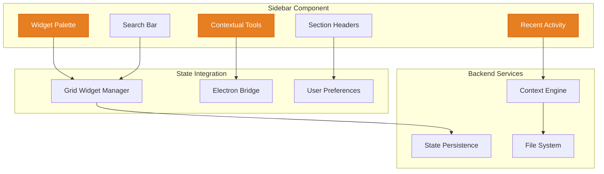

# ===== SCAFFOLD IDENTITY =====
title: "Sidebar - Contextual Navigation & Widget Palette"
scaffold_id: "scf.02_sidebar"
type: "scaffold"
category: "frontend-component"

# ===== SYSTEMATIC SCAFFOLDING =====
lifecycle: "dev"
state: "minimal"
seat: "mvp"

# ===== AVAILABILITY AND ACCESS =====
phase_availability: "always"
priority: "high"
agent_accessible: true
user_configurable: true

# ===== PROMOTION GATES =====
promotion_gates:
  to_intermediate_i1:
    - "Displays available widgets in a draggable palette."
    - "Provides quick access to recent conversations and files."
    - "Supports collapsible sections for space efficiency."
  to_complete:
    - "Implements widget categories and search functionality."
    - "Supports custom widget organization and favorites."
    - "Provides contextual tools based on active view."

# ===== OBSERVABILITY =====
observability:
  metrics:
    - "sidebar.interaction.total"
    - "sidebar.widget.drag.frequency"
    - "sidebar.section.toggle.frequency"
  alerts:
    - "sidebar.performance.slow"
  dashboards:
    - "ui_interaction_metrics"

# ===== SECURITY REQUIREMENTS =====
security:
  authentication_required: false
  authorization_level: "user"
  data_classification: "public"
  encryption_at_rest: false
  audit_logging: false

# ===== TECHNICAL METADATA =====
dependencies: ["mod.17_electron_bridge", "2-scf.12_grid_widget_manager"]
integrations: ["scf.04_grid_layout", "scf.05_chip_view"]
last_updated: "2025-10-06"
version: "1.0.0"
maintainer: "Lech/Claude"

# ===== AGENTIC INTEGRATION =====
agent_capabilities:
  can_read: true
  can_write: true
  can_propose_changes: false
  requires_approval: false
---

# scf.02. Sidebar - Contextual Navigation & Widget Palette

## Purpose

To act as the **dynamic navigation and widget discovery hub** that provides quick access to available widgets, recent activity, and contextual tools. It adapts its content based on the current active section and user behavior, serving as both a widget palette and a quick navigation tool.

**Out of Scope:**
- Widget business logic (provides access, delegates functionality)
- Content rendering and management (focuses on navigation and discovery)
- Complex data operations (delegates to backend services)

---

## Primary Features

- **Widget Palette:** Displays all available widgets organized by category with drag-and-drop functionality.

- **Quick Navigation:** Provides fast access to recent conversations, files, and frequently used tools.

- **Contextual Tools:** Shows relevant actions and tools based on the current active section or selected widget.

- **Collapsible Sections:** Allows users to customize which sections are visible to optimize screen real estate.

- **Search and Filter:** Quick search functionality for widgets and recent items.

- **Favorites Organization:** Lets users mark frequently used widgets and tools as favorites for quick access.

---

## Architecture

The Sidebar is a collapsible React component that integrates with the Grid Widget Manager and adapts to user context.



**Component Structure:**
```typescript
interface SidebarProps {
  // Layout state
  isCollapsed: boolean;
  activeSection: string;
  selectedWidgetId?: string;

  // Widget management
  availableWidgets: WidgetType[];
  recentItems: RecentItem[];
  favorites: string[];

  // Event handlers
  onToggleCollapse: () => void;
  onWidgetDragStart: (widgetType: WidgetType) => void;
  onNavigate: (destination: string) => void;
  onAddFavorite: (widgetId: string) => void;
  onRemoveFavorite: (widgetId: string) => void;
}

interface SidebarState {
  searchTerm: string;
  expandedSections: Set<string>;
  activeCategory: string;
}
```

**Widget Categories:**
- **Communication:** Chat, Voice, Video, Email
- **Data & Analytics:** Charts, Tables, Metrics, Dashboards
- **Productivity:** Notes, Tasks, Calendar, Reminders
- **Development:** Code Editor, Terminal, API Tools, Debug
- **Media:** Image Viewer, Audio Player, Video Player
- **System:** File Browser, Settings, Monitor

---

## Responsive Behavior

The Sidebar adapts to different screen sizes and user preferences:

**Desktop (>1200px):**
- Full sidebar with all sections visible
- Widget descriptions and metadata
- Rich interaction states and hover effects

**Tablet (768px-1200px):**
- Compact sidebar with icon-based navigation
- Collapsible sections to save space
- Simplified widget cards

**Mobile (<768px):**
- Overlay sidebar that slides in from left
- Minimal widget information
- Touch-optimized interactions

---

## State Progression & Promotion Gates

### Current State: minimal

### Minimal State
**Definition:** Basic sidebar with widget palette and collapsible sections.
**Requirements:**
- [ ] Displays available widgets in categorized list
- [ ] Supports drag-and-drop to grid
- [ ] Can collapse/expand sidebar
- [ ] Shows basic recent items list

### Intermediate I1 State
**Definition:** Enhanced sidebar with search and favorites.
**Requirements:**
- [ ] All `minimal` requirements met
- [ ] Functional search across widgets and recent items
- [ ] Favorites system with quick access
- [ ] Contextual tools based on active section
- [ ] Responsive design for all screen sizes

### Complete State
**Definition:** Professional sidebar with advanced features and customization.
**Requirements:**
- [ ] All `I1` requirements met
- [ ] Custom widget organization and user-created categories
- [ ] Advanced filtering and sorting options
- [ ] Keyboard navigation and accessibility
- [ ] Performance optimization for large widget libraries
- [ ] Analytics and usage tracking integration

---

## Production Implementation

```typescript
// /src/components/Sidebar/Sidebar.tsx
import React, { useState, useEffect, useMemo } from 'react';
import { useGridWidgetManager } from '../../state/GridWidgetManager';
import { WidgetPalette } from './WidgetPalette';
import { RecentActivity } from './RecentActivity';
import { ContextualTools } from './ContextualTools';
import { SidebarSearch } from './SidebarSearch';
import { SectionHeader } from './SectionHeader';

export const Sidebar: React.FC<SidebarProps> = ({
  isCollapsed,
  activeSection,
  selectedWidgetId,
  availableWidgets,
  recentItems,
  favorites,
  onToggleCollapse,
  onWidgetDragStart,
  onNavigate,
  onAddFavorite,
  onRemoveFavorite
}) => {
  const [searchTerm, setSearchTerm] = useState('');
  const [expandedSections, setExpandedSections] = useState<Set<string>>(new Set(['widgets', 'recent']));
  const [activeCategory, setActiveCategory] = useState('all');

  const { addWidget } = useGridWidgetManager();

  // Filter widgets based on search and category
  const filteredWidgets = useMemo(() => {
    return availableWidgets.filter(widget => {
      const matchesSearch = !searchTerm ||
        widget.name.toLowerCase().includes(searchTerm.toLowerCase()) ||
        widget.description.toLowerCase().includes(searchTerm.toLowerCase());

      const matchesCategory = activeCategory === 'all' || widget.category === activeCategory;

      return matchesSearch && matchesCategory;
    });
  }, [availableWidgets, searchTerm, activeCategory]);

  // Filter recent items based on search
  const filteredRecentItems = useMemo(() => {
    return recentItems.filter(item =>
      !searchTerm || item.title.toLowerCase().includes(searchTerm.toLowerCase())
    );
  }, [recentItems, searchTerm]);

  const handleWidgetDragStart = (widgetType: WidgetType) => {
    onWidgetDragStart(widgetType);
  };

  const handleSectionToggle = (sectionId: string) => {
    setExpandedSections(prev => {
      const newExpanded = new Set(prev);
      if (newExpanded.has(sectionId)) {
        newExpanded.delete(sectionId);
      } else {
        newExpanded.add(sectionId);
      }
      return newExpanded;
    });
  };

  const handleWidgetAdd = (widgetType: WidgetType) => {
    addWidget(widgetType.id);
  };

  if (isCollapsed) {
    return <CollapsedSidebar onToggleCollapse={onToggleCollapse} />;
  }

  return (
    <aside className={`sidebar ${isCollapsed ? 'sidebar--collapsed' : ''}`}>
      {/* Sidebar Header */}
      <div className="sidebar__header">
        <button
          onClick={onToggleCollapse}
          className="sidebar__toggle"
          aria-label="Collapse sidebar"
        >
          <Icon name="chevron-left" />
        </button>
        <h2 className="sidebar__title">Tools & Widgets</h2>
      </div>

      {/* Search Bar */}
      <div className="sidebar__search">
        <SidebarSearch
          value={searchTerm}
          onChange={setSearchTerm}
          placeholder="Search widgets and items..."
        />
      </div>

      {/* Widget Palette */}
      <div className="sidebar__section">
        <SectionHeader
          title="Widgets"
          icon="grid"
          isExpanded={expandedSections.has('widgets')}
          onToggle={() => handleSectionToggle('widgets')}
          count={filteredWidgets.length}
        />

        {expandedSections.has('widgets') && (
          <div className="sidebar__content">
            {/* Category Filter */}
            <div className="sidebar__categories">
              <button
                className={`sidebar__category ${activeCategory === 'all' ? 'sidebar__category--active' : ''}`}
                onClick={() => setActiveCategory('all')}
              >
                All
              </button>
              {Object.values(WidgetCategory).map(category => (
                <button
                  key={category}
                  className={`sidebar__category ${activeCategory === category ? 'sidebar__category--active' : ''}`}
                  onClick={() => setActiveCategory(category)}
                >
                  {category}
                </button>
              ))}
            </div>

            {/* Widget Grid */}
            <WidgetPalette
              widgets={filteredWidgets}
              favorites={favorites}
              onDragStart={handleWidgetDragStart}
              onAdd={handleWidgetAdd}
              onAddFavorite={onAddFavorite}
              onRemoveFavorite={onRemoveFavorite}
            />
          </div>
        )}
      </div>

      {/* Recent Activity */}
      <div className="sidebar__section">
        <SectionHeader
          title="Recent"
          icon="clock"
          isExpanded={expandedSections.has('recent')}
          onToggle={() => handleSectionToggle('recent')}
          count={filteredRecentItems.length}
        />

        {expandedSections.has('recent') && (
          <div className="sidebar__content">
            <RecentActivity
              items={filteredRecentItems}
              onNavigate={onNavigate}
            />
          </div>
        )}
      </div>

      {/* Contextual Tools */}
      <div className="sidebar__section">
        <SectionHeader
          title="Tools"
          icon="tool"
          isExpanded={expandedSections.has('tools')}
          onToggle={() => handleSectionToggle('tools')}
        />

        {expandedSections.has('tools') && (
          <div className="sidebar__content">
            <ContextualTools
              activeSection={activeSection}
              selectedWidgetId={selectedWidgetId}
              onNavigate={onNavigate}
            />
          </div>
        )}
      </div>
    </aside>
  );
};

// Widget Palette Component
export const WidgetPalette: React.FC<WidgetPaletteProps> = ({
  widgets,
  favorites,
  onDragStart,
  onAdd,
  onAddFavorite,
  onRemoveFavorite
}) => {
  const handleDragStart = (e: React.DragEvent, widget: WidgetType) => {
    e.dataTransfer.setData('text/plain', JSON.stringify(widget));
    e.dataTransfer.effectAllowed = 'copy';
    onDragStart(widget);
  };

  const handleDragEnd = () => {
    // Clean up any drag states
  };

  return (
    <div className="widget-palette">
      <div className="widget-palette__grid">
        {widgets.map(widget => (
          <div
            key={widget.id}
            className="widget-palette__item"
            draggable
            onDragStart={(e) => handleDragStart(e, widget)}
            onDragEnd={handleDragEnd}
          >
            <div className="widget-palette__card">
              <div className="widget-palette__header">
                
                <button
                  onClick={() => favorites.includes(widget.id)
                    ? onRemoveFavorite(widget.id)
                    : onAddFavorite(widget.id)}
                  className="widget-palette__favorite"
                  aria-label={favorites.includes(widget.id) ? 'Remove from favorites' : 'Add to favorites'}
                >
                  <Icon
                    name={favorites.includes(widget.id) ? 'star-filled' : 'star'}
                    className={favorites.includes(widget.id) ? 'widget-palette__favorite--active' : ''}
                  />
                </button>
              </div>

              <div className="widget-palette__content">
                <h3 className="widget-palette__name">{widget.name}</h3>
                <p className="widget-palette__description">{widget.description}</p>

                <div className="widget-palette__meta">
                  <span className="widget-palette__category">{widget.category}</span>
                  <span className="widget-palette__size">
                    {widget.defaultSize.w}×{widget.defaultSize.h}
                  </span>
                </div>
              </div>

              <button
                onClick={() => onAdd(widget)}
                className="widget-palette__add"
                aria-label={`Add ${widget.name} to grid`}
              >
                <Icon name="plus" />
              </button>
            </div>
          </div>
        ))}
      </div>
    </div>
  );
};

// Recent Activity Component
export const RecentActivity: React.FC<RecentActivityProps> = ({
  items,
  onNavigate
}) => {
  const getItemIcon = (type: RecentItemType) => {
    switch (type) {
      case 'conversation': return 'message-circle';
      case 'file': return 'file';
      case 'widget': return 'grid';
      default: return 'clock';
    }
  };

  const formatRelativeTime = (timestamp: number) => {
    const now = Date.now();
    const diff = now - timestamp;

    if (diff < 60000) return 'Just now';
    if (diff < 3600000) return `${Math.floor(diff / 60000)}m ago`;
    if (diff < 86400000) return `${Math.floor(diff / 3600000)}h ago`;
    return `${Math.floor(diff / 86400000)}d ago`;
  };

  return (
    <div className="recent-activity">
      <div className="recent-activity__list">
        {items.length === 0 ? (
          <div className="recent-activity__empty">
            <Icon name="clock" className="recent-activity__empty-icon" />
            <p className="recent-activity__empty-text">No recent activity</p>
          </div>
        ) : (
          items.map(item => (
            <button
              key={item.id}
              onClick={() => onNavigate(item.destination)}
              className="recent-activity__item"
            >
              <div className="recent-activity__icon">
                <Icon name={getItemIcon(item.type)} />
              </div>

              <div className="recent-activity__content">
                <div className="recent-activity__title">{item.title}</div>
                <div className="recent-activity__meta">
                  <span className="recent-activity__type">{item.type}</span>
                  <span className="recent-activity__time">
                    {formatRelativeTime(item.timestamp)}
                  </span>
                </div>
              </div>
            </button>
          ))
        )}
      </div>
    </div>
  );
};
```

**CSS for Sidebar:**
```css
/* Sidebar.module.css */
.sidebar {
  position: fixed;
  top: 64px;
  left: 0;
  width: 320px;
  height: calc(100vh - 64px);
  background: var(--surface-secondary);
  border-right: 1px solid var(--border-primary);
  display: flex;
  flex-direction: column;
  transition: all 0.3s ease;
  z-index: 900;
  overflow: hidden;
}

.sidebar--collapsed {
  width: 64px;
}

.sidebar__header {
  display: flex;
  align-items: center;
  padding: 16px;
  border-bottom: 1px solid var(--border-primary);
  gap: 12px;
}

.sidebar__toggle {
  background: none;
  border: none;
  padding: 8px;
  border-radius: 6px;
  cursor: pointer;
  color: var(--text-secondary);
  transition: all 0.2s ease;
}

.sidebar__toggle:hover {
  background: var(--surface-tertiary);
  color: var(--text-primary);
}

.sidebar__title {
  font-size: 16px;
  font-weight: 600;
  color: var(--text-primary);
  margin: 0;
}

.sidebar--collapsed .sidebar__title {
  display: none;
}

.sidebar__search {
  padding: 16px;
  border-bottom: 1px solid var(--border-primary);
}

.sidebar__section {
  flex: 1;
  overflow: hidden;
  display: flex;
  flex-direction: column;
}

.sidebar__content {
  flex: 1;
  overflow-y: auto;
  padding: 0 16px 16px;
}

.sidebar__categories {
  display: flex;
  gap: 8px;
  margin-bottom: 16px;
  flex-wrap: wrap;
}

.sidebar__category {
  padding: 6px 12px;
  border: 1px solid var(--border-secondary);
  border-radius: 16px;
  background: var(--surface-primary);
  color: var(--text-secondary);
  font-size: 12px;
  cursor: pointer;
  transition: all 0.2s ease;
}

.sidebar__category:hover {
  border-color: var(--border-primary);
  color: var(--text-primary);
}

.sidebar__category--active {
  background: var(--accent-primary);
  border-color: var(--accent-primary);
  color: white;
}

/* Widget Palette */
.widget-palette__grid {
  display: grid;
  grid-template-columns: repeat(auto-fill, minmax(140px, 1fr));
  gap: 12px;
}

.widget-palette__item {
  cursor: grab;
  transition: transform 0.2s ease;
}

.widget-palette__item:active {
  cursor: grabbing;
}

.widget-palette__item:hover {
  transform: translateY(-2px);
}

.widget-palette__card {
  background: var(--surface-primary);
  border: 1px solid var(--border-secondary);
  border-radius: 8px;
  padding: 12px;
  position: relative;
  transition: all 0.2s ease;
}

.widget-palette__card:hover {
  border-color: var(--border-primary);
  box-shadow: 0 4px 12px rgba(0, 0, 0, 0.1);
}

.widget-palette__header {
  display: flex;
  justify-content: space-between;
  align-items: center;
  margin-bottom: 8px;
}

.widget-palette__icon {
  width: 24px;
  height: 24px;
  border-radius: 4px;
}

.widget-palette__favorite {
  background: none;
  border: none;
  padding: 4px;
  cursor: pointer;
  color: var(--text-tertiary);
  transition: color 0.2s ease;
}

.widget-palette__favorite:hover {
  color: var(--text-secondary);
}

.widget-palette__favorite--active {
  color: var(--accent-warning);
}

.widget-palette__name {
  font-size: 14px;
  font-weight: 600;
  color: var(--text-primary);
  margin: 0 0 4px 0;
  line-height: 1.3;
}

.widget-palette__description {
  font-size: 12px;
  color: var(--text-secondary);
  margin: 0 0 8px 0;
  line-height: 1.4;
  display: -webkit-box;
  -webkit-line-clamp: 2;
  -webkit-box-orient: vertical;
  overflow: hidden;
}

.widget-palette__meta {
  display: flex;
  justify-content: space-between;
  align-items: center;
  font-size: 11px;
  color: var(--text-tertiary);
}

.widget-palette__add {
  position: absolute;
  top: 8px;
  right: 8px;
  background: var(--accent-primary);
  border: none;
  width: 24px;
  height: 24px;
  border-radius: 4px;
  color: white;
  cursor: pointer;
  display: flex;
  align-items: center;
  justify-content: center;
  opacity: 0;
  transition: opacity 0.2s ease;
}

.widget-palette__card:hover .widget-palette__add {
  opacity: 1;
}

.widget-palette__add:hover {
  background: var(--accent-primary-dark);
}

/* Responsive Design */
@media (max-width: 768px) {
  .sidebar {
    transform: translateX(-100%);
    width: 280px;
  }

  .sidebar--open {
    transform: translateX(0);
  }

  .widget-palette__grid {
    grid-template-columns: repeat(auto-fill, minmax(120px, 1fr));
  }
}

@media (max-width: 480px) {
  .sidebar {
    width: 100%;
  }

  .widget-palette__grid {
    grid-template-columns: repeat(auto-fill, minmax(100px, 1fr));
    gap: 8px;
  }
}
```

---

## Testing Strategy

1. **Component Test: Widget Rendering**
   - **Given:** A list of available widgets
   - **When:** The Sidebar component renders
   - **Then:** All widgets should be displayed in the correct categories

2. **Interaction Test: Drag and Drop**
   - **Given:** A widget in the palette
   - **When:** User starts dragging the widget
   - **Then:** onDragStart callback should be called with widget data

3. **Search Test: Widget Filtering**
   - **Given:** Multiple widgets including "Chat Widget"
   - **When:** User searches for "Chat"
   - **Then:** Only "Chat Widget" and matching widgets should be visible

4. **Responsive Test: Mobile Layout**
   - **Given:** Screen width is 480px
   - **When:** Sidebar renders
   - **Then:** Should use overlay layout with proper touch targets

---