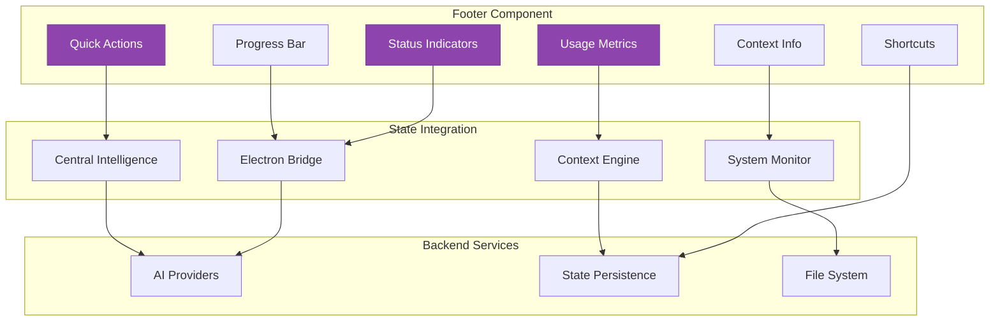

# ===== SCAFFOLD IDENTITY =====
title: "Footer - System Status & Quick Actions"
scaffold_id: "scf.03_footer"
type: "scaffold"
category: "frontend-component"

# ===== SYSTEMATIC SCAFFOLDING =====
lifecycle: "dev"
state: "minimal"
seat: "mvp"

# ===== AVAILABILITY AND ACCESS =====
phase_availability: "always"
priority: "medium"
agent_accessible: true
user_configurable: true

# ===== PROMOTION GATES =====
promotion_gates:
  to_intermediate_i1:
    - "Displays system status and connection information."
    - "Provides quick access to common actions."
    - "Shows active AI provider and usage metrics."
  to_complete:
    - "Implements customizable action buttons and status indicators."
    - "Supports keyboard shortcuts and tooltips."
    - "Provides detailed system information on hover/click."

# ===== OBSERVABILITY =====
observability:
  metrics:
    - "footer.interaction.total"
    - "footer.action.click.frequency"
    - "footer.status.hover.duration"
  alerts:
    - "footer.performance.slow"
  dashboards:
    - "ui_interaction_metrics"

# ===== SECURITY REQUIREMENTS =====
security:
  authentication_required: false
  authorization_level: "user"
  data_classification: "public"
  encryption_at_rest: false
  audit_logging: false

# ===== TECHNICAL METADATA =====
dependencies: ["mod.17_electron_bridge"]
integrations: ["all backend services"]
last_updated: "2025-10-06"
version: "1.0.0"
maintainer: "Lech/Claude"

# ===== AGENTIC INTEGRATION =====
agent_capabilities:
  can_read: true
  can_write: true
  can_propose_changes: false
  requires_approval: false
---

# scf.03. Footer - System Status & Quick Actions

## Purpose

To act as the **system information hub and quick action bar** that provides users with essential status indicators, rapid access to common functions, and contextual information about the application state. It serves as the bottom anchor of the UI, complementing the header's navigation with practical functionality.

**Out of Scope:**
- Complex application settings (delegates to Settings view)
- Detailed system monitoring (provides status, delegates to specialized views)
- Business logic implementation (provides UI shortcuts to backend services)

---

## Primary Features

- **System Status Indicators:** Displays connection status, active AI providers, and system health at a glance.

- **Quick Actions:** Provides fast access to frequently used operations like new chat, screenshot, voice input, and settings.

- **Usage Metrics:** Shows token usage, API costs, and performance metrics for active AI providers.

- **Context Information:** Displays current time, active conversation context, and other relevant situational data.

- **Progress Indicators:** Shows background operation progress, file transfers, and async task status.

- **Keyboard Shortcuts:** Displays and manages keyboard shortcut hints and customizable hotkeys.

---

## Architecture

The Footer is a fixed-position React component that integrates with multiple backend services to provide real-time status and actions.



**Component Structure:**
```typescript
interface FooterProps {
  // System status
  isOnline: boolean;
  activeProvider: AIProvider;
  systemHealth: SystemHealthStatus;

  // Usage information
  tokenUsage: TokenUsageMetrics;
  apiCosts: APICostMetrics;

  // Active operations
  backgroundTasks: BackgroundTask[];
  currentContext?: string;

  // User preferences
  showShortcuts: boolean;
  customActions: QuickAction[];

  // Event handlers
  onQuickAction: (action: QuickAction) => void;
  onToggleShortcuts: () => void;
  onShowDetailedStatus: () => void;
}

interface FooterState {
  expandedSection: 'status' | 'metrics' | 'shortcuts' | null;
  currentTime: Date;
  notifications: FooterNotification[];
}
```

---

## Responsive Design

The Footer adapts to different screen sizes while maintaining essential functionality:

**Desktop (>1200px):**
- Full footer with all sections visible
- Detailed metrics and status information
- Complete quick action toolbar

**Tablet (768px-1200px):**
- Compact footer with collapsible sections
- Essential status indicators only
- Reduced quick action set

**Mobile (<768px):**
- Minimal footer with critical status only
- Hidden metrics (accessible via tap)
- Essential quick actions only

---

## State Progression & Promotion Gates

### Current State: minimal

### Minimal State
**Definition:** Basic footer with status indicators and simple actions.
**Requirements:**
- [ ] Shows online/offline status
- [ ] Displays active AI provider
- [ ] Basic quick actions (new chat, settings)
- [ ] Current time display

### Intermediate I1 State
**Definition:** Enhanced footer with metrics and progress tracking.
**Requirements:**
- [ ] All `minimal` requirements met
- [ ] Token usage and cost metrics
- [ ] Background task progress indicators
- [ ] Keyboard shortcuts display
- [ ] Expandable sections for detailed information

### Complete State
**Definition:** Professional footer with full customization and advanced features.
**Requirements:**
- [ ] All `I1` requirements met
- [ ] Customizable quick actions and layout
- [ ] Advanced system monitoring integration
- [ ] Performance metrics and analytics
- [ ] Accessibility features and keyboard navigation
- [ ] Theme-aware styling and animations

---

## Production Implementation

```typescript
// /src/components/Footer/Footer.tsx
import React, { useState, useEffect } from 'react';
import { formatDistanceToNow } from 'date-fns';
import { StatusIndicators } from './StatusIndicators';
import { QuickActions } from './QuickActions';
import { UsageMetrics } from './UsageMetrics';
import { ContextInfo } from './ContextInfo';
import { ProgressBar } from './ProgressBar';
import { KeyboardShortcuts } from './KeyboardShortcuts';

export const Footer: React.FC<FooterProps> = ({
  isOnline,
  activeProvider,
  systemHealth,
  tokenUsage,
  apiCosts,
  backgroundTasks,
  currentContext,
  showShortcuts,
  customActions,
  onQuickAction,
  onToggleShortcuts,
  onShowDetailedStatus
}) => {
  const [expandedSection, setExpandedSection] = useState<'status' | 'metrics' | 'shortcuts' | null>(null);
  const [currentTime, setCurrentTime] = useState(new Date());

  useEffect(() => {
    const timer = setInterval(() => {
      setCurrentTime(new Date());
    }, 1000);

    return () => clearInterval(timer);
  }, []);

  const handleQuickAction = (action: QuickAction) => {
    onQuickAction(action);
  };

  const handleSectionToggle = (section: typeof expandedSection) => {
    setExpandedSection(expandedSection === section ? null : section);
  };

  const hasActiveTasks = backgroundTasks.length > 0;
  const primaryTask = backgroundTasks.find(task => task.priority === 'high') || backgroundTasks[0];

  return (
    <footer className="footer">
      <div className="footer__container">
        {/* Left Section - Status and Context */}
        <div className="footer__section footer__section--left">
          <StatusIndicators
            isOnline={isOnline}
            activeProvider={activeProvider}
            systemHealth={systemHealth}
            onShowDetails={() => handleSectionToggle('status')}
            isExpanded={expandedSection === 'status'}
          />

          <ContextInfo
            currentTime={currentTime}
            currentContext={currentContext}
            onContextClick={() => handleSectionToggle('status')}
          />
        </div>

        {/* Center Section - Quick Actions */}
        <div className="footer__section footer__section--center">
          <QuickActions
            actions={customActions}
            onAction={handleQuickAction}
            compactMode={window.innerWidth < 768}
          />
        </div>

        {/* Right Section - Metrics and Progress */}
        <div className="footer__section footer__section--right">
          <UsageMetrics
            tokenUsage={tokenUsage}
            apiCosts={apiCosts}
            onExpand={() => handleSectionToggle('metrics')}
            isExpanded={expandedSection === 'metrics'}
          />

          {hasActiveTasks && primaryTask && (
            <ProgressBar
              task={primaryTask}
              allTasks={backgroundTasks}
              onClick={() => handleSectionToggle('status')}
            />
          )}

          <button
            onClick={onToggleShortcuts}
            className={`footer__shortcuts-toggle ${showShortcuts ? 'footer__shortcuts-toggle--active' : ''}`}
            aria-label="Toggle keyboard shortcuts"
          >
            <Icon name="keyboard" />
          </button>
        </div>
      </div>

      {/* Expandable Sections */}
      {expandedSection && (
        <div className="footer__expanded">
          {expandedSection === 'status' && (
            <DetailedStatus
              systemHealth={systemHealth}
              backgroundTasks={backgroundTasks}
              onClose={() => setExpandedSection(null)}
            />
          )}

          {expandedSection === 'metrics' && (
            <DetailedMetrics
              tokenUsage={tokenUsage}
              apiCosts={apiCosts}
              onClose={() => setExpandedSection(null)}
            />
          )}

          {expandedSection === 'shortcuts' && (
            <KeyboardShortcuts
              onClose={() => setExpandedSection(null)}
            />
          )}
        </div>
      )}
    </footer>
  );
};

// Status Indicators Component
export const StatusIndicators: React.FC<StatusIndicatorsProps> = ({
  isOnline,
  activeProvider,
  systemHealth,
  onShowDetails,
  isExpanded
}) => {
  const getStatusColor = (status: 'healthy' | 'warning' | 'error') => {
    switch (status) {
      case 'healthy': return 'var(--status-success)';
      case 'warning': return 'var(--status-warning)';
      case 'error': return 'var(--status-error)';
    }
  };

  const getProviderColor = (provider: AIProvider) => {
    switch (provider) {
      case 'anthropic': return 'var(--provider-anthropic)';
      case 'openai': return 'var(--provider-openai)';
      case 'google': return 'var(--provider-google)';
      default: return 'var(--text-secondary)';
    }
  };

  return (
    <div className="status-indicators">
      <div className="status-indicators__group">
        {/* Connection Status */}
        <div className="status-indicator">
          <div
            className={`status-indicator__dot ${isOnline ? 'status-indicator__dot--online' : 'status-indicator__dot--offline'}`}
            style={{ backgroundColor: isOnline ? 'var(--status-success)' : 'var(--status-error)' }}
          />
          <span className="status-indicator__label">
            {isOnline ? 'Online' : 'Offline'}
          </span>
        </div>

        {/* AI Provider Status */}
        <div className="status-indicator">
          <div
            className="status-indicator__dot status-indicator__dot--provider"
            style={{ backgroundColor: getProviderColor(activeProvider) }}
          />
          <span className="status-indicator__label">
            {activeProvider}
          </span>
        </div>

        {/* System Health */}
        <div className="status-indicator">
          <div
            className="status-indicator__dot"
            style={{ backgroundColor: getStatusColor(systemHealth.overall) }}
          />
          <span className="status-indicator__label">
            {systemHealth.overall}
          </span>
        </div>
      </div>

      {!isExpanded && (
        <button
          onClick={onShowDetails}
          className="status-indicators__details"
          aria-label="Show detailed status"
        >
          <Icon name="info" />
        </button>
      )}
    </div>
  );
};

// Quick Actions Component
export const QuickActions: React.FC<QuickActionsProps> = ({
  actions,
  onAction,
  compactMode = false
}) => {
  const defaultActions: QuickAction[] = [
    {
      id: 'new-chat',
      label: 'New Chat',
      icon: 'message-circle-plus',
      shortcut: 'Cmd+N',
      action: () => onAction({ id: 'new-chat', label: 'New Chat', icon: 'message-circle-plus' })
    },
    {
      id: 'voice-input',
      label: 'Voice Input',
      icon: 'mic',
      shortcut: 'Cmd+Shift+V',
      action: () => onAction({ id: 'voice-input', label: 'Voice Input', icon: 'mic' })
    },
    {
      id: 'screenshot',
      label: 'Screenshot',
      icon: 'camera',
      shortcut: 'Cmd+Shift+S',
      action: () => onAction({ id: 'screenshot', label: 'Screenshot', icon: 'camera' })
    },
    {
      id: 'settings',
      label: 'Settings',
      icon: 'settings',
      shortcut: 'Cmd+,',
      action: () => onAction({ id: 'settings', label: 'Settings', icon: 'settings' })
    }
  ];

  const allActions = [...defaultActions, ...actions];

  if (compactMode) {
    return (
      <div className="quick-actions quick-actions--compact">
        {allActions.slice(0, 3).map(action => (
          <button
            key={action.id}
            onClick={action.action}
            className="quick-action quick-action--compact"
            title={`${action.label} (${action.shortcut})`}
            aria-label={action.label}
          >
            <Icon name={action.icon} />
          </button>
        ))}
      </div>
    );
  }

  return (
    <div className="quick-actions">
      {allActions.map(action => (
        <button
          key={action.id}
          onClick={action.action}
          className="quick-action"
          title={`${action.label} (${action.shortcut})`}
          aria-label={action.label}
        >
          <Icon name={action.icon} className="quick-action__icon" />
          <span className="quick-action__label">{action.label}</span>
          {action.shortcut && (
            <span className="quick-action__shortcut">{action.shortcut}</span>
          )}
        </button>
      ))}
    </div>
  );
};

// Usage Metrics Component
export const UsageMetrics: React.FC<UsageMetricsProps> = ({
  tokenUsage,
  apiCosts,
  onExpand,
  isExpanded
}) => {
  const totalTokens = tokenUsage.input + tokenUsage.output;
  const totalCost = apiCosts.currentMonth;

  const getUsageLevel = (used: number, limit: number) => {
    const percentage = (used / limit) * 100;
    if (percentage > 90) return 'high';
    if (percentage > 70) return 'medium';
    return 'low';
  };

  const usageLevel = getUsageLevel(totalTokens, tokenUsage.limit);

  return (
    <div className="usage-metrics">
      <div className="usage-metrics__primary">
        <div className="usage-metrics__item">
          <Icon name="zap" className="usage-metrics__icon" />
          <span className="usage-metrics__value">
            {totalTokens.toLocaleString()}
          </span>
          <span className="usage-metrics__label">tokens</span>
        </div>

        <div className="usage-metrics__item">
          <Icon name="dollar-sign" className="usage-metrics__icon" />
          <span className="usage-metrics__value">
            ${totalCost.toFixed(2)}
          </span>
          <span className="usage-metrics__label">this month</span>
        </div>
      </div>

      {!isExpanded && (
        <button
          onClick={onExpand}
          className="usage-metrics__expand"
          aria-label="Show detailed metrics"
        >
          <Icon name="chevron-up" />
        </button>
      )}

      {/* Usage Level Indicator */}
      <div className={`usage-metrics__level usage-metrics__level--${usageLevel}`}>
        <div className="usage-metrics__level-bar" />
      </div>
    </div>
  );
};

// Progress Bar Component
export const ProgressBar: React.FC<ProgressBarProps> = ({
  task,
  allTasks,
  onClick
}) => {
  const progress = task.progress || 0;
  const hasMultipleTasks = allTasks.length > 1;

  return (
    <div className="progress-bar" onClick={onClick}>
      <div className="progress-bar__content">
        <div className="progress-bar__info">
          <Icon name={task.icon || 'loader'} className="progress-bar__icon" />
          <span className="progress-bar__label">{task.title}</span>
          {hasMultipleTasks && (
            <span className="progress-bar__count">
              +{allTasks.length - 1} more
            </span>
          )}
        </div>

        <div className="progress-bar__percentage">
          {Math.round(progress)}%
        </div>
      </div>

      <div className="progress-bar__track">
        <div
          className="progress-bar__fill"
          style={{ width: `${progress}%` }}
        />
      </div>
    </div>
  );
};
```

**CSS for Footer:**
```css
/* Footer.module.css */
.footer {
  position: fixed;
  bottom: 0;
  left: 0;
  right: 0;
  height: 48px;
  background: var(--surface-secondary);
  border-top: 1px solid var(--border-primary);
  z-index: 800;
  display: flex;
  align-items: center;
}

.footer__container {
  display: flex;
  align-items: center;
  justify-content: space-between;
  height: 100%;
  padding: 0 16px;
  max-width: 1600px;
  margin: 0 auto;
  gap: 16px;
}

.footer__section {
  display: flex;
  align-items: center;
  gap: 16px;
  flex: 1;
}

.footer__section--left {
  justify-content: flex-start;
}

.footer__section--center {
  justify-content: center;
  flex: 2;
}

.footer__section--right {
  justify-content: flex-end;
}

/* Status Indicators */
.status-indicators {
  display: flex;
  align-items: center;
  gap: 12px;
}

.status-indicators__group {
  display: flex;
  align-items: center;
  gap: 8px;
}

.status-indicator {
  display: flex;
  align-items: center;
  gap: 6px;
  font-size: 12px;
  color: var(--text-secondary);
}

.status-indicator__dot {
  width: 8px;
  height: 8px;
  border-radius: 50%;
  background: var(--text-tertiary);
}

.status-indicator__dot--online {
  background: var(--status-success);
  box-shadow: 0 0 4px var(--status-success);
}

.status-indicator__dot--offline {
  background: var(--status-error);
}

.status-indicator__dot--provider {
  border-radius: 2px;
  width: 12px;
  height: 8px;
}

.status-indicators__details {
  background: none;
  border: none;
  padding: 4px;
  color: var(--text-tertiary);
  cursor: pointer;
  border-radius: 4px;
  transition: all 0.2s ease;
}

.status-indicators__details:hover {
  color: var(--text-secondary);
  background: var(--surface-tertiary);
}

/* Quick Actions */
.quick-actions {
  display: flex;
  align-items: center;
  gap: 4px;
}

.quick-action {
  display: flex;
  align-items: center;
  gap: 6px;
  padding: 6px 10px;
  background: var(--surface-primary);
  border: 1px solid var(--border-secondary);
  border-radius: 6px;
  color: var(--text-secondary);
  font-size: 12px;
  cursor: pointer;
  transition: all 0.2s ease;
  white-space: nowrap;
}

.quick-action:hover {
  background: var(--surface-tertiary);
  border-color: var(--border-primary);
  color: var(--text-primary);
}

.quick-action__icon {
  width: 14px;
  height: 14px;
}

.quick-action__shortcut {
  color: var(--text-tertiary);
  font-size: 10px;
  font-weight: 500;
}

.quick-actions--compact {
  gap: 2px;
}

.quick-action--compact {
  padding: 6px;
  min-width: 36px;
  justify-content: center;
}

.quick-action--compact .quick-action__label,
.quick-action--compact .quick-action__shortcut {
  display: none;
}

/* Usage Metrics */
.usage-metrics {
  position: relative;
  display: flex;
  align-items: center;
  gap: 16px;
}

.usage-metrics__primary {
  display: flex;
  align-items: center;
  gap: 12px;
}

.usage-metrics__item {
  display: flex;
  align-items: center;
  gap: 4px;
  font-size: 11px;
  color: var(--text-secondary);
}

.usage-metrics__icon {
  width: 12px;
  height: 12px;
  color: var(--text-tertiary);
}

.usage-metrics__value {
  font-weight: 600;
  color: var(--text-primary);
}

.usage-metrics__label {
  color: var(--text-tertiary);
}

.usage-metrics__expand {
  background: none;
  border: none;
  padding: 4px;
  color: var(--text-tertiary);
  cursor: pointer;
  border-radius: 4px;
  transition: all 0.2s ease;
}

.usage-metrics__expand:hover {
  color: var(--text-secondary);
  background: var(--surface-tertiary);
}

.usage-metrics__level {
  position: absolute;
  bottom: -2px;
  left: 0;
  right: 0;
  height: 2px;
  background: var(--border-primary);
}

.usage-metrics__level--low {
  background: var(--status-success);
}

.usage-metrics__level--medium {
  background: var(--status-warning);
}

.usage-metrics__level--high {
  background: var(--status-error);
}

.usage-metrics__level-bar {
  height: 100%;
  width: 30%;
  background: inherit;
  transition: width 0.3s ease;
}

/* Progress Bar */
.progress-bar {
  display: flex;
  flex-direction: column;
  gap: 4px;
  min-width: 200px;
  cursor: pointer;
  padding: 4px 0;
}

.progress-bar__content {
  display: flex;
  justify-content: space-between;
  align-items: center;
  font-size: 11px;
}

.progress-bar__info {
  display: flex;
  align-items: center;
  gap: 6px;
  color: var(--text-secondary);
}

.progress-bar__icon {
  width: 12px;
  height: 12px;
  animation: spin 1s linear infinite;
}

.progress-bar__count {
  color: var(--text-tertiary);
  font-size: 10px;
}

.progress-bar__percentage {
  color: var(--text-primary);
  font-weight: 500;
}

.progress-bar__track {
  height: 3px;
  background: var(--border-primary);
  border-radius: 2px;
  overflow: hidden;
}

.progress-bar__fill {
  height: 100%;
  background: var(--accent-primary);
  border-radius: 2px;
  transition: width 0.3s ease;
}

/* Expandable Sections */
.footer__expanded {
  position: absolute;
  bottom: 48px;
  left: 0;
  right: 0;
  background: var(--surface-primary);
  border: 1px solid var(--border-primary);
  border-bottom: none;
  border-radius: 8px 8px 0 0;
  padding: 16px;
  max-height: 300px;
  overflow-y: auto;
  z-index: 801;
}

/* Responsive Design */
@media (max-width: 768px) {
  .footer__container {
    padding: 0 8px;
    gap: 8px;
  }

  .footer__section--center {
    flex: 1;
  }

  .quick-actions {
    overflow-x: auto;
    scrollbar-width: none;
  }

  .quick-actions::-webkit-scrollbar {
    display: none;
  }

  .usage-metrics__primary {
    gap: 8px;
  }

  .progress-bar {
    min-width: 150px;
  }
}

@media (max-width: 480px) {
  .footer {
    height: 44px;
  }

  .footer__section--left {
    flex: 0.8;
  }

  .status-indicators__group {
    gap: 4px;
  }

  .status-indicator .status-indicator__label {
    display: none;
  }
}

@keyframes spin {
  from { transform: rotate(0deg); }
  to { transform: rotate(360deg); }
}
```

---

## Testing Strategy

1. **Component Test: Status Indicators**
   - **Given:** The application is online with Claude active
   - **When:** Footer renders
   - **Then:** Should show "Online" status and "Claude" provider with correct colors

2. **Interaction Test: Quick Actions**
   - **Given:** Footer with quick action buttons
   - **When:** User clicks "New Chat" button
   - **Then:** onQuickAction callback should be called with new-chat action

3. **Metrics Test: Token Usage Display**
   - **Given:** Token usage data with 1500 input and 800 output tokens
   - **When:** Footer renders
   - **Then:** Should display "2300 tokens" in the metrics section

4. **Responsive Test: Mobile Layout**
   - **Given:** Screen width is 480px
   - **When:** Footer renders
   - **Then:** Should show compact quick actions and hide text labels

---