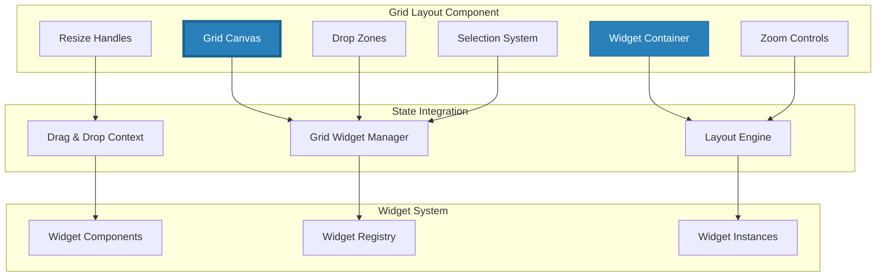

# ===== SCAFFOLD IDENTITY =====
title: "Grid Layout - Interactive Widget Canvas"
scaffold_id: "scf.04_grid_layout"
type: "scaffold"
category: "frontend-component"

# ===== SYSTEMATIC SCAFFOLDING =====
lifecycle: "dev"
state: "minimal"
seat: "mvp"

# ===== AVAILABILITY AND ACCESS =====
phase_availability: "always"
priority: "critical"
agent_accessible: true
user_configurable: true

# ===== PROMOTION GATES =====
promotion_gates:
  to_intermediate_i1:
    - "Widgets can be dragged and dropped onto the grid."
    - "Widgets can be resized by dragging corners/edges."
    - "Grid layout persists across application restarts."
  to_complete:
    - "Implements advanced grid algorithms for auto-packing."
    - "Supports widget snapping and alignment guides."
    - "Provides multiple grid modes (free, snap, columns)."

# ===== OBSERVABILITY =====
observability:
  metrics:
    - "grid_layout.interaction.total"
    - "grid_layout.widget.add.frequency"
    - "grid_layout.resize.frequency"
  alerts:
    - "grid_layout.performance.slow"
    - "grid_layout.corruption.detected"
  dashboards:
    - "ui_interaction_metrics"

# ===== SECURITY REQUIREMENTS =====
security:
  authentication_required: false
  authorization_level: "user"
  data_classification: "user_preferences"
  encryption_at_rest: false
  audit_logging: false

# ===== TECHNICAL METADATA =====
dependencies: ["2-scf.12_grid_widget_manager", "mod.17_electron_bridge"]
integrations: ["all widget components", "scf.02_sidebar"]
last_updated: "2025-10-06"
version: "1.0.0"
maintainer: "Lech/Claude"

# ===== AGENTIC INTEGRATION =====
agent_capabilities:
  can_read: true
  can_write: true
  can_propose_changes: false
  requires_approval: false
---

# scf.04. Grid Layout - Interactive Widget Canvas

## Purpose

To act as the **central interactive canvas** where users can arrange, resize, and interact with widgets in a flexible grid system. It provides the primary workspace for the application, enabling users to create custom dashboards by placing and organizing widgets according to their workflow needs.

**Out of Scope:**
- Widget business logic (provides container, delegates functionality)
- Widget rendering management (focuses on layout, not content)
- Data persistence (delegates to Grid Widget Manager and State Persistence)

---

## Primary Features

- **Drag & Drop Widget Placement:** Users can drag widgets from the sidebar and drop them onto the grid with visual feedback.

- **Widget Resizing:** Widgets can be resized by dragging their corners and edges with snap-to-grid functionality.

- **Grid System:** Implements a responsive grid layout with configurable grid size and margins.

- **Collision Detection:** Prevents widget overlap and provides smart positioning suggestions.

- **Layout Persistence:** Saves and restores grid layouts automatically.

- **Multi-Selection:** Select multiple widgets for batch operations like alignment and deletion.

- **Zoom Controls:** Allows users to zoom in/out of the grid for better visibility of dense layouts.

---

## Architecture

The Grid Layout is a sophisticated React component that manages the spatial organization of widgets and provides rich interaction capabilities.



**Component Structure:**
```typescript
interface GridLayoutProps {
  // Layout configuration
  gridWidth: number;
  gridHeight: number;
  cellSize: number;
  margin: number;
  containerPadding: number;

  // Widget data
  layout: LayoutState;
  widgets: Record<string, WidgetInstance>;
  availableWidgets: WidgetType[];

  // Interaction state
  isDragging: boolean;
  isResizing: boolean;
  selectedWidgets: string[];
  activeWidgetId?: string;

  // View state
  zoomLevel: number;
  gridSize: { cols: number; rows: number };
  showGridLines: boolean;

  // Event handlers
  onLayoutChange: (layout: LayoutState) => void;
  onWidgetAdd: (widgetType: WidgetType, position: Position) => void;
  onWidgetRemove: (widgetId: string) => void;
  onWidgetResize: (widgetId: string, size: Size) => void;
  onWidgetMove: (widgetId: string, position: Position) => void;
  onSelectionChange: (widgetIds: string[]) => void;
}

interface GridLayoutState {
  dragState: DragState | null;
  resizeState: ResizeState | null;
  dropZones: DropZone[];
  clipboard: WidgetInstance[];
  isMultiSelecting: boolean;
  selectionBox: SelectionBox | null;
}
```

**Grid Configuration:**
- **Cell Size:** 20px × 20px (configurable)
- **Minimum Widget Size:** 1×1 cells (20×20px)
- **Maximum Grid Size:** 100×50 cells (2000×1000px)
- **Grid Margin:** 8px between widgets
- **Container Padding:** 16px from edges

---

## Grid Modes

The Grid Layout supports three different layout modes:

### Free Mode
- Widgets can be positioned anywhere without snapping to grid
- Full freedom of placement
- Useful for artistic/creative layouts

### Snap Mode (Default)
- Widgets snap to grid cells when placed
- Maintains alignment while allowing flexibility
- Best balance of freedom and order

### Column Mode
- Widgets align to predefined columns (12-column system)
- Maintains perfect vertical alignment
- Ideal for structured, dashboard-like layouts

---

## State Progression & Promotion Gates

### Current State: minimal

### Minimal State
**Definition:** Basic grid with drag-and-drop widget placement.
**Requirements:**
- [ ] Grid canvas renders with visible grid lines
- [ ] Widgets can be dragged from sidebar and placed on grid
- [ ] Basic collision detection prevents overlap
- [ ] Layout persists to local storage

### Intermediate I1 State
**Definition:** Interactive grid with resizing and selection.
**Requirements:**
- [ ] All `minimal` requirements met
- [ ] Widgets can be resized by dragging corners/edges
- [ ] Multiple widgets can be selected with Ctrl+click
- [ ] Selected widgets can be deleted with Delete key
- [ ] Zoom controls work (25%, 50%, 100%, 150%, 200%)

### Complete State
**Definition:** Professional grid with advanced features and polish.
**Requirements:**
- [ ] All `I1` requirements met
- [ ] Smart auto-packing algorithms organize widgets
- [ ] Alignment guides appear when dragging/resizing
- [ ] Copy/paste functionality for widgets
- [ ] Keyboard shortcuts for all operations
- [ ] Performance optimization for 100+ widgets
- [ ] Undo/redo system for layout changes

---

## Production Implementation

```typescript
// /src/components/GridLayout/GridLayout.tsx
import React, { useState, useRef, useEffect, useCallback } from 'react';
import { useGridWidgetManager } from '../../state/GridWidgetManager';
import { GridCanvas } from './GridCanvas';
import { WidgetContainer } from './WidgetContainer';
import { DropZone } from './DropZone';
import { SelectionBox } from './SelectionBox';
import { ResizeHandles } from './ResizeHandles';
import { GridBackground } from './GridBackground';

export const GridLayout: React.FC<GridLayoutProps> = ({
  gridWidth,
  gridHeight,
  cellSize,
  margin,
  containerPadding,
  layout,
  widgets,
  availableWidgets,
  isDragging,
  isResizing,
  selectedWidgets,
  activeWidgetId,
  zoomLevel,
  gridSize,
  showGridLines,
  onLayoutChange,
  onWidgetAdd,
  onWidgetRemove,
  onWidgetResize,
  onWidgetMove,
  onSelectionChange
}) => {
  const gridRef = useRef<HTMLDivElement>(null);
  const [dragState, setDragState] = useState<DragState | null>(null);
  const [resizeState, setResizeState] = useState<ResizeState | null>(null);
  const [dropZones, setDropZones] = useState<DropZone[]>([]);
  const [isMultiSelecting, setIsMultiSelecting] = useState(false);
  const [selectionBox, setSelectionBox] = useState<SelectionBox | null>(null);

  const { moveWidget, resizeWidget, removeWidget } = useGridWidgetManager();

  // Calculate grid dimensions
  const gridDimensions = useMemo(() => ({
    width: gridSize.cols * cellSize + (gridSize.cols - 1) * margin + containerPadding * 2,
    height: gridSize.rows * cellSize + (gridSize.rows - 1) * margin + containerPadding * 2
  }), [gridSize, cellSize, margin, containerPadding]);

  // Handle widget drag start
  const handleWidgetDragStart = useCallback((widgetId: string, startPosition: Position) => {
    const widget = widgets[widgetId];
    if (!widget) return;

    setDragState({
      type: 'widget',
      widgetId,
      startPosition,
      currentPosition: startPosition,
      originalLayout: { ...layout[widgetId] }
    });
  }, [widgets, layout]);

  // Handle widget drag
  const handleWidgetDrag = useCallback((clientX: number, clientY: number) => {
    if (!dragState || dragState.type !== 'widget') return;

    const gridPosition = screenToGridPosition(clientX, clientY, zoomLevel);
    const newPosition = findBestPosition(gridPosition, dragState.widgetId);

    setDragState(prev => prev ? { ...prev, currentPosition: newPosition } : null);
  }, [dragState, zoomLevel]);

  // Handle widget drag end
  const handleWidgetDragEnd = useCallback(() => {
    if (!dragState || dragState.type !== 'widget') return;

    const { widgetId, currentPosition } = dragState;

    if (currentPosition.x !== dragState.originalLayout.x ||
        currentPosition.y !== dragState.originalLayout.y) {
      onWidgetMove(widgetId, currentPosition);
    }

    setDragState(null);
    setDropZones([]);
  }, [dragState, onWidgetMove]);

  // Handle widget resize start
  const handleWidgetResizeStart = useCallback((widgetId: string, resizeHandle: ResizeHandle) => {
    const widget = widgets[widgetId];
    if (!widget) return;

    setResizeState({
      widgetId,
      resizeHandle,
      startPosition: { x: widget.x, y: widget.y },
      startSize: { w: widget.w, h: widget.h },
      currentSize: { w: widget.w, h: widget.h }
    });
  }, [widgets]);

  // Handle widget resize
  const handleWidgetResize = useCallback((clientX: number, clientY: number) => {
    if (!resizeState) return;

    const gridPosition = screenToGridPosition(clientX, clientY, zoomLevel);
    const newSize = calculateNewSize(resizeState, gridPosition);

    setResizeState(prev => prev ? { ...prev, currentSize: newSize } : null);
  }, [resizeState, zoomLevel]);

  // Handle widget resize end
  const handleWidgetResizeEnd = useCallback(() => {
    if (!resizeState) return;

    const { widgetId, currentSize } = resizeState;

    onWidgetResize(widgetId, currentSize);
    setResizeState(null);
  }, [resizeState, onWidgetResize]);

  // Handle external drop (from sidebar)
  const handleExternalDrop = useCallback((e: React.DragEvent) => {
    e.preventDefault();

    try {
      const widgetType: WidgetType = JSON.parse(e.dataTransfer.getData('text/plain'));
      const gridPosition = screenToGridPosition(e.clientX, e.clientY, zoomLevel);
      const finalPosition = findBestPosition(gridPosition);

      onWidgetAdd(widgetType, finalPosition);
    } catch (error) {
      console.error('Failed to parse widget data:', error);
    }

    setDropZones([]);
  }, [onWidgetAdd, zoomLevel]);

  // Handle selection
  const handleWidgetClick = useCallback((widgetId: string, event: React.MouseEvent) => {
    event.stopPropagation();

    if (event.ctrlKey || event.metaKey) {
      // Multi-select
      const newSelection = selectedWidgets.includes(widgetId)
        ? selectedWidgets.filter(id => id !== widgetId)
        : [...selectedWidgets, widgetId];
      onSelectionChange(newSelection);
    } else {
      // Single select
      onSelectionChange([widgetId]);
    }
  }, [selectedWidgets, onSelectionChange]);

  // Handle background click (deselect)
  const handleBackgroundClick = useCallback(() => {
    onSelectionChange([]);
  }, [onSelectionChange]);

  // Handle keyboard events
  useEffect(() => {
    const handleKeyDown = (e: KeyboardEvent) => {
      if (selectedWidgets.length === 0) return;

      switch (e.key) {
        case 'Delete':
        case 'Backspace':
          selectedWidgets.forEach(widgetId => {
            onWidgetRemove(widgetId);
          });
          onSelectionChange([]);
          break;

        case 'c':
        case 'C':
          if (e.ctrlKey || e.metaKey) {
            e.preventDefault();
            // Copy selected widgets to clipboard
            const widgetsToCopy = selectedWidgets.map(id => widgets[id]).filter(Boolean);
            setClipboard(widgetsToCopy);
          }
          break;

        case 'v':
        case 'V':
          if (e.ctrlKey || e.metaKey) {
            e.preventDefault();
            // Paste widgets from clipboard
            pasteWidgetsFromClipboard();
          }
          break;
      }
    };

    window.addEventListener('keydown', handleKeyDown);
    return () => window.removeEventListener('keydown', handleKeyDown);
  }, [selectedWidgets, widgets, onWidgetRemove, onSelectionChange]);

  // Utility functions
  const screenToGridPosition = (screenX: number, screenY: number, zoom: number): Position => {
    if (!gridRef.current) return { x: 0, y: 0 };

    const rect = gridRef.current.getBoundingClientRect();
    const relativeX = (screenX - rect.left) / zoom;
    const relativeY = (screenY - rect.top) / zoom;

    return {
      x: Math.max(0, Math.floor((relativeX - containerPadding) / (cellSize + margin))),
      y: Math.max(0, Math.floor((relativeY - containerPadding) / (cellSize + margin)))
    };
  };

  const findBestPosition = (desiredPosition: Position, excludeWidgetId?: string): Position => {
    let bestPosition = { ...desiredPosition };

    // Check for collisions and find nearest empty position
    for (let y = desiredPosition.y; y < gridSize.rows; y++) {
      for (let x = desiredPosition.x; x < gridSize.cols; x++) {
        const testPosition = { x, y };

        if (!hasCollision(testPosition, excludeWidgetId)) {
          return testPosition;
        }
      }
    }

    return bestPosition;
  };

  const hasCollision = (position: Position, excludeWidgetId?: string): boolean => {
    return Object.entries(layout).some(([widgetId, layoutItem]) => {
      if (widgetId === excludeWidgetId) return false;

      return (
        position.x < layoutItem.x + layoutItem.w &&
        position.x + 1 > layoutItem.x &&
        position.y < layoutItem.y + layoutItem.h &&
        position.y + 1 > layoutItem.y
      );
    });
  };

  const calculateNewSize = (resizeState: ResizeState, gridPosition: Position): Size => {
    const { resizeHandle, startPosition, startSize } = resizeState;

    let newWidth = startSize.w;
    let newHeight = startSize.h;

    switch (resizeHandle) {
      case 'se':
        newWidth = Math.max(1, gridPosition.x - startPosition.x);
        newHeight = Math.max(1, gridPosition.y - startPosition.y);
        break;
      case 'sw':
        newWidth = Math.max(1, startPosition.x + startSize.w - gridPosition.x);
        newHeight = Math.max(1, gridPosition.y - startPosition.y);
        break;
      case 'ne':
        newWidth = Math.max(1, gridPosition.x - startPosition.x);
        newHeight = Math.max(1, startPosition.y + startSize.h - gridPosition.y);
        break;
      case 'nw':
        newWidth = Math.max(1, startPosition.x + startSize.w - gridPosition.x);
        newHeight = Math.max(1, startPosition.y + startSize.h - gridPosition.y);
        break;
    }

    return { w: newWidth, h: newHeight };
  };

  return (
    <div className="grid-layout-container">
      {/* Grid Background */}
      {showGridLines && (
        <GridBackground
          width={gridDimensions.width}
          height={gridDimensions.height}
          cellSize={cellSize * zoomLevel}
          margin={margin * zoomLevel}
        />
      )}

      {/* Main Grid Canvas */}
      <GridCanvas
        ref={gridRef}
        width={gridDimensions.width}
        height={gridDimensions.height}
        zoomLevel={zoomLevel}
        onDrop={handleExternalDrop}
        onDragOver={(e) => e.preventDefault()}
        onClick={handleBackgroundClick}
        className="grid-canvas"
      >
        {/* Render Widgets */}
        {Object.entries(widgets).map(([widgetId, widget]) => {
          const widgetType = availableWidgets.find(w => w.id === widget.widgetTypeId);
          if (!widgetType) return null;

          const isBeingDragged = dragState?.widgetId === widgetId;
          const isBeingResized = resizeState?.widgetId === widgetId;
          const isSelected = selectedWidgets.includes(widgetId);
          const isActive = activeWidgetId === widgetId;

          return (
            <WidgetContainer
              key={widgetId}
              widgetId={widgetId}
              widget={widget}
              widgetType={widgetType}
              position={{
                x: (widget.x * (cellSize + margin) + containerPadding) * zoomLevel,
                y: (widget.y * (cellSize + margin) + containerPadding) * zoomLevel
              }}
              size={{
                width: (widget.w * (cellSize + margin) - margin) * zoomLevel,
                height: (widget.h * (cellSize + margin) - margin) * zoomLevel
              }}
              isBeingDragged={isBeingDragged}
              isBeingResized={isBeingResized}
              isSelected={isSelected}
              isActive={isActive}
              onClick={handleWidgetClick}
              onDragStart={handleWidgetDragStart}
              onResizeStart={handleWidgetResizeStart}
              zoomLevel={zoomLevel}
            />
          );
        })}

        {/* Drop Zones */}
        {dropZones.map((zone, index) => (
          <DropZone
            key={index}
            zone={zone}
            zoomLevel={zoomLevel}
          />
        ))}

        {/* Selection Box */}
        {selectionBox && (
          <SelectionBox
            box={selectionBox}
            zoomLevel={zoomLevel}
          />
        )}
      </GridCanvas>

      {/* Resize Handles for active widget */}
      {resizeState && (
        <ResizeHandles
          widgetId={resizeState.widgetId}
          widget={widgets[resizeState.widgetId]}
          position={layout[resizeState.widgetId]}
          onResize={handleWidgetResize}
          onResizeEnd={handleWidgetResizeEnd}
          zoomLevel={zoomLevel}
        />
      )}
    </div>
  );
};

// Widget Container Component
export const WidgetContainer: React.FC<WidgetContainerProps> = ({
  widgetId,
  widget,
  widgetType,
  position,
  size,
  isBeingDragged,
  isBeingResized,
  isSelected,
  isActive,
  onClick,
  onDragStart,
  onResizeStart,
  zoomLevel
}) => {
  const [isHovered, setIsHovered] = useState(false);

  const handleMouseDown = (e: React.MouseEvent) => {
    if (e.button === 0) { // Left click only
      onDragStart(widgetId, { x: widget.x, y: widget.y });
    }
  };

  const handleClick = (e: React.MouseEvent) => {
    e.stopPropagation();
    onClick(widgetId, e);
  };

  return (
    <div
      className={`widget-container ${isSelected ? 'widget-container--selected' : ''} ${isActive ? 'widget-container--active' : ''} ${isBeingDragged ? 'widget-container--dragging' : ''} ${isBeingResized ? 'widget-container--resizing' : ''}`}
      style={{
        position: 'absolute',
        left: position.x,
        top: position.y,
        width: size.width,
        height: size.height,
        transform: `scale(${isBeingDragged ? 0.95 : 1})`,
        opacity: isBeingDragged ? 0.8 : 1,
        zIndex: isSelected ? 100 : isActive ? 50 : 1,
        transition: isBeingDragged ? 'none' : 'all 0.2s ease'
      }}
      onMouseDown={handleMouseDown}
      onClick={handleClick}
      onMouseEnter={() => setIsHovered(true)}
      onMouseLeave={() => setIsHovered(false)}
    >
      {/* Widget Content */}
      <div className="widget-container__content">
        {/* Render the actual widget component based on type */}
        <WidgetRenderer
          widgetType={widgetType}
          widget={widget}
          isActive={isActive}
        />
      </div>

      {/* Widget Controls */}
      {(isSelected || isHovered) && !isBeingDragged && (
        <div className="widget-container__controls">
          <button
            className="widget-container__control widget-container__control--remove"
            onClick={(e) => {
              e.stopPropagation();
              // Handle widget removal
            }}
            aria-label="Remove widget"
          >
            <Icon name="x" />
          </button>

          <button
            className="widget-container__control widget-container__control--configure"
            onClick={(e) => {
              e.stopPropagation();
              // Handle widget configuration
            }}
            aria-label="Configure widget"
          >
            <Icon name="settings" />
          </button>
        </div>
      )}

      {/* Resize Handles */}
      {isSelected && !isBeingDragged && (
        <ResizeHandles
          widgetId={widgetId}
          widget={widget}
          position={position}
          onResizeStart={onResizeStart}
          zoomLevel={zoomLevel}
        />
      )}

      {/* Selection Border */}
      {isSelected && (
        <div className="widget-container__selection-border" />
      )}
    </div>
  );
};
```

**CSS for Grid Layout:**
```css
/* GridLayout.module.css */
.grid-layout-container {
  position: relative;
  width: 100%;
  height: 100%;
  overflow: auto;
  background: var(--surface-primary);
}

.grid-canvas {
  position: relative;
  width: 100%;
  height: 100%;
  min-width: 100%;
  min-height: 100%;
}

/* Widget Container */
.widget-container {
  position: absolute;
  background: var(--surface-secondary);
  border: 1px solid var(--border-secondary);
  border-radius: 8px;
  overflow: hidden;
  cursor: move;
  user-select: none;
  transition: all 0.2s ease;
}

.widget-container:hover {
  border-color: var(--border-primary);
  box-shadow: 0 4px 12px rgba(0, 0, 0, 0.1);
}

.widget-container--selected {
  border-color: var(--accent-primary);
  box-shadow: 0 0 0 2px var(--accent-primary-transparent);
}

.widget-container--active {
  border-color: var(--accent-secondary);
  box-shadow: 0 0 0 2px var(--accent-secondary-transparent);
}

.widget-container--dragging {
  cursor: grabbing;
  z-index: 1000 !important;
  box-shadow: 0 8px 24px rgba(0, 0, 0, 0.2);
}

.widget-container--resizing {
  cursor: nwse-resize;
}

.widget-container__content {
  width: 100%;
  height: 100%;
  padding: 8px;
  overflow: hidden;
}

.widget-container__controls {
  position: absolute;
  top: 4px;
  right: 4px;
  display: flex;
  gap: 4px;
  opacity: 0;
  transition: opacity 0.2s ease;
}

.widget-container:hover .widget-container__controls,
.widget-container--selected .widget-container__controls {
  opacity: 1;
}

.widget-container__control {
  width: 24px;
  height: 24px;
  border: none;
  background: var(--surface-primary);
  border: 1px solid var(--border-secondary);
  border-radius: 4px;
  color: var(--text-secondary);
  cursor: pointer;
  display: flex;
  align-items: center;
  justify-content: center;
  transition: all 0.2s ease;
}

.widget-container__control:hover {
  background: var(--surface-tertiary);
  color: var(--text-primary);
  border-color: var(--border-primary);
}

.widget-container__control--remove:hover {
  background: var(--status-error);
  color: white;
  border-color: var(--status-error);
}

.widget-container__selection-border {
  position: absolute;
  top: -2px;
  left: -2px;
  right: -2px;
  bottom: -2px;
  border: 2px solid var(--accent-primary);
  border-radius: 10px;
  pointer-events: none;
}

/* Grid Background */
.grid-background {
  position: absolute;
  top: 0;
  left: 0;
  width: 100%;
  height: 100%;
  pointer-events: none;
  background-image:
    linear-gradient(var(--border-tertiary) 1px, transparent 1px),
    linear-gradient(90deg, var(--border-tertiary) 1px, transparent 1px);
  background-size: var(--cell-size) var(--cell-size);
}

/* Drop Zones */
.drop-zone {
  position: absolute;
  background: var(--accent-primary-transparent);
  border: 2px dashed var(--accent-primary);
  border-radius: 8px;
  pointer-events: none;
  animation: dropZonePulse 1s ease-in-out infinite;
}

@keyframes dropZonePulse {
  0%, 100% { opacity: 0.3; }
  50% { opacity: 0.6; }
}

/* Selection Box */
.selection-box {
  position: absolute;
  background: var(--accent-primary-transparent);
  border: 1px solid var(--accent-primary);
  pointer-events: none;
  z-index: 999;
}

/* Resize Handles */
.resize-handle {
  position: absolute;
  background: var(--accent-primary);
  border: 2px solid white;
  border-radius: 50%;
  width: 8px;
  height: 8px;
  cursor: nwse-resize;
  z-index: 10;
}

.resize-handle--se {
  bottom: -4px;
  right: -4px;
  cursor: nwse-resize;
}

.resize-handle--sw {
  bottom: -4px;
  left: -4px;
  cursor: nesw-resize;
}

.resize-handle--ne {
  top: -4px;
  right: -4px;
  cursor: nesw-resize;
}

.resize-handle--nw {
  top: -4px;
  left: -4px;
  cursor: nwse-resize;
}

.resize-handle:hover {
  transform: scale(1.2);
  background: var(--accent-primary-dark);
}

/* Responsive Design */
@media (max-width: 768px) {
  .widget-container__controls {
    opacity: 1;
  }

  .widget-container__control {
    width: 32px;
    height: 32px;
  }

  .resize-handle {
    width: 12px;
    height: 12px;
  }
}

/* Performance optimizations */
.widget-container {
  will-change: transform;
  contain: layout style paint;
}

.grid-canvas {
  contain: layout style;
}
```

---

## Testing Strategy

1. **Component Test: Widget Placement**
   - **Given:** An empty grid and a Chat Widget from sidebar
   - **When:** User drags widget to position (5, 3) on grid
   - **Then:** Widget should appear at grid position (5, 3) with correct dimensions

2. **Interaction Test: Widget Resizing**
   - **Given:** A widget at position (2, 2) with size (3, 2)
   - **When:** User drags southeast resize handle to add 2 columns and 1 row
   - **Then:** Widget should have new size (5, 3) at same position

3. **Collision Test: Overlap Prevention**
   - **Given:** Widget A at position (0, 0) with size (2, 2)
   - **When:** User tries to place Widget B at position (1, 1)
   - **Then:** Widget B should be moved to nearest empty position

4. **Persistence Test: Layout Saving**
   - **Given:** Grid with multiple widgets in specific positions
   - **When:** Application is restarted
   - **Then:** All widgets should appear in same positions

---