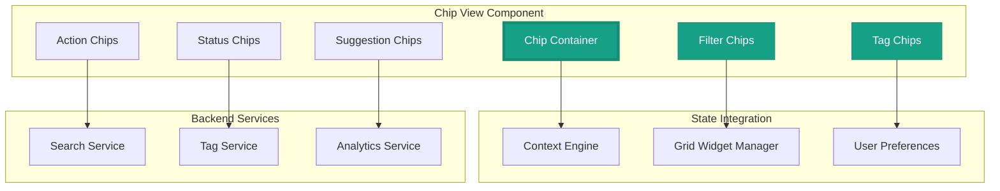

# ===== SCAFFOLD IDENTITY =====
title: "Chip View - Contextual Action & Filter Interface"
scaffold_id: "scf.05_chip_view"
type: "scaffold"
category: "frontend-component"

# ===== SYSTEMATIC SCAFFOLDING =====
lifecycle: "dev"
state: "minimal"
seat: "mvp"

# ===== AVAILABILITY AND ACCESS =====
phase_availability: "always"
priority: "medium"
agent_accessible: true
user_configurable: true

# ===== PROMOTION GATES =====
promotion_gates:
  to_intermediate_i1:
    - "Displays contextual chips for active filters and tags."
    - "Supports chip removal and addition interactions."
    - "Provides visual feedback for chip states."
  to_complete:
    - "Implements advanced chip customization and grouping."
    - "Supports keyboard navigation and screen reader compatibility."
    - "Provides chip analytics and usage tracking."

# ===== OBSERVABILITY =====
observability:
  metrics:
    - "chip_view.interaction.total"
    - "chip_view.add.frequency"
    - "chip_view.remove.frequency"
  alerts:
    - "chip_view.performance.slow"
  dashboards:
    - "ui_interaction_metrics"

# ===== SECURITY REQUIREMENTS =====
security:
  authentication_required: false
  authorization_level: "user"
  data_classification: "public"
  encryption_at_rest: false
  audit_logging: false

# ===== TECHNICAL METADATA =====
dependencies: ["mod.17_electron_bridge", "2-scf.12_grid_widget_manager"]
integrations: ["scf.04_grid_layout", "all widget components"]
last_updated: "2025-10-06"
version: "1.0.0"
maintainer: "Lech/Claude"

# ===== AGENTIC INTEGRATION =====
agent_capabilities:
  can_read: true
  can_write: true
  can_propose_changes: false
  requires_approval: false
---

# scf.05. Chip View - Contextual Action & Filter Interface

## Purpose

To act as the **contextual chip-based interface** that provides users with quick access to filters, tags, actions, and context-specific controls. It presents information and actions in a compact, scannable format that enhances the user's ability to understand and manipulate the current application state.

**Out of Scope:**
- Complex data visualization (delegates to specialized components)
- Business logic implementation (provides interface, delegates functionality)
- Content management (focuses on presentation and interaction)

---

## Primary Features

- **Filter Chips:** Display active filters with ability to remove or modify them.

- **Tag Management:** Show and manage context tags for conversations, files, and widgets.

- **Action Chips:** Provide quick access to context-specific actions and commands.

- **Status Indicators:** Visual chips showing system status, connection state, and activity levels.

- **Smart Suggestions:** Contextual chip suggestions based on user behavior and current context.

- **Grouping and Organization:** Logical grouping of related chips with visual hierarchy.

---

## Architecture

The Chip View is a flexible React component that adapts to different contexts and provides rich interaction capabilities.



**Component Structure:**
```typescript
interface ChipViewProps {
  // Chip data
  chips: ChipData[];
  groups: ChipGroup[];

  // Context information
  contextType: 'conversation' | 'grid' | 'file' | 'search';
  activeFilters: FilterChip[];
  availableTags: TagChip[];
  suggestedActions: ActionChip[];

  // Interaction state
  isEditable: boolean;
  maxChips: number;
  showSuggestions: boolean;

  // Event handlers
  onChipAdd: (chip: ChipData) => void;
  onChipRemove: (chipId: string) => void;
  onChipEdit: (chipId: string, newValue: string) => void;
  onChipGroupToggle: (groupId: string) => void;
}

interface ChipViewState {
  editingChipId: string | null;
  inputValue: string;
  suggestions: ChipSuggestion[];
  activeGroups: Set<string>;
  draggedChip: ChipData | null;
}
```

**Chip Types:**
- **Filter Chips:** Applied filters that can be removed or modified
- **Tag Chips:** Descriptive tags for categorization and search
- **Action Chips:** Quick actions relevant to current context
- **Status Chips:** System status and health indicators
- **Suggestion Chips:** AI-powered suggestions based on context

---

## Context Adaptation

The Chip View adapts its content based on the current application context:

### Conversation Context
- **Tags:** Topics, participants, sentiment, priority
- **Filters:** Date range, message type, content source
- **Actions:** Summarize, export, share, archive

### Grid Context
- **Tags:** Layout type, widget categories, usage patterns
- **Filters:** Widget types, activity status, date created
- **Actions:** Save layout, reset view, add widgets

### File Context
- **Tags:** File type, content category, project
- **Filters:** Size, date modified, author, location
- **Actions:** Open, share, duplicate, analyze

### Search Context
- **Tags:** Search terms, result types, relevance
- **Filters:** Date, source, content type
- **Actions:** Refine, save, export, analyze

---

## State Progression & Promotion Gates

### Current State: minimal

### Minimal State
**Definition:** Basic chip display with remove functionality.
**Requirements:**
- [ ] Chips display correctly with proper styling
- [ ] Chips can be removed with click/tap
- [ ] Basic grouping by chip type
- [ ] Responsive layout for different screen sizes

### Intermediate I1 State
**Definition:** Interactive chip view with editing and suggestions.
**Requirements:**
- [ ] All `minimal` requirements met
- [ ] Chips can be edited in place
- [ ] New chips can be added via input
- [ ] Smart suggestions appear based on context
- [ ] Chip groups can be collapsed/expanded

### Complete State
**Definition:** Professional chip view with advanced features and customization.
**Requirements:**
- [ ] All `I1` requirements met
- [ ] Drag-and-drop chip reordering
- [ ] Advanced filtering and search within chips
- [ ] Keyboard navigation and accessibility
- [ ] Custom chip styling and themes
- [ ] Analytics and usage tracking
- [ ] Export/import chip configurations

---

## Production Implementation

```typescript
// /src/components/ChipView/ChipView.tsx
import React, { useState, useEffect, useRef } from 'react';
import { ChipContainer } from './ChipContainer';
import { FilterChip } from './FilterChip';
import { TagChip } from './TagChip';
import { ActionChip } from './ActionChip';
import { StatusChip } from './StatusChip';
import { SuggestionChip } from './SuggestionChip';
import { ChipInput } from './ChipInput';

export const ChipView: React.FC<ChipViewProps> = ({
  chips,
  groups,
  contextType,
  activeFilters,
  availableTags,
  suggestedActions,
  isEditable,
  maxChips,
  showSuggestions,
  onChipAdd,
  onChipRemove,
  onChipEdit,
  onChipGroupToggle
}) => {
  const [editingChipId, setEditingChipId] = useState<string | null>(null);
  const [inputValue, setInputValue] = useState('');
  const [suggestions, setSuggestions] = useState<ChipSuggestion[]>([]);
  const [activeGroups, setActiveGroups] = useState<Set<string>>(new Set(['all']));
  const [draggedChip, setDraggedChip] = useState<ChipData | null>(null);
  const inputRef = useRef<HTMLInputElement>(null);

  // Filter chips based on active groups
  const visibleChips = chips.filter(chip => {
    if (activeGroups.has('all')) return true;
    return activeGroups.has(chip.groupId);
  });

  // Get available chip types for current context
  const getContextualChipTypes = () => {
    switch (contextType) {
      case 'conversation':
        return ['tag', 'filter', 'action'];
      case 'grid':
        return ['tag', 'action', 'status'];
      case 'file':
        return ['tag', 'filter', 'action'];
      case 'search':
        return ['filter', 'tag', 'suggestion'];
      default:
        return ['tag', 'filter', 'action', 'status'];
    }
  };

  // Handle chip addition
  const handleChipAdd = (chipType: ChipType, value: string) => {
    const newChip: ChipData = {
      id: `chip_${Date.now()}_${Math.random().toString(36).substr(2, 9)}`,
      type: chipType,
      value,
      groupId: getContextualGroupId(chipType),
      createdAt: Date.now(),
      isRemovable: true,
      isEditable: true
    };

    onChipAdd(newChip);
    setInputValue('');
    setSuggestions([]);
  };

  // Handle chip removal
  const handleChipRemove = (chipId: string) => {
    onChipRemove(chipId);
    if (editingChipId === chipId) {
      setEditingChipId(null);
    }
  };

  // Handle chip editing
  const handleChipEdit = (chipId: string, newValue: string) => {
    onChipEdit(chipId, newValue);
    setEditingChipId(null);
  };

  // Handle input change with suggestions
  const handleInputChange = (value: string) => {
    setInputValue(value);

    if (value.length > 1) {
      const contextualSuggestions = generateSuggestions(value, contextType);
      setSuggestions(contextualSuggestions);
    } else {
      setSuggestions([]);
    }
  };

  // Handle input submission
  const handleInputSubmit = (value: string) => {
    if (value.trim()) {
      const chipType = determineChipType(value, contextType);
      handleChipAdd(chipType, value.trim());
    }
  };

  // Handle group toggle
  const handleGroupToggle = (groupId: string) => {
    setActiveGroups(prev => {
      const newGroups = new Set(prev);
      if (newGroups.has(groupId)) {
        newGroups.delete(groupId);
        // Ensure at least one group is active
        if (newGroups.size === 0) {
          newGroups.add('all');
        }
      } else {
        newGroups.add(groupId);
        // Remove 'all' if specific groups are selected
        newGroups.delete('all');
      }
      return newGroups;
    });
    onChipGroupToggle(groupId);
  };

  // Utility functions
  const generateSuggestions = (query: string, context: ChipContext): ChipSuggestion[] => {
    // Generate contextual suggestions based on input and current context
    const suggestions: ChipSuggestion[] = [];

    switch (context) {
      case 'conversation':
        suggestions.push(
          { type: 'tag', value: 'important', confidence: 0.9 },
          { type: 'tag', value: 'follow-up', confidence: 0.8 },
          { type: 'filter', value: 'last-7-days', confidence: 0.7 }
        );
        break;
      case 'grid':
        suggestions.push(
          { type: 'tag', value: 'dashboard', confidence: 0.9 },
          { type: 'action', value: 'save-layout', confidence: 0.8 }
        );
        break;
      // Add more contexts...
    }

    return suggestions.filter(s =>
      s.value.toLowerCase().includes(query.toLowerCase())
    ).slice(0, 5);
  };

  const determineChipType = (value: string, context: ChipContext): ChipType => {
    // Auto-determine chip type based on value and context
    if (value.includes(':')) return 'filter';
    if (value.startsWith('#')) return 'tag';
    if (context === 'search') return 'filter';
    return 'tag';
  };

  const getContextualGroupId = (chipType: ChipType): string => {
    return `${contextType}_${chipType}s`;
  };

  // Group chips by type
  const groupedChips = visibleChips.reduce((groups, chip) => {
    const groupId = chip.groupId || chip.type;
    if (!groups[groupId]) {
      groups[groupId] = [];
    }
    groups[groupId].push(chip);
    return groups;
  }, {} as Record<string, ChipData[]>);

  return (
    <div className="chip-view">
      {/* Chip Groups */}
      <div className="chip-view__groups">
        {groups.map(group => (
          <ChipGroup
            key={group.id}
            group={group}
            isActive={activeGroups.has(group.id)}
            onToggle={() => handleGroupToggle(group.id)}
            chipCount={groupedChips[group.id]?.length || 0}
          />
        ))}
      </div>

      {/* Chip Container */}
      <ChipContainer className="chip-view__container">
        {/* Render grouped chips */}
        {Object.entries(groupedChips).map(([groupId, groupChips]) => (
          <div key={groupId} className="chip-view__group">
            {groupChips.map(chip => (
              <ChipWrapper
                key={chip.id}
                chip={chip}
                isEditing={editingChipId === chip.id}
                onEdit={() => setEditingChipId(chip.id)}
                onRemove={() => handleChipRemove(chip.id)}
                onSave={(newValue) => handleChipEdit(chip.id, newValue)}
                onCancel={() => setEditingChipId(null)}
              />
            ))}
          </div>
        ))}

        {/* Chip Input */}
        {isEditable && visibleChips.length < maxChips && (
          <ChipInput
            ref={inputRef}
            value={inputValue}
            suggestions={suggestions}
            onChange={handleInputChange}
            onSubmit={handleInputSubmit}
            onSuggestionSelect={(suggestion) => {
              handleChipAdd(suggestion.type, suggestion.value);
              setInputValue('');
              setSuggestions([]);
            }}
            placeholder="Add tag or filter..."
          />
        )}
      </ChipContainer>

      {/* Suggestions */}
      {showSuggestions && suggestions.length > 0 && (
        <div className="chip-view__suggestions">
          <div className="chip-view__suggestions-header">
            <Icon name="sparkles" className="chip-view__suggestions-icon" />
            <span>Suggestions</span>
          </div>
          <div className="chip-view__suggestions-list">
            {suggestions.map((suggestion, index) => (
              <SuggestionChip
                key={index}
                suggestion={suggestion}
                onSelect={() => {
                  handleChipAdd(suggestion.type, suggestion.value);
                  setInputValue('');
                  setSuggestions([]);
                }}
              />
            ))}
          </div>
        </div>
      )}
    </div>
  );
};

// Individual Chip Components
export const FilterChip: React.FC<ChipProps> = ({ chip, onRemove, onEdit, isEditable }) => {
  const [isEditing, setIsEditing] = useState(false);
  const [editValue, setEditValue] = useState(chip.value);

  const handleEdit = () => {
    if (isEditable) {
      setIsEditing(true);
    }
  };

  const handleSave = () => {
    if (editValue.trim() && editValue !== chip.value) {
      onEdit(editValue.trim());
    }
    setIsEditing(false);
  };

  const handleCancel = () => {
    setEditValue(chip.value);
    setIsEditing(false);
  };

  if (isEditing) {
    return (
      <div className="chip chip--editing chip--filter">
        <input
          type="text"
          value={editValue}
          onChange={(e) => setEditValue(e.target.value)}
          onKeyDown={(e) => {
            if (e.key === 'Enter') handleSave();
            if (e.key === 'Escape') handleCancel();
          }}
          onBlur={handleSave}
          className="chip__input"
          autoFocus
        />
        <button onClick={handleCancel} className="chip__cancel">
          <Icon name="x" />
        </button>
      </div>
    );
  }

  return (
    <div className="chip chip--filter" onClick={handleEdit}>
      <Icon name="filter" className="chip__icon" />
      <span className="chip__value">{chip.value}</span>
      {chip.isRemovable && (
        <button
          onClick={(e) => {
            e.stopPropagation();
            onRemove();
          }}
          className="chip__remove"
          aria-label={`Remove ${chip.value} filter`}
        >
          <Icon name="x" />
        </button>
      )}
    </div>
  );
};

export const TagChip: React.FC<ChipProps> = ({ chip, onRemove, onEdit, isEditable }) => {
  const getTagColor = (tagValue: string) => {
    // Generate consistent colors based on tag value
    const colors = [
      'var(--tag-blue)', 'var(--tag-green)', 'var(--tag-orange)',
      'var(--tag-purple)', 'var(--tag-pink)', 'var(--tag-teal)'
    ];
    const index = tagValue.split('').reduce((acc, char) => acc + char.charCodeAt(0), 0);
    return colors[index % colors.length];
  };

  return (
    <div
      className="chip chip--tag"
      style={{ backgroundColor: getTagColor(chip.value) }}
    >
      <Icon name="tag" className="chip__icon" />
      <span className="chip__value">{chip.value}</span>
      {chip.isRemovable && (
        <button
          onClick={(e) => {
            e.stopPropagation();
            onRemove();
          }}
          className="chip__remove chip__remove--tag"
          aria-label={`Remove ${chip.value} tag`}
        >
          <Icon name="x" />
        </button>
      )}
    </div>
  );
};

export const ActionChip: React.FC<ChipProps> = ({ chip, onClick, onRemove }) => {
  return (
    <button className="chip chip--action" onClick={onClick}>
      <Icon name={chip.icon || 'play'} className="chip__icon" />
      <span className="chip__value">{chip.value}</span>
      {chip.isRemovable && (
        <button
          onClick={(e) => {
            e.stopPropagation();
            onRemove();
          }}
          className="chip__remove"
          aria-label={`Remove ${chip.value} action`}
        >
          <Icon name="x" />
        </button>
      )}
    </button>
  );
};

export const StatusChip: React.FC<ChipProps> = ({ chip }) => {
  const getStatusColor = (status: string) => {
    switch (status.toLowerCase()) {
      case 'online': case 'active': case 'connected':
        return 'var(--status-success)';
      case 'offline': case 'inactive': case 'disconnected':
        return 'var(--status-error)';
      case 'busy': case 'loading': case 'processing':
        return 'var(--status-warning)';
      default:
        return 'var(--status-info)';
    }
  };

  return (
    <div
      className="chip chip--status"
      style={{ backgroundColor: getStatusColor(chip.value) }}
    >
      <div className={`chip__status-indicator chip__status-indicator--${chip.value.toLowerCase()}`} />
      <span className="chip__value">{chip.value}</span>
    </div>
  );
};

// Chip Wrapper Component
const ChipWrapper: React.FC<ChipWrapperProps> = ({
  chip,
  isEditing,
  onEdit,
  onRemove,
  onSave,
  onCancel
}) => {
  const handleRemove = () => {
    onRemove();
  };

  const handleEdit = () => {
    onEdit();
  };

  const handleSave = (newValue: string) => {
    onSave(newValue);
  };

  const handleCancel = () => {
    onCancel();
  };

  const renderChip = () => {
    switch (chip.type) {
      case 'filter':
        return (
          <FilterChip
            chip={chip}
            onEdit={handleEdit}
            onRemove={handleRemove}
            isEditable={chip.isEditable}
          />
        );
      case 'tag':
        return (
          <TagChip
            chip={chip}
            onEdit={handleEdit}
            onRemove={handleRemove}
            isEditable={chip.isEditable}
          />
        );
      case 'action':
        return (
          <ActionChip
            chip={chip}
            onClick={() => {/* Handle action */}}
            onRemove={handleRemove}
          />
        );
      case 'status':
        return <StatusChip chip={chip} />;
      default:
        return null;
    }
  };

  return (
    <div className="chip-wrapper">
      {renderChip()}
    </div>
  );
};
```

**CSS for Chip View:**
```css
/* ChipView.module.css */
.chip-view {
  display: flex;
  flex-direction: column;
  gap: 12px;
  padding: 16px;
  background: var(--surface-primary);
  border-radius: 8px;
  border: 1px solid var(--border-secondary);
}

.chip-view__groups {
  display: flex;
  gap: 8px;
  flex-wrap: wrap;
  margin-bottom: 8px;
}

.chip-view__container {
  display: flex;
  flex-wrap: wrap;
  gap: 8px;
  align-items: center;
  min-height: 32px;
}

.chip-view__group {
  display: flex;
  flex-wrap: wrap;
  gap: 8px;
  align-items: center;
}

.chip-view__suggestions {
  margin-top: 8px;
  padding-top: 8px;
  border-top: 1px solid var(--border-tertiary);
}

.chip-view__suggestions-header {
  display: flex;
  align-items: center;
  gap: 6px;
  margin-bottom: 8px;
  font-size: 12px;
  color: var(--text-secondary);
  font-weight: 500;
}

.chip-view__suggestions-icon {
  width: 14px;
  height: 14px;
  color: var(--accent-warning);
}

.chip-view__suggestions-list {
  display: flex;
  flex-wrap: wrap;
  gap: 6px;
}

/* Base Chip Styles */
.chip {
  display: inline-flex;
  align-items: center;
  gap: 6px;
  padding: 6px 12px;
  background: var(--surface-secondary);
  border: 1px solid var(--border-secondary);
  border-radius: 16px;
  font-size: 13px;
  font-weight: 500;
  color: var(--text-primary);
  transition: all 0.2s ease;
  cursor: pointer;
  user-select: none;
  white-space: nowrap;
  max-width: 200px;
}

.chip:hover {
  background: var(--surface-tertiary);
  border-color: var(--border-primary);
  transform: translateY(-1px);
  box-shadow: 0 2px 8px rgba(0, 0, 0, 0.1);
}

.chip__icon {
  width: 14px;
  height: 14px;
  flex-shrink: 0;
}

.chip__value {
  overflow: hidden;
  text-overflow: ellipsis;
  white-space: nowrap;
}

.chip__remove {
  background: none;
  border: none;
  width: 16px;
  height: 16px;
  border-radius: 50%;
  color: var(--text-tertiary);
  cursor: pointer;
  display: flex;
  align-items: center;
  justify-content: center;
  transition: all 0.2s ease;
  flex-shrink: 0;
}

.chip__remove:hover {
  background: var(--surface-primary);
  color: var(--text-primary);
}

.chip__remove--tag {
  background: rgba(255, 255, 255, 0.2);
  color: rgba(255, 255, 255, 0.8);
}

.chip__remove--tag:hover {
  background: rgba(255, 255, 255, 0.3);
  color: white;
}

/* Chip Type Variants */
.chip--filter {
  background: var(--surface-secondary);
  border-color: var(--border-secondary);
  color: var(--text-primary);
}

.chip--tag {
  color: white;
  border-color: transparent;
}

.chip--action {
  background: var(--accent-primary);
  border-color: var(--accent-primary);
  color: white;
  cursor: pointer;
}

.chip--action:hover {
  background: var(--accent-primary-dark);
  border-color: var(--accent-primary-dark);
}

.chip--status {
  color: white;
  border-color: transparent;
  cursor: default;
}

.chip--status:hover {
  transform: none;
  box-shadow: none;
}

.chip--editing {
  background: var(--surface-primary);
  border-color: var(--accent-primary);
  box-shadow: 0 0 0 2px var(--accent-primary-transparent);
}

.chip__input {
  background: transparent;
  border: none;
  outline: none;
  color: var(--text-primary);
  font-size: 13px;
  font-weight: 500;
  min-width: 80px;
  max-width: 150px;
}

.chip__cancel {
  background: none;
  border: none;
  width: 16px;
  height: 16px;
  border-radius: 50%;
  color: var(--text-tertiary);
  cursor: pointer;
  display: flex;
  align-items: center;
  justify-content: center;
  transition: all 0.2s ease;
}

.chip__cancel:hover {
  background: var(--surface-tertiary);
  color: var(--text-primary);
}

/* Status Chip Indicators */
.chip__status-indicator {
  width: 8px;
  height: 8px;
  border-radius: 50%;
  flex-shrink: 0;
}

.chip__status-indicator--online,
.chip__status-indicator--active,
.chip__status-indicator--connected {
  background: white;
  box-shadow: 0 0 4px rgba(255, 255, 255, 0.5);
}

.chip__status-indicator--offline,
.chip__status-indicator--inactive,
.chip__status-indicator--disconnected {
  background: rgba(255, 255, 255, 0.7);
}

.chip__status-indicator--busy,
.chip__status-indicator--loading,
.chip__status-indicator--processing {
  background: rgba(255, 255, 255, 0.8);
  animation: pulse 1.5s ease-in-out infinite;
}

/* Tag Colors */
:root {
  --tag-blue: #3b82f6;
  --tag-green: #10b981;
  --tag-orange: #f97316;
  --tag-purple: #8b5cf6;
  --tag-pink: #ec4899;
  --tag-teal: #14b8a6;
}

/* Animations */
@keyframes pulse {
  0%, 100% { opacity: 1; }
  50% { opacity: 0.5; }
}

/* Responsive Design */
@media (max-width: 768px) {
  .chip-view {
    padding: 12px;
    gap: 8px;
  }

  .chip {
    padding: 4px 8px;
    font-size: 12px;
    gap: 4px;
  }

  .chip__icon {
    width: 12px;
    height: 12px;
  }

  .chip__remove {
    width: 14px;
    height: 14px;
  }
}

/* Performance optimizations */
.chip {
  will-change: transform;
  contain: layout style paint;
}

.chip-view__container {
  contain: layout style;
}
```

---

## Testing Strategy

1. **Component Test: Chip Rendering**
   - **Given:** A list of chips with different types
   - **When:** The ChipView component renders
   - **Then:** All chips should display with correct styling and icons

2. **Interaction Test: Chip Removal**
   - **Given:** A FilterChip with value "important"
   - **When:** User clicks the remove button
   - **Then:** onRemove callback should be called with the chip ID

3. **Input Test: Chip Addition**
   - **Given:** An empty chip input field
   - **When:** User types "urgent" and presses Enter
   - **Then:** onChipAdd callback should be called with new tag chip

4. **Context Test: Suggestion Generation**
   - **Given:** Context type is "conversation" and input "follow"
   - **When:** User types in the chip input
   - **Then:** Should show suggestion for "follow-up" tag

---