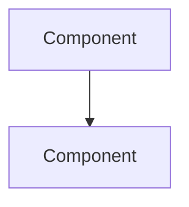

---
# ===== MODULE IDENTITY =====
title: "[Module Name] - [Brief Description]"
module_id: "[unique_identifier]"
type: "module"
category: "[primitive|first_degree|default|advanced|backend|agentic]"

# ===== SYSTEMATIC SCAFFOLDING =====
lifecycle: "dev"
state: "minimal"
seat: "mvp"

# ===== AVAILABILITY AND ACCESS =====
phase_availability: "[always|post_onboarding|unlockable|expert]"
priority: "[critical|high|medium|low]"
agent_accessible: true
user_configurable: true

# ===== PROMOTION GATES =====
promotion_gates:
  to_intermediate_i1:
    - "Core functionality implemented and tested"
    - "Basic security requirements met"
    - "Documentation complete"
  to_intermediate_i2:
    - "Reliability and UX improvements complete"
    - "Performance benchmarks met"
    - "Advanced features implemented"
  to_intermediate_i3:
    - "Integration breadth achieved"
    - "Advanced capabilities operational"
    - "Comprehensive testing completed"
  to_complete:
    - "Production deployment validated"
    - "All features fully operational"
    - "Performance SLA met"

# ===== OBSERVABILITY =====
observability:
  metrics:
    - "[module_name].operation.success_rate"
    - "[module_name].performance.response_time_ms"
  alerts:
    - "[module_name].error_rate_high"
    - "[module_name].performance_degraded"
  dashboards:
    - "[module_name]_health"
    - "[module_name]_performance"

# ===== SECURITY REQUIREMENTS =====
security:
  authentication_required: false
  authorization_level: "public"
  data_classification: "public"
  encryption_at_rest: false
  encryption_in_transit: true
  audit_logging: false
  rate_limiting: false
  input_validation: "basic"

# ===== TECHNICAL METADATA =====
dependencies: []
integrations: []
api_contracts: []
last_updated: "YYYY-MM-DD"
version: "1.0.0"
maintainer: "Orchestra.blue Team"

# ===== AGENTIC INTEGRATION =====
agent_capabilities:
  can_read: true
  can_write: false
  can_propose_changes: true
  requires_approval: false

agent_boundaries:
  allowed_operations: ["basic_operations"]
  forbidden_operations: ["unauthorized_access", "security_bypass"]
  escalation_triggers: ["security_violation", "performance_degradation"]
---

# [##] [Module Name] - [Brief Description]

## 4-Purpose

**O QUE É:** Declaração do problema que o módulo resolve e seus limites claros.

**DEVE CONTER:**
- Objetivo em 1-2 parágrafos explicando o "porquê" este módulo existe
- "Out of scope" em bullets (o que este módulo NÃO faz)

**NÃO DEVE CONTER:**
- Decisões de implementação específicas
- Comandos de execução
- Detalhes técnicos (vão em Architecture)

**FORMATO:** Texto corrido curto + bullets opcionais para exclusões

---

## 5-Primary Features

**O QUE É:** Compromissos de capacidade do módulo - o que ele entrega.

**DEVE CONTER:**
- 5-10 bullets no formato "**Nome da Feature:** Descrição (1-2 linhas)"
- Cada bullet é uma promessa funcional mensurável

**NÃO DEVE CONTER:**
- Detalhes de API (vão em Contracts)
- Passos de deploy (vão em Production Implementation)

**FORMATO:**
```markdown
- **Feature Name:** Clear description of capability
- **Feature Name:** Clear description of capability
```

---

## 6-Architecture

**O QUE É:** Estrutura INTERNA do módulo e seus fluxos internos.

**DEVE CONTER:**
- Diagrama Mermaid mostrando componentes internos
- Bullets descrevendo componentes principais e decisões arquiteturais
- Fluxo de dados interno

**NÃO DEVE CONTER:**
- Integrações externas nomeadas (vão em Integrations & References)
- Detalhes de implementação linha-por-linha

**FORMATO:**
```markdown
[1 parágrafo de overview]



**Components:**
- Component A: Description
- Component B: Description
```

---

## Contracts

**O QUE É:** I/O formais - APIs, eventos, schemas.

**DEVE CONTER:**
- TypeScript interfaces/types para DTOs
- JSON examples de payloads
- Tabela de campos opcional (se muitos campos)

**NÃO DEVE CONTER:**
- Narrativa extensa ou tutorial de uso
- Lógica de negócio (fica em Architecture/Behavior)

**FORMATO:**
```typescript
interface InputContract {
  field: type
  field: type
}

interface OutputContract {
  field: type
}
```

---

## 7-Sub-Components & Behavior

**O QUE É:** Decomposição em partes menores (UI components, serviços auxiliares) e comportamentos.

**DEVE CONTER:**
- H3 para cada subcomponente
- Purpose, Behavior, Props/Config, Responsividade (se UI)

**NÃO DEVE CONTER:**
- Passos de deploy/runtime (vão em Production Implementation)

**FORMATO:**
```markdown
### Component Name

- **Purpose:** What it does
- **Behavior:** How it works
- **Props:** (if UI component)
```typescript
interface ComponentProps {
  prop: type
}
```
- **Responsive:** Mobile/Tablet/Desktop behavior
```

---

## State Progression & Promotion Gates

**O QUE É:** Maturidade do módulo (Minimal → Intermediate I1/I2/I3 → Complete) e critérios objetivos de avanço.

**DEVE CONTER:**
- ### Current State: [state_name]
- Checklists de requisitos para cada estado
- Gates objetivos entre estados

**NÃO DEVE CONTER:**
- Métricas/SLOs (vão em Success Criteria)
- Passos de implementação (vão em Production Implementation)

**FORMATO:**
```markdown
### Current State: minimal

### Minimal State
**Definition:** Basic functionality that works end-to-end
**Requirements:**
- [ ] Core module structure implemented
- [ ] Basic functionality operational
- [ ] Documentation complete
- [ ] Security requirements met

### Intermediate I1 State
[Same pattern]

[Continue for I2, I3, Complete]

## Promotion Gates
- **Minimal→I1:** Objective criteria list
- **I1→I2:** Objective criteria list
```

---

## 8-Production Implementation

**O QUE É:** Como rodar, entregar e operar o módulo em produção.

**DEVE CONTER:**
- Passos numerados (build, deploy, rollback, monitoring)
- Comandos bash/npm/docker
- TypeScript/JSON de configuração
- Environment variables

**NÃO DEVE CONTER:**
- Testes (vão em Testing Strategy)
- Metas de desempenho (vão em Success Criteria)

**FORMATO:**
```markdown
### **🔧 Production-Ready Implementation**

```typescript
export interface ModuleImplementation {
  initialize(): Promise<void>
  execute(params: Params): Promise<Result>
  validate(): Promise<ValidationResult>
  monitor(): Promise<PerformanceMetrics>
}

export class ProductionModule implements ModuleImplementation {
  async initialize() { }
  async execute() { }
  async validate() { }
  async monitor() { }
}
```

**Deployment Steps:**
1. Build: `npm run build`
2. Test: `npm test`
3. Deploy: `npm run deploy`
4. Verify: Check health endpoint
```

---

## Security & Compliance

**O QUE É:** Garantias de AuthN, AuthZ, criptografia, auditoria.

**DEVE CONTER:**
- Bullets por tema de segurança
- ### **Brazilian Compliance** quando aplicável (LGPD, tax, banking)
- Políticas específicas do módulo

**NÃO DEVE CONTER:**
- KPIs/SLO de segurança (vão em Success Criteria)

**FORMATO:**
```markdown
**Security Controls:**
- Authentication and authorization requirements
- Data encryption (at rest, in transit)
- Audit logging requirements
- Input validation and sanitization

### **Brazilian Compliance** (if applicable)
- LGPD data subject rights implementation
- Brazilian tax calculation compliance
- Open Finance security standards
```

---

## 9-Testing Strategy

**O QUE É:** Abordagem e cenários de teste do módulo.

**DEVE CONTER:**
- Cenários numerados (Given/When/Then quando possível)
- Dados de teste/fixtures
- Comandos de execução

**NÃO DEVE CONTER:**
- Metas de performance (vão em Success Criteria)
- Passos de deploy

**FORMATO:**
```markdown
**Test Scenarios:**

1. **Scenario Name:** Description
   - Given: Initial condition
   - When: Action performed
   - Then: Expected result
   - Command: `npm test -- scenario-name`

2. **Scenario Name:** Description
   [Same pattern]
```

---

## 10-Success Criteria, Performance & Observability

**O QUE É:** Metas mensuráveis e telemetria do módulo.

**DEVE CONTER:**
- **Tabela** com métricas (Metric | Target | Window | Source)
- SLOs específicos (latency p95, accuracy %, uptime %)
- Links para dashboards e alertas

**NÃO DEVE CONTER:**
- Procedimentos de teste (vão em Testing Strategy)
- Passos de implementação

**FORMATO:**
```markdown
| Metric | Target | Window | Source |
|--------|--------|--------|--------|
| Response Time | <100ms p95 | 5 min | Prometheus |
| Success Rate | >99.9% | 1 hour | Application logs |
| Accuracy | >95% | Daily | Validation pipeline |

**SLOs:**
- Latency: <100ms p95 for responsive user experience
- Accuracy: >95% for reliable results
- Uptime: >99.9% for continuous availability

**Dashboards:**
- [Module Name] Health: [URL]
- [Module Name] Performance: [URL]
```

---

## 11-Agent Integration

**O QUE É:** Como agentes autônomos interagem com este módulo, com limites e aprovações.

**DEVE CONTER:**
- **Capabilities:** O que agentes podem fazer
- **Boundaries:** O que agentes NÃO podem fazer
- **Approvals:** Quando precisa HITL (draft → approve → apply)

**NÃO DEVE CONTER:**
- Contratos HTTP (vão em Contracts)
- Implementação de agentes (fica no Agent Layer)

**FORMATO:**
```markdown
**Agent Capabilities:**
- Agents can read module data
- Agents can propose changes via Change-Set
- Agents can trigger operations (within policy limits)

**Agent Boundaries:**
- Cannot directly modify data (must use Change-Set proposal)
- Cannot bypass security policies
- Cannot access data outside entity scope

**Approval Workflow:**
- Low-risk operations: Auto-approved (logged in audit trail)
- Medium-risk: Require single human approval
- High-risk: Require multi-signature approval

**Policy Constraints:** (if applicable)
| Operation | Daily Limit | Per-Operation Limit | Approval Threshold |
|-----------|-------------|---------------------|-------------------|
| Data Query | 1000 | N/A | Auto |
| Modify Budget | 10 | N/A | Human |
| Execute Payment | 5 | R$ 500 | Human if >R$ 100 |
```

---

## 12-Integrations & References

**O QUE É:** Dependências externas, ordem de implementação, e cross-references.

**DEVE CONTER:**
- **Dependencies:** O que precisa existir antes
- **Data Flows:** De onde recebe e para onde envia dados
- **Agent Coordination:** Como se coordena com agentes
- **User Journey:** Passo anterior e próximo passo
- **Implementation Order:** Build After / Build Before
- **See Also:** Links para documentação relacionada

**NÃO DEVE CONTER:**
- Detalhes internos (vão em Architecture)
- Código (vão em Contracts)

**FORMATO:**
```markdown
### **Dependencies:**
- **Core Infrastructure:** [[mod.10_DATA_POOL]], [[mod.14_NERVOUS_SYSTEM]]
- **Required Services:** [[scf.70_OKLCH_DESIGN]], [[mod.90_PACKAGE_CONFIG]]

### **Data Flows:**
- **Receives Data From:** [[source_modules]]
- **Sends Data To:** [[destination_modules]]

### **Agent Coordination:**
- **Orchestrated By:** [[mod.0.3_MAESTRO]]
- **Coordinates With:** [[peer_modules]]

### **User Journey:**
- **Previous Step:** [[prior_module]]
- **Next Step:** [[next_module]]

### **Implementation Order:**
- **Build After:** [[dependencies]]
- **Build Before:** [[dependents]]

## See Also
- **Architecture:** [[gov.PROJECT_ARCHITECTURE]]
- **Security:** [[cfg.POLICY_AS_CODE]]
- **Implementation:** [[gov.IMPLEMENTATION_ROADMAP]]
```

---

# 📋 **MODULE UNIVERSAL TEMPLATE**

**This template defines the UNIVERSAL TRUTH for all MODULE specification files.**

**Use this as:**
- ✅ Template for creating new module specs
- ✅ Checklist for reviewing existing modules
- ✅ Standard for AI agents writing specifications
- ✅ Normative guide for consistency across all mod.* files

**Total Standard Sections:** 12
**Required:** Purpose, Features, Contracts, State Progression, Production Implementation
**Conditional:** Sub-Components (if UI), Brazilian Compliance (if applicable)

---

**This is the CANONICAL MODULE SPECIFICATION TEMPLATE for the Orchestra.blue.** 📋✅
