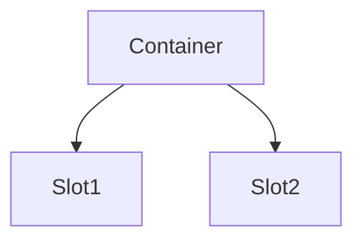

---
# ===== MODULE IDENTITY =====
title: "[Scaffold Name] - [Visual/Structural Description]"
module_id: "[unique_identifier]"
type: "scaffold"
category: "structural"

# ===== SYSTEMATIC SCAFFOLDING =====
lifecycle: "dev"
state: "minimal"
seat: "mvp"

# ===== AVAILABILITY AND ACCESS =====
phase_availability: "always"
priority: "critical"
agent_accessible: false
user_configurable: true

# ===== PROMOTION GATES =====
promotion_gates:
  to_intermediate_i1:
    - "Core layout implemented and tested"
    - "Responsive behavior working"
    - "Design system integrated"
  to_intermediate_i2:
    - "UX polish complete"
    - "Performance benchmarks met"
    - "Accessibility compliance"
  to_intermediate_i3:
    - "Advanced features implemented"
    - "Cross-browser tested"
    - "Mobile optimization complete"
  to_complete:
    - "Production deployment validated"
    - "All breakpoints working"
    - "Design system SLA met"

# ===== OBSERVABILITY =====
observability:
  metrics:
    - "[scaffold_name].render.performance_ms"
    - "[scaffold_name].interaction.response_time_ms"
  alerts:
    - "[scaffold_name].render_degraded"
    - "[scaffold_name].accessibility_violation"
  dashboards:
    - "[scaffold_name]_ux_health"

# ===== SECURITY REQUIREMENTS =====
security:
  authentication_required: false
  authorization_level: "public"
  data_classification: "public"
  encryption_at_rest: false
  encryption_in_transit: true
  audit_logging: false
  rate_limiting: false
  input_validation: "basic"

# ===== TECHNICAL METADATA =====
dependencies: []
integrations: []
api_contracts: []
last_updated: "YYYY-MM-DD"
version: "1.0.0"
maintainer: "Orchestra.blue Team"

# ===== AGENTIC INTEGRATION =====
agent_capabilities:
  can_read: true
  can_write: false
  can_propose_changes: true
  requires_approval: false

agent_boundaries:
  allowed_operations: ["read_layout", "propose_changes"]
  forbidden_operations: ["modify_structure", "bypass_design_system"]
  escalation_triggers: ["layout_corruption", "accessibility_violation"]
---

# [##] [Scaffold Name] - [Visual/Structural Description]

## Purpose

**O QUE É:** Razão do scaffold existir - base estrutural/visual que garante consistência para módulos.

**DEVE CONTER:**
- Filosofia de uso (por que este scaffold é necessário)
- Limites claros (o que o scaffold GARANTE vs o que módulos decidem)

**NÃO DEVE CONTER:**
- Features específicas de módulos que usam o scaffold

**FORMATO:** 1-2 parágrafos + bullets "out of scope"

---

## Primary Features

**O QUE É:** Padrões de UI/UX fornecidos pelo scaffold.

**DEVE CONTER:**
- Grid system specifications
- Design tokens (OKLCH colors, spacing, typography)
- Responsiveness breakpoints
- Accessibility guarantees

**NÃO DEVE CONTER:**
- Comportamento de módulos específicos

**FORMATO:**
```markdown
- **Feature Name:** Description
- **Grid System:** 12-column responsive grid
- **Design Tokens:** OKLCH color system with APCA >83 Lc
- **Responsiveness:** Mobile-first (1→2→3→4 columns)
```

---

## Architecture

**O QUE É:** Hierarquia estrutural e pontos de extensão do scaffold.

**DEVE CONTER:**
- Diagrama mostrando hierarquia (containers, slots, theming)
- Camadas do scaffold (layout, composition, theming)
- Extension points onde módulos se plugam

**NÃO DEVE CONTER:**
- Módulos específicos (apenas slots genéricos)

**FORMATO:**
```markdown
[Overview paragraph]



**Layers:**
- Layout Layer: Structure and positioning
- Composition Layer: How components combine
- Theming Layer: OKLCH tokens and styling
```

---

## Contracts

**O QUE É:** Props/contratos de componentes-base do scaffold.

**DEVE CONTER:**
- TypeScript interfaces de props
- Exemplos mínimos de uso

**NÃO DEVE CONTER:**
- Props de módulos que usam o scaffold (apenas scaffold props)

**FORMATO:**
```typescript
interface ScaffoldProps {
  theme: OKLCHTheme
  layout: LayoutConfig
  responsive: ResponsiveConfig
}

interface SlotProps {
  children: ReactNode
  config: SlotConfig
}
```

---

## Sub-Components & Behavior

**O QUE É:** Widgets/views fornecidos pelo scaffold e seus comportamentos/estados.

**DEVE CONTER:**
- H3 para cada sub-component (Slot, Container, Theme Provider)
- Purpose, Behavior, Responsive rules
- Keyboard shortcuts/accessibility

**NÃO DEVE CONTER:**
- Módulos que usam os slots (apenas os slots em si)

**FORMATO:**
```markdown
### Slot Name

- **Purpose:** Provide area for [module type]
- **Behavior:** Auto-resize, overflow handling
- **Responsive:**
  - Mobile: Single column
  - Tablet: Two columns
  - Desktop: Three columns
- **Accessibility:** ARIA labels, keyboard navigation
```

---

## State Progression & Promotion Gates

**O QUE É:** Evolução do scaffold (protótipo → estável → otimizado).

**DEVE CONTER:**
- Checklists focados em UX, performance visual, acessibilidade
- Gates de qualidade visual (contrast ratios, response times)

**NÃO DEVE CONTER:**
- Features de módulos (apenas qualidade do scaffold)

**FORMATO:**
```markdown
### Current State: intermediate_i1

### Minimal State
- [ ] Basic layout implemented
- [ ] Design tokens defined
- [ ] Responsive behavior working

[Continue pattern]

## Promotion Gates
- **Minimal→I1:** Layout functional, design integrated
- **I1→I2:** UX polished, performance optimized
```

---

## Production Implementation

**O QUE É:** Padrões universais de UI (tokenização OKLCH, a11y, SSR/CSR).

**DEVE CONTER:**
- Passos numerados para aplicar o scaffold
- TypeScript/JSON de tokens e configuração
- Build commands e otimização

**NÃO DEVE CONTER:**
- Deploy de módulos (apenas do scaffold em si)

**FORMATO:**
```markdown
### **🔧 Production-Ready Implementation**

```typescript
export const DesignTokens = {
  colors: OKLCHPalette,
  spacing: SpacingScale,
  typography: TypographyScale
}
```

**Setup Steps:**
1. Import design tokens: `import { tokens } from '@/scaffold'`
2. Apply theme provider: `<ThemeProvider theme={tokens}>`
3. Use responsive utilities: `className="responsive-grid"`
```

---

## Security & Compliance

**O QUE É:** Princípios de UI segura (masking de PII, WCAG, CSP).

**DEVE CONTER:**
- Bullets de boas práticas de segurança visual
- Políticas LGPD aplicáveis a UI (se houver dados sensíveis)

**NÃO DEVE CONTER:**
- Backend security (fica em módulos)

**FORMATO:**
```markdown
**UI Security Principles:**
- Input sanitization (prevent XSS)
- PII masking (sensitive data display)
- WCAG 2.2 AA compliance (accessibility)
- CSP headers (Content Security Policy)

**LGPD UI Considerations:**
- Consent UI for data processing
- Clear data usage explanations
- Easy-to-find privacy controls
```

---

## Testing Strategy

**O QUE É:** Validação de UI (visual regression, interação, responsividade).

**DEVE CONTER:**
- Cenários numerados de teste visual
- Comandos de execução (Playwright, Jest, etc.)

**NÃO DEVE CONTER:**
- Testes de lógica de negócio (fica em módulos)

**FORMATO:**
```markdown
**Visual Testing:**

1. **Responsive Behavior:** Verify breakpoints work correctly
   - Command: `npm run test:responsive`
   - Expected: Layout adapts at 768px, 1024px, 1440px

2. **Accessibility:** WCAG compliance validation
   - Command: `npm run test:a11y`
   - Expected: >95% compliance score

3. **Theme Switching:** Verify OKLCH transitions
   - Command: `npm run test:theme`
   - Expected: Smooth 0.3s transitions, contrast >83 Lc
```

---

## Success Criteria, Performance & Observability

**O QUE É:** Metas de UX/performance (FPS, TTI, CLS) e tracking.

**DEVE CONTER:**
- **Tabela** de métricas UX/performance
- Links de dashboards de Real User Monitoring

**NÃO DEVE CONTER:**
- Business metrics (fica em módulos)

**FORMATO:**
```markdown
| Metric | Target | Window | Source |
|--------|--------|--------|--------|
| First Paint | <1s p95 | Page load | RUM |
| Interaction Latency | <50ms p95 | User action | Performance API |
| Cumulative Layout Shift | <0.1 | Page load | Core Web Vitals |
| Accessibility Score | >95% | Daily audit | Lighthouse CI |

**Performance SLOs:**
- Render time: <50ms p95 for smooth experience
- Theme switching: <300ms with OKLCH transitions
- Accessibility: >95% WCAG 2.2 AA compliance
```

---

## Agent Integration

**O QUE É:** Como agentes podem reconfigurar/operar UI dinamicamente.

**DEVE CONTER:**
- Capabilities de personalização de UI
- Limits (o que agentes não podem mudar)
- Approvals necessários

**NÃO DEVE CONTER:**
- Lógica de agentes (fica no Agent Layer)

**FORMATO:**
```markdown
**Agent UI Capabilities:**
- Agents can propose theme changes
- Agents can suggest layout optimizations
- Agents can personalize widget positions (user preference learning)

**Agent UI Boundaries:**
- Cannot break responsive behavior
- Cannot violate accessibility standards
- Cannot remove core navigation elements

**Approvals:**
- Theme changes: User approval required
- Layout changes: Auto-approved if accessibility maintained
```

---

## Integrations & References

**O QUE É:** Que módulos se plugam ao scaffold e como.

**DEVE CONTER:**
- Bullets de módulos que consomem o scaffold
- Padrões de integração

**NÃO DEVE CONTER:**
- Implementação dos módulos

**FORMATO:**
```markdown
### **Modules Using This Scaffold:**
- [[mod.20_DASHBOARD]] - Uses grid layout system
- [[mod.21_AGENT_CONSOLE]] - Uses theme tokens
- ALL UI modules - Consume design system

### **Scaffold Exposes:**
- Design tokens (OKLCH colors, spacing, typography)
- Layout primitives (Grid, Flex, Container)
- Responsive utilities (breakpoint hooks)
- Accessibility helpers (ARIA, keyboard navigation)

## See Also
- **Architecture:** [[gov.PROJECT_ARCHITECTURE]]
- **Design System:** [[scf.70_OKLCH_DESIGN]]
- **Implementation:** [[gov.IMPLEMENTATION_ROADMAP]]
```

---

# 📋 **SCAFFOLD UNIVERSAL TEMPLATE**

**This template defines the UNIVERSAL TRUTH for all SCAFFOLD specification files.**

**Use this as:**
- ✅ Template for creating new scaffold specs
- ✅ Standard for UI/UX structural components
- ✅ Guide for design system documentation
- ✅ Normative reference for all scf.* files

**Total Standard Sections:** 12
**Required:** Purpose, Features, Architecture, Contracts, Production Implementation
**Focus:** Visual structure, design systems, responsive behavior, accessibility

---

**This is the CANONICAL SCAFFOLD SPECIFICATION TEMPLATE for the Orchestra.blue.** 🎨✅
