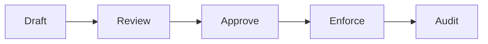

---
# ===== CONFIGURATION IDENTITY =====
title: "[Policy/Config Name] - [Domain Description]"
config_id: "[unique_identifier]"
type: "configuration"
category: "policy"

# ===== SYSTEMATIC SCAFFOLDING =====
lifecycle: "prod"
state: "complete"
seat: "mvp"

# ===== AVAILABILITY AND ACCESS =====
phase_availability: "always"
priority: "critical"
agent_accessible: true
user_configurable: false

# ===== PROMOTION GATES =====
promotion_gates:
  to_intermediate_i1:
    - "Policy schema validated"
    - "Enforcement engine tested"
    - "Audit trail functional"
  to_intermediate_i2:
    - "Policy versioning working"
    - "Rollback procedures tested"
    - "Compliance validation automated"
  to_intermediate_i3:
    - "Multi-environment deployment"
    - "Advanced policy features"
    - "Zero-downtime updates"
  to_complete:
    - "Production enforcement validated"
    - "100% policy coverage"
    - "Audit compliance verified"

# ===== OBSERVABILITY =====
observability:
  metrics:
    - "policy.evaluations.total"
    - "policy.violations.total"
    - "policy.enforcement.latency_ms"
  alerts:
    - "policy.violation_rate_high"
    - "policy.enforcement_failed"
  dashboards:
    - "policy_compliance_dashboard"
    - "policy_violations_tracker"

# ===== SECURITY REQUIREMENTS =====
security:
  authentication_required: true
  authorization_level: "system"
  data_classification: "confidential"
  encryption_at_rest: true
  encryption_in_transit: true
  audit_logging: true
  rate_limiting: false
  input_validation: "strict"

# ===== TECHNICAL METADATA =====
dependencies: []
integrations: []
api_contracts: []
last_updated: "YYYY-MM-DD"
version: "1.0.0"
maintainer: "Security & Compliance Team"

# ===== AGENTIC INTEGRATION =====
agent_capabilities:
  can_read: true
  can_write: false
  can_propose_changes: true
  requires_approval: true

agent_boundaries:
  allowed_operations: ["read_policy", "propose_change"]
  forbidden_operations: ["modify_policy", "bypass_enforcement"]
  escalation_triggers: ["policy_violation", "security_breach"]
---

# [#] [Policy/Config Name] - [Domain]

## Purpose

**O QUE É:** Porquê da política/configuração - regras declarativas e auditáveis que governam comportamento autônomo.

**DEVE CONTER:**
- Objetivos da política (o que ela controla e por quê)
- Escopo de aplicação (quem/o quê é governado)
- Riscos mitigados

**NÃO DEVE CONTER:**
- Implementação técnica do enforcer (vai em Production Implementation)

**FORMATO:** 1-2 parágrafos explicativos

---

## Primary Features

**O QUE É:** Classes de políticas fornecidas (acesso, retenção, spending, tax).

**DEVE CONTER:**
- Bullets com tipos de regras suportadas
- Descrição curta de cada classe

**NÃO DEVE CONTER:**
- Schemas detalhados (vão em Contracts)

**FORMATO:**
```markdown
- **Access Control Policies:** Who can access what
- **Data Retention Policies:** How long data is kept
- **Spending Policies:** Agent spending limits and approvals
- **Tax Compliance Policies:** Brazilian tax calculations (if applicable)
```

---

## Architecture

**O QUE É:** Visão do policy enforcer, ciclo de vida de políticas, storage.

**DEVE CONTER:**
- Diagrama do fluxo: draft → approve → apply → audit
- Componentes (policy engine, storage, enforcer, audit trail)

**NÃO DEVE CONTER:**
- Código de implementação (vai em Production Implementation)

**FORMATO:**
```markdown
[Overview paragraph]



**Components:**
- Policy Storage: Versioned, immutable policy definitions
- Enforcement Engine: Real-time policy evaluation (<10ms)
- Audit Trail: Immutable log of all decisions
- Kill-Switch: Emergency override mechanism
```

---

## Contracts

**O QUE É:** Schemas de política - fonte da verdade executável.

**DEVE CONTER:**
- JSON/YAML schemas executáveis
- Exemplos completos de políticas
- Regras de validação

**NÃO DEVE CONTER:**
- Narrativa de uso (fica em Purpose)

**FORMATO:**
```json
{
  "policy_schema": {
    "name": "string",
    "version": "string",
    "rules": [
      {
        "condition": "expression",
        "action": "allow|deny|require_approval",
        "reason": "string"
      }
    ],
    "caps": {
      "perTransaction": number,
      "daily": number,
      "monthly": number
    }
  }
}
```

**Examples:**
```json
{
  "name": "conservative-spending-policy",
  "caps": { "perTransaction": 500, "daily": 1000, "monthly": 5000 },
  "rules": [
    { "if": { "category": "gambling" }, "then": { "effect": "DENY" } }
  ]
}
```

---

## Sub-Components & Behavior

**O QUE É:** Domínios de regras (audit, throttling, tax tables, kill-switch).

**DEVE CONTER:**
- H3 para cada subdomínio
- Escopo, efeitos, exemplos

**NÃO DEVE CONTER:**
- Implementação do enforcer (vai em Production Implementation)

**FORMATO:**
```markdown
### Spending Policies

- **Scope:** Agent financial operations
- **Rules:** Per-transaction, daily, monthly caps
- **Effects:** Auto-approve, require approval, deny
- **Example:** See Contracts section

### Kill-Switch Policies

- **Scope:** Emergency cluster-wide shutdown
- **Trigger:** Security threat, policy violation
- **Effect:** All agents frozen within <300ms
- **Example:** `{ "type": "KILL_SWITCH", "on": true }`
```

---

## State Progression & Promotion Gates

**O QUE É:** Maturação de políticas (draft → tested → enforced → audited).

**DEVE CONTER:**
- Checklists e gates focados em review, approval, rollout %

**NÃO DEVE CONTER:**
- Métricas de adesão (vão em Success Criteria)

**FORMATO:**
```markdown
### Draft State
- [ ] Policy schema defined
- [ ] Examples documented
- [ ] Review requested

### Enforced State
- [ ] Approved by security team
- [ ] Deployed to production
- [ ] Monitoring active

## Promotion Gates
- **Draft→Review:** Schema valid, examples complete
- **Review→Enforced:** Approved, tested, monitoring ready
```

---

## Production Implementation

**O QUE É:** Aplicação, enforcement, control plane de políticas.

**DEVE CONTER:**
- Passos numerados (deploy, enable, rollback)
- YAML/JSON de deployment e versioning
- Comandos para policy updates

**NÃO DEVE CONTER:**
- Testes (vão em Testing Strategy)

**FORMATO:**
```markdown
### **🔧 Production Enforcement**

```typescript
export function evaluatePolicy(
  policy: Policy,
  action: Action,
  context: Context
): PolicyDecision {
  // Enforcement logic with <10ms guarantee
}
```

**Deployment:**
1. Validate policy: `npm run validate-policy policy.json`
2. Deploy to staging: `npm run deploy-policy --env staging`
3. Gradual rollout: 10% → 50% → 100%
4. Monitor violations: Check dashboard

**Rollback:**
```bash
npm run rollback-policy --version previous
```
```

---

## Security & Compliance

**O QUE É:** Garantias embutidas na própria política.

**DEVE CONTER:**
- Bullets por tema (encryption, audit, separation of duties)
- ### **Brazilian Compliance** quando aplicável (LGPD, tax)

**NÃO DEVE CONTER:**
- KPIs (vão em Success Criteria)

**FORMATO:**
```markdown
**Policy Security:**
- Policies stored encrypted at rest (KMS)
- Policy changes audited in Change-Set Ledger
- Multi-signature required for critical policy changes

### **Brazilian Compliance**
- LGPD consent policies implemented
- Tax policy calculations per Brazilian law (IRPF, MEI, ISS)
- Data retention per Lei 8.137/1990 (7 years for tax records)
```

---

## Testing Strategy

**O QUE É:** Validação por simulação/dry-run e policy asserts.

**DEVE CONTER:**
- Cenários numerados com expected results
- Consultas de verificação (query policy store)

**NÃO DEVE CONTER:**
- Métricas de produção (vão em Success Criteria)

**FORMATO:**
```markdown
**Policy Testing:**

1. **Dry Run:** Simulate policy enforcement
   ```bash
   npm run policy-dry-run --policy spending.json --action mock-payment.json
   # Expected: DENY (exceeds daily cap)
   ```

2. **Violation Detection:** Verify policy catches violations
   ```bash
   npm run test-violations
   # Expected: All violation scenarios blocked
   ```

3. **Kill-Switch:** Verify cluster-wide shutdown
   ```bash
   npm run test-kill-switch
   # Expected: All agents frozen <300ms
   ```
```

---

## Success Criteria, Performance & Observability

**O QUE É:** Adesão a políticas e cobertura.

**DEVE CONTER:**
- **Tabela** de métricas (% requests covered, violations/day, enforcement latency)
- Links para dashboards de compliance

**NÃO DEVE CONTER:**
- Procedimentos de teste

**FORMATO:**
```markdown
| Metric | Target | Window | Source |
|--------|--------|--------|--------|
| Policy Coverage | 100% | Real-time | Policy Engine |
| Violation Rate | <1% | Daily | Audit Trail |
| Enforcement Latency | <10ms p95 | 1 min | Performance logs |
| Kill-Switch Response | <300ms | Test | Benchmark suite |

**Compliance SLOs:**
- Policy evaluation: <10ms p95 for real-time enforcement
- Coverage: 100% of operations governed by policy
- Audit completeness: 100% of decisions logged
```

---

## Agent Integration

**O QUE É:** Agentes propondo/aplicando políticas com HITL approval.

**DEVE CONTER:**
- Capabilities, Boundaries, Approval workflow

**NÃO DEVE CONTER:**
- Contratos HTTP (vão em Contracts)

**FORMATO:**
```markdown
**Agent Policy Capabilities:**
- Agents can propose policy changes via Change-Set
- Agents execute within policy constraints (enforced automatically)
- Agents cannot modify active policies directly

**Approval Workflow:**
- Policy change proposal: Agent creates Change-Set with rationale
- Human review: User approves/rejects in Approval Tray
- Apply: Nervous System updates policy store
- Audit: Complete trail in Change-Set Ledger
```

---

## Integrations & References

**O QUE É:** Módulos e sistemas que consomem/aplicam a configuração.

**DEVE CONTER:**
- Bullets de módulos que enforcement
- Links para docs relacionados

**NÃO DEVE CONTER:**
- Detalhes internos dos módulos

**FORMATO:**
```markdown
### **Enforced By:**
- [[mod.51_AGENT_RUNTIME]] - Enforces agent spending policies
- [[mod.15_SECURITY_FABRIC]] - Enforces access policies
- [[mod.53_INTELLIGENCE]] - Enforces data quality policies

### **Consumed By:**
- ALL modules with agent integration
- Security-critical operations
- Financial transactions

## See Also
- **Architecture:** [[gov.PROJECT_ARCHITECTURE]]
- **Security:** [[gov.SECURITY_TESTING]]
- **Implementation:** [[gov.IMPLEMENTATION_ROADMAP]]
```

---

# 📋 **CONFIGURATION UNIVERSAL TEMPLATE**

**This template defines the UNIVERSAL TRUTH for all CONFIGURATION specification files.**

**Use this as:**
- ✅ Template for creating new policy/config specs
- ✅ Standard for executable rules and schemas
- ✅ Guide for Policy-as-Code documentation
- ✅ Normative reference for all cfg.* files

**Total Standard Sections:** 12
**Required:** Purpose, Contracts (schemas!), Production Implementation (enforcement)
**Focus:** Executable policies, enforcement, compliance, audit trails

---

**This is the CANONICAL CONFIGURATION SPECIFICATION TEMPLATE for the Orchestra.blue.** ⚙️✅
