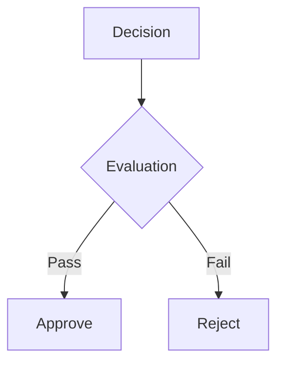

---
# ===== GOVERNANCE IDENTITY =====
title: "[Governance Document Name] - [Strategic Domain]"
doc_id: "[unique_identifier]"
type: "governance"
category: "documentation"

# ===== SYSTEMATIC SCAFFOLDING =====
lifecycle: "prod"
state: "complete"
seat: "mvp"

# ===== AVAILABILITY AND ACCESS =====
phase_availability: "always"
priority: "critical"
agent_accessible: false
user_configurable: false

# ===== PROMOTION GATES =====
promotion_gates:
  to_intermediate_i1:
    - "Principles documented"
    - "Framework defined"
    - "Examples provided"
  to_intermediate_i2:
    - "Adoption measured"
    - "Validation automated"
    - "Continuous improvement active"
  to_intermediate_i3:
    - "Organization-wide adoption"
    - "Advanced governance features"
    - "Best practice status"
  to_complete:
    - "Industry-standard quality"
    - "External validation received"
    - "Continuous evolution process"

# ===== OBSERVABILITY =====
observability:
  metrics:
    - "governance.compliance_score"
    - "governance.decision_lead_time_days"
  alerts:
    - "governance.compliance_declining"
    - "governance.review_overdue"
  dashboards:
    - "governance_health"
    - "decision_tracking"

# ===== SECURITY REQUIREMENTS =====
security:
  authentication_required: false
  authorization_level: "public"
  data_classification: "public"
  encryption_at_rest: false
  encryption_in_transit: true
  audit_logging: false
  rate_limiting: false
  input_validation: "basic"

# ===== TECHNICAL METADATA =====
dependencies: []
integrations: []
api_contracts: []
last_updated: "YYYY-MM-DD"
version: "1.0.0"
maintainer: "Architecture & Governance Team"

# ===== AGENTIC INTEGRATION =====
agent_capabilities:
  can_read: true
  can_write: false
  can_propose_changes: false
  requires_approval: false

agent_boundaries:
  allowed_operations: ["read_guidelines"]
  forbidden_operations: ["modify_governance"]
  escalation_triggers: ["governance_violation"]
---

# [#] [Governance Document Name]

## Purpose

**O QUE É:** Princípios e diretrizes que norteiam decisões arquiteturais e estratégicas.

**DEVE CONTER:**
- Objetivos do framework de governança
- Escopo de validade (quando aplicar estas diretrizes)
- Trade-offs reconhecidos (o que sacrificamos por quê)

**NÃO DEVE CONTER:**
- Implementação técnica (fica em módulos)
- Decisões específicas de um módulo (apenas princípios universais)

**FORMATO:** 1-2 parágrafos + bullets de trade-offs

---

## Primary Features

**O QUE É:** Políticas-guia normativas (simplicidade, security-first, data-openness).

**DEVE CONTER:**
- Bullets de princípios normativos
- "Always do X, Never do Y" rules

**NÃO DEVE CONTER:**
- Tutoriais ou procedimentos (vão em Production Implementation)

**FORMATO:**
```markdown
**Core Governance Principles:**
- **Simplicity First:** Prefer simple solutions over complex ones
- **Security by Default:** All modules must meet baseline security
- **Data Openness:** Audit trails are immutable and accessible
- **Agent Safety:** Autonomous actions require policy constraints
```

---

## Architecture

**O QUE É:** Arquitetura CONCEITUAL de governança (camadas, decision trees, frameworks).

**DEVE CONTER:**
- Diagrama de decision flow
- Critérios decisórios estruturados
- Níveis de governança (individual, team, organization)

**NÃO DEVE CONTER:**
- Implementação técnica de tooling

**FORMATO:**
```markdown
[Overview of governance structure]



**Governance Layers:**
- Individual: Developer decisions within module
- Team: Architectural decisions across modules
- Organization: Strategic decisions platform-wide
```

---

## Contracts

**O QUE É:** Artefatos formais de decisão (matrizes de decisão, guidelines, checklists).

**DEVE CONTER:**
- JSON/YAML de decision matrices
- Templates de ADR (Architecture Decision Records)
- Checklists formais

**NÃO DEVE CONTER:**
- Decisões específicas já tomadas (apenas templates)

**FORMATO:**
```json
{
  "decision_matrix": {
    "criteria": [
      { "name": "Security Impact", "weight": 0.3 },
      { "name": "Performance Impact", "weight": 0.2 },
      { "name": "Complexity", "weight": 0.2 },
      { "name": "Cost", "weight": 0.3 }
    ],
    "threshold": 0.7
  }
}
```

**ADR Template:**
```markdown
# ADR-NNN: [Decision Title]
- Status: [Proposed|Accepted|Rejected|Deprecated]
- Context: [Why this decision is needed]
- Decision: [What we decided]
- Consequences: [Positive and negative impacts]
```

---

## Sub-Components & Behavior

**O QUE É:** Subframeworks de governança (tier system, role definitions, review processes).

**DEVE CONTER:**
- H3 para cada subframework
- Regras claras e critérios

**NÃO DEVE CONTER:**
- Implementação técnica de tools

**FORMATO:**
```markdown
### Tier System

- **Tier 1:** Own markdown file (architectural significance)
- **Tier 2:** Section within file (supporting component)
- **Criteria:** Has independent contracts + can be developed separately

### Review Process

- **Code Review:** All changes require peer review
- **Architecture Review:** Significant changes require architect approval
- **Security Review:** Security-impacting changes require security team approval
```

---

## State Progression & Promotion Gates

**O QUE É:** Evolução de princípio → padrão → norma obrigatória.

**DEVE CONTER:**
- Checklists de adoção (awareness → adoption → enforcement)
- Gates de validação (auditorias, compliance checks)

**NÃO DEVE CONTER:**
- Implementação de tooling

**FORMATO:**
```markdown
### Principle State
- [ ] Documented in governance
- [ ] Communicated to team
- [ ] Examples provided

### Standard State
- [ ] Adopted by majority
- [ ] Tooling support available
- [ ] Violations tracked

### Norm State
- [ ] Organization-wide enforcement
- [ ] Automated validation
- [ ] Continuous improvement

## Promotion Gates
- **Principle→Standard:** >50% adoption, positive feedback
- **Standard→Norm:** >90% adoption, automated enforcement
```

---

## Production Implementation

**O QUE É:** Como princípios viram prática (policies, tooling, CI gates).

**DEVE CONTER:**
- Passos numerados para aplicar governança
- Tools e automation
- Evidências de compliance

**NÃO DEVE CONTER:**
- Testes (vão em Testing Strategy)

**FORMATO:**
```markdown
### **🔧 Governance in Practice**

**Implementation Steps:**
1. Define governance principle in this document
2. Create checklist/template for application
3. Implement CI validation (linting, checks)
4. Train team on principle
5. Measure adoption and compliance

**Tooling:**
```bash
# Validate compliance
npm run governance-check

# Generate compliance report
npm run governance-report --output report.md
```

**Evidence:**
- ADRs in `decisions/` folder
- CI pipeline checks in `.github/workflows/`
- Compliance dashboard: [URL]
```

---

## Security & Compliance

**O QUE É:** Limites de risco aceitos e baselines de segurança obrigatórios.

**DEVE CONTER:**
- Bullets por domínio (auth, data protection, supply chain)
- Baselines não-negociáveis

**NÃO DEVE CONTER:**
- Implementação técnica de controles

**FORMATO:**
```markdown
**Security Baselines (Non-Negotiable):**
- All modules must have security requirements in front-matter
- All sensitive data encrypted at rest and in transit
- All financial operations audited in Change-Set Ledger
- All agent actions policy-constrained

**Compliance Domains:**
- LGPD: Data subject rights, consent management
- Financial Regulations: PCI DSS, Open Banking compliance
- Audit: Complete immutable trails for all state changes
```

---

## Testing Strategy

**O QUE É:** Validação de aderência (reviews, lints, auditorias).

**DEVE CONTER:**
- Cenários numerados de validation
- Checklists de auditoria

**NÃO DEVE CONTER:**
- Métricas de compliance (vão em Success Criteria)

**FORMATO:**
```markdown
**Governance Validation:**

1. **Automated Checks:** CI pipeline validation
   ```bash
   npm run lint-governance
   # Checks: Front-matter complete, security defined, etc.
   ```

2. **Peer Review:** Human validation
   - Checklist: Architecture review template
   - Approval: 2+ reviewers for significant changes

3. **Audit:** Quarterly compliance review
   - Verify adherence to governance principles
   - Identify gaps and improvement areas
```

---

## Success Criteria, Performance & Observability

**O QUE É:** Métricas de governança (conformidade, lead time de decisão, coverage).

**DEVE CONTER:**
- **Tabela** de metas (compliance %, decision latency)
- Fontes de evidência (dashboards, reports)

**NÃO DEVE CONTER:**
- Procedimentos (vão em Testing Strategy)

**FORMATO:**
```markdown
| Metric | Target | Window | Source |
|--------|--------|--------|--------|
| Governance Compliance | >95% | Weekly | Audit reports |
| Decision Lead Time | <7 days | Monthly | Decision log |
| ADR Coverage | 100% for significant changes | Ongoing | ADR repository |
| Principle Adoption | >90% | Quarterly survey | Team feedback |

**Success Indicators:**
- All modules follow tier categorization system
- Security requirements documented in 100% of specs
- ADRs exist for all significant architectural decisions
```

---

## Agent Integration

**O QUE É:** Agentes como executores e verificadores de governança.

**DEVE CONTER:**
- Capabilities (agents can validate compliance)
- Limits (agents cannot override governance)
- Approvals (governance changes require human approval)

**NÃO DEVE CONTER:**
- Agent implementation details

**FORMATO:**
```markdown
**Agent Governance Capabilities:**
- Agents can validate module compliance with governance
- Agents can propose governance improvements
- Agents can generate compliance reports

**Agent Governance Boundaries:**
- Cannot modify governance principles without approval
- Cannot bypass governance validation
- Cannot grant themselves governance exceptions

**Approval Workflow:**
- Governance change proposals: Require architect + security team approval
- Exceptions: Require documented justification + time-limited
```

---

## Integrations & References

**O QUE É:** Normas externas (industry standards) e docs internos relacionados.

**DEVE CONTER:**
- Bullets de frameworks externos (TOGAF, C4, etc.)
- Links para outros governance docs

**NÃO DEVE CONTER:**
- Implementação técnica

**FORMATO:**
```markdown
### **External Standards:**
- Industry best practices (TOGAF, C4 Architecture)
- Security frameworks (OWASP, NIST)
- Compliance standards (LGPD, PCI DSS)

### **Related Governance:**
- [[gov.PROJECT_ARCHITECTURE]] - Component organization
- [[gov.SECURITY_TESTING]] - Security standards
- [[gov.IMPLEMENTATION_ROADMAP]] - Strategic direction

## See Also
- **All Modules:** Apply these principles
- **Security:** [[cfg.POLICY_AS_CODE]]
- **Process:** [[gov.EDIT_RULES]]
```

---

# 📋 **GOVERNANCE UNIVERSAL TEMPLATE**

**This template defines the UNIVERSAL TRUTH for all GOVERNANCE specification files.**

**Use this as:**
- ✅ Template for creating new governance docs
- ✅ Standard for strategic/architectural principles
- ✅ Guide for decision frameworks and methodologies
- ✅ Normative reference for all gov.* files

**Total Standard Sections:** 12
**Required:** Purpose, Primary Features (principles), Architecture (frameworks)
**Focus:** Principles, decision frameworks, standards, strategic guidance

---

**This is the CANONICAL GOVERNANCE SPECIFICATION TEMPLATE for the Orchestra.blue.** 📐✅
