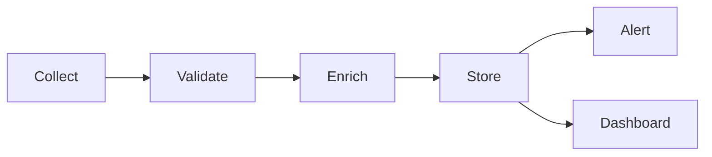

---
# ===== OPERATIONS IDENTITY =====
title: "[Operations Component] - [Operational Domain]"
ops_id: "[unique_identifier]"
type: "operations"
category: "operations"

# ===== SYSTEMATIC SCAFFOLDING =====
lifecycle: "prod"
state: "intermediate_i2"
seat: "mvp"

# ===== AVAILABILITY AND ACCESS =====
phase_availability: "always"
priority: "high"
agent_accessible: true
user_configurable: true

# ===== PROMOTION GATES =====
promotion_gates:
  to_intermediate_i1:
    - "Collection pipeline operational"
    - "Basic monitoring active"
    - "Alerting configured"
  to_intermediate_i2:
    - "Automation implemented"
    - "SLI/SLO defined and tracked"
    - "Runbooks documented"
  to_intermediate_i3:
    - "Self-healing capabilities"
    - "Predictive alerting active"
    - "Advanced analytics operational"
  to_complete:
    - "Full automation achieved"
    - "Zero-touch operations"
    - "Continuous optimization"

# ===== OBSERVABILITY =====
observability:
  metrics:
    - "[ops_component].uptime_percentage"
    - "[ops_component].mttr_minutes"
    - "[ops_component].data_quality_score"
  alerts:
    - "[ops_component].slo_violation"
    - "[ops_component].data_quality_degraded"
  dashboards:
    - "[ops_component]_operational_health"
    - "[ops_component]_sli_slo_tracker"

# ===== SECURITY REQUIREMENTS =====
security:
  authentication_required: true
  authorization_level: "system"
  data_classification: "internal"
  encryption_at_rest: true
  encryption_in_transit: true
  audit_logging: true
  rate_limiting: false
  input_validation: "strict"

# ===== TECHNICAL METADATA =====
dependencies: []
integrations: []
api_contracts: []
last_updated: "YYYY-MM-DD"
version: "1.0.0"
maintainer: "Operations & SRE Team"

# ===== AGENTIC INTEGRATION =====
agent_capabilities:
  can_read: true
  can_write: true
  can_propose_changes: true
  requires_approval: true

agent_boundaries:
  allowed_operations: ["monitor", "alert", "collect_metrics", "propose_remediation"]
  forbidden_operations: ["modify_production_data", "disable_monitoring"]
  escalation_triggers: ["slo_breach", "data_loss", "security_incident"]
---

# [#] [Operations Component] - [Domain]

## Purpose

**O QUE É:** Finalidade operacional - monitorar, reagir, analisar para garantir saúde contínua.

**DEVE CONTER:**
- Objetivo operacional (o que garante em produção)
- Escopo de operação contínua (24/7, on-demand, scheduled)

**NÃO DEVE CONTER:**
- Features de produto (fica em módulos)

**FORMATO:** 1-2 parágrafos explicando missão operacional

---

## Primary Features

**O QUE É:** Pilares operacionais (coleta, validação, resposta, reporte).

**DEVE CONTER:**
- Bullets de capabilities operacionais
- SLIs/SLOs primários

**NÃO DEVE CONTER:**
- Implementação técnica detalhada

**FORMATO:**
```markdown
- **Data Collection:** Real-time metrics from all modules
- **Validation:** Automated data quality checks
- **Alerting:** Proactive notifications on threshold violations
- **Reporting:** Automated operational reports
- **Self-Healing:** Automated remediation for known issues
```

---

## Architecture

**O QUE É:** Pipelines e circuitos operacionais, fontes de verdade.

**DEVE CONTER:**
- Diagrama de data flow operacional
- Estágios (ingest → validate → enrich → serve → observe)
- Storage de métricas/logs

**NÃO DEVE CONTER:**
- Código de implementação (vai em Production Implementation)

**FORMATO:**
```markdown
[Overview of operational architecture]



**Operational Pipeline:**
- Collection: Metrics from applications, infrastructure, agents
- Validation: Schema checks, anomaly detection
- Enrichment: Context addition, aggregation
- Storage: Time-series database, log aggregation
- Serving: Dashboards, APIs, alerting
```

---

## Contracts

**O QUE É:** Contratos operacionais - inputs/outputs de métricas, SLIs, queries.

**DEVE CONTER:**
- JSON/SQL/TypeScript para metric schemas
- Query examples para operational data

**NÃO DEVE CONTER:**
- Narrativa extensa

**FORMATO:**
```typescript
interface OperationalMetric {
  name: string
  value: number
  unit: string
  timestamp: Date
  labels: Record<string, string>
}

interface SLI {
  name: string
  query: string
  window: string
  threshold: number
}
```

**Query Examples:**
```sql
-- Uptime calculation
SELECT
  (SUM(CASE WHEN status='healthy' THEN 1 ELSE 0 END) * 100.0 / COUNT(*)) as uptime_pct
FROM health_checks
WHERE timestamp > NOW() - INTERVAL '24 hours';
```

---

## Sub-Components & Behavior

**O QUE É:** Coletores, validadores, enriquecedores, dashboards, runbooks.

**DEVE CONTER:**
- H3 para cada subcomponente operacional
- Função, comportamento, triggers

**NÃO DEVE CONTER:**
- Features de produto

**FORMATO:**
```markdown
### Metric Collector

- **Function:** Collect metrics from application endpoints
- **Behavior:** Poll every 60s, exponential backoff on failure
- **Output:** Time-series data to storage

### Alert Manager

- **Function:** Evaluate thresholds and trigger notifications
- **Behavior:** Check every 1min, deduplicate within 5min window
- **Output:** Notifications (email, Slack, PagerDuty)

### Dashboard Generator

- **Function:** Render operational dashboards
- **Behavior:** Real-time updates via WebSocket
- **Output:** Grafana dashboards, custom UI
```

---

## State Progression & Promotion Gates

**O QUE É:** Evolução de processos (manual → semi-automated → fully automated) e níveis de maturidade operacional.

**DEVE CONTER:**
- Checklists focados em automação, coverage, MTTR
- Gates de maturidade operacional

**NÃO DEVE CONTER:**
- Features de produto

**FORMATO:**
```markdown
### Manual State
- [ ] Runbooks documented
- [ ] Manual procedures tested
- [ ] Escalation paths defined

### Semi-Automated State
- [ ] Common tasks automated
- [ ] Automated alerting active
- [ ] Self-service dashboards available

### Fully Automated State
- [ ] Self-healing for common issues
- [ ] Predictive alerting operational
- [ ] Zero-touch incident response for P3/P4

## Promotion Gates
- **Manual→Semi:** Runbooks complete, automation for top 5 tasks
- **Semi→Full:** Self-healing proven, MTTR <15min for common issues
```

---

## Production Implementation

**O QUE É:** Operação diária, escalonamento, continuidade.

**DEVE CONTER:**
- Passos numerados para daily ops
- Bash/SQL/Python scripts para rotinas
- Cron schedules, on-call procedures

**NÃO DEVE CONTER:**
- Testes (vão em Testing Strategy)

**FORMATO:**
```markdown
### **🔧 Daily Operations**

**Routine Tasks:**
1. Health check: `./scripts/health-check.sh` (runs every 5min via cron)
2. Data quality validation: `./scripts/validate-data.py` (daily at 2 AM)
3. Metric aggregation: `./scripts/aggregate-metrics.sql` (hourly)

**Incident Response:**
```bash
# P1 Incident (immediate response)
./runbooks/p1-incident-response.sh

# Check current status
curl https://api/health

# Rollback if needed
./scripts/rollback.sh --version previous
```

**On-Call Procedures:**
- Rotation: Weekly, documented in PagerDuty
- Escalation: P1 → immediate, P2 → 30min, P3 → 4hours
- Runbooks: `/runbooks/` directory
```

---

## Security & Compliance

**O QUE É:** Controles operacionais (SoD, auditoria, retenção de logs).

**DEVE CONTER:**
- Bullets de operational security
- Políticas ligadas a dados em operação (retention, access)

**NÃO DEVE CONTER:**
- Application security (fica em módulos)

**FORMATO:**
```markdown
**Operational Security:**
- Separation of Duties: Read-only access for ops, write requires approval
- Audit Logging: All operational actions logged to immutable store
- Data Retention: Logs retained 90 days, metrics 1 year
- Access Control: Ops dashboard requires authentication

**Compliance:**
- LGPD: Operational data anonymized, no PII in logs
- Financial: Audit trails retained 7 years per Brazilian law
- Incident Response: Breach notification within 72 hours
```

---

## Testing Strategy

**O QUE É:** Verificação contínua (sanity checks, reconciliação, canários).

**DEVE CONTER:**
- Cenários numerados de validation operacional
- Queries de verificação

**NÃO DEVE CONTER:**
- Testes de features (fica em módulos)

**FORMATO:**
```markdown
**Operational Testing:**

1. **Sanity Checks:** Verify operational health
   ```bash
   ./tests/sanity-check.sh
   # Expected: All endpoints responding, metrics flowing
   ```

2. **Data Reconciliation:** Verify data consistency
   ```sql
   SELECT COUNT(*) FROM source WHERE NOT EXISTS (SELECT 1 FROM target WHERE id=source.id);
   -- Expected: 0 (perfect reconciliation)
   ```

3. **Canary Testing:** Verify changes don't degrade ops
   ```bash
   ./tests/canary-deploy.sh --percentage 10
   # Expected: Metrics stable, no error spike
   ```
```

---

## Success Criteria, Performance & Observability

**O QUE É:** Metas de saúde operacional (uptime, erro rate, MTTR/MTBF, data quality).

**DEVE CONTER:**
- **Tabela** de SLIs e SLOs
- Fontes (dashboards, alerting)

**NÃO DEVE CONTER:**
- Procedimentos (vão em Testing Strategy)

**FORMATO:**
```markdown
| SLI/SLO | Target | Window | Source |
|---------|--------|--------|--------|
| System Uptime | >99.9% | Monthly | Pingdom |
| Error Rate | <0.1% | 5 min | Application logs |
| MTTR | <30min | Per incident | Incident tracker |
| MTBF | >720 hours | Rolling 30 days | Incident history |
| Data Quality Score | >99% | Daily | DQ pipeline |

**Operational SLOs:**
- Uptime: >99.9% for critical services
- MTTR: <30min for P1 incidents, <4hours for P2
- Data Quality: >99% accuracy, <1min staleness
- Alert Precision: >80% (low false positive rate)

**Dashboards:**
- Operational Health: [Grafana URL]
- SLI/SLO Tracker: [Dashboard URL]
- On-Call Dashboard: [PagerDuty URL]
```

---

## Agent Integration

**O QUE É:** Agentes como operadores automatizados e first responders.

**DEVE CONTER:**
- Capabilities (agents can monitor, alert, remediate)
- Limits (agents cannot disable monitoring, modify data)
- Approvals (when agent actions need human confirmation)

**NÃO DEVE CONTER:**
- Agent implementation (fica no Agent Layer)

**FORMATO:**
```markdown
**Agent Operational Capabilities:**
- Agents can monitor metrics and trigger alerts
- Agents can collect diagnostic data during incidents
- Agents can execute approved remediation runbooks
- Agents can generate operational reports

**Agent Operational Boundaries:**
- Cannot disable monitoring or alerting
- Cannot modify production data directly
- Cannot bypass incident response procedures
- Cannot grant themselves elevated operational access

**Approval Workflow:**
- Metric collection: Auto-approved (read-only)
- Alert triggering: Auto-approved (notifications only)
- Remediation execution: Requires human approval for P1/P2
- Data modification: Always requires human approval
```

---

## Integrations & References

**O QUE É:** Ligações com SIEM, APM, data warehouse, módulos produtores de métricas.

**DEVE CONTER:**
- Bullets de integrações (Prometheus, Grafana, DataDog, etc.)
- Links para módulos que produzem métricas

**NÃO DEVE CONTER:**
- Implementação de integrações (vai em Production Implementation)

**FORMATO:**
```markdown
### **Operational Integrations:**
- **Metrics:** Prometheus, CloudWatch, DataDog
- **Logging:** ELK Stack, Loki, CloudWatch Logs
- **Alerting:** PagerDuty, Opsgenie, Slack
- **Dashboards:** Grafana, custom UI
- **Incident Management:** Jira, ServiceNow

### **Data Sources:**
- [[mod.50_POOL_ENGINE]] - Database metrics
- [[mod.51_AGENT_RUNTIME]] - Agent execution metrics
- [[mod.15_SECURITY_FABRIC]] - Security events
- ALL modules - Health endpoints, performance metrics

## See Also
- **Architecture:** [[gov.PROJECT_ARCHITECTURE]]
- **Monitoring Standards:** [[gov.SECURITY_TESTING]]
- **Incident Response:** [[cfg.KILL_SWITCH_AUDIT]]
```

---

# 📋 **OPERATIONS UNIVERSAL TEMPLATE**

**This template defines the UNIVERSAL TRUTH for all OPERATIONS specification files.**

**Use this as:**
- ✅ Template for creating new operational specs
- ✅ Standard for monitoring, alerting, and reliability
- ✅ Guide for SRE/DevOps documentation
- ✅ Normative reference for all ops.* files

**Total Standard Sections:** 12
**Required:** Purpose, Architecture (pipelines), Contracts (SLIs), Success Criteria (SLOs)
**Focus:** Monitoring, alerting, automation, reliability, incident response

---

**This is the CANONICAL OPERATIONS SPECIFICATION TEMPLATE for the Orchestra.blue.** 🔧✅
