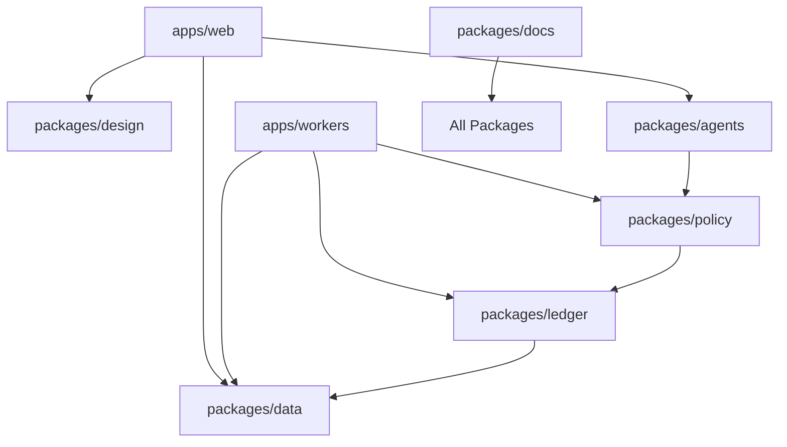

# 🏗️ MONOREPO ARCHITECTURE - PRODUCTION STRUCTURE

## **🚀 PRODUCTION IMPLEMENTATION (ChatGPT-5 Excellence)**

### **📦 Package Structure Mapping**
```
/apps/web              # Next.js (RSC + client islands)
/apps/workers          # Jobs: ingestion, sync, policy checks, recon
/packages/agents       # Orchestrator + specialist agents + tool SDK
/packages/policy       # Policy DSL, evaluator, caps, msig, kill-switch
/packages/ledger       # Change-Set store (SQL), hash-chain, APIs
/packages/data         # Prisma schema / SQL migrations / RLS helpers
/packages/design       # Tokens (OKLCH), components, APCA checks
/packages/docs         # Docs-as-code, ADRs, runbooks, RAG index
```

### **🎯 Category Mapping**
| Spec Category | Package | Owner Team |
|---------------|---------|------------|
| structural [00–06] | design + web | UI specialists |
| primitive [10–19] | platform core | Platform team |
| first_degree [20–29] | domain + workers | Domain experts |
| agentic [60–69, 0.x] | agents package | Agent specialists |

## **📐 DETAILED PACKAGE SPECIFICATIONS**

### **🌐 `/apps/web` - Next.js Application**
```typescript
// Production-ready React Server Components + Client Islands
- Framework: Next.js 15 App Router
- Architecture: RSC with selective hydration
- Routing: App directory structure
- State: Zustand + React Query for server state
- UI: Design system from packages/design
- Auth: NextAuth.js with multi-provider support
- Deployment: Vercel with edge functions
```

### **⚙️ `/apps/workers` - Background Processing**
```typescript
// Distributed job processing system
- Framework: Inngest for job orchestration
- Jobs: Data ingestion, policy evaluation, reconciliation
- Queue: Redis-backed with retry logic
- Monitoring: Structured logging + metrics
- Scaling: Auto-scale based on queue depth
- Error Handling: Dead letter queues + alerting
```

### **🤖 `/packages/agents` - AI Agent Framework**
```typescript
// Multi-agent orchestration platform
export interface AgentFramework {
  orchestrator: OrchestratorAgent;
  specialists: SpecialistAgent[];
  tools: ToolSDK;
  communication: MessageBus;
  monitoring: AgentMetrics;
}

// Agent types
- orchestrator-prime: Master coordinator
- backend-specialist: API development
- frontend-specialist: UI implementation
- data-specialist: Analytics and reporting
- security-specialist: Compliance and audit
```

### **📋 `/packages/policy` - Policy Engine**
```typescript
// Domain-specific language for financial policies
export interface PolicyEngine {
  dsl: PolicyDSL;
  evaluator: PolicyEvaluator;
  capabilities: CapabilitySystem;
  multisig: MultisigApproval;
  killswitch: EmergencyStop;
}

// Policy types
- spending_limits: Budget enforcement
- approval_workflows: Multi-level approvals
- compliance_rules: Regulatory compliance
- risk_controls: Risk management
```

### **📊 `/packages/ledger` - Financial Ledger**
```typescript
// Immutable financial transaction store
export interface Ledger {
  changeset: ChangeSetStore;
  hashchain: HashChainVerification;
  apis: LedgerAPI;
  audit: AuditTrail;
  reconciliation: ReconEngine;
}

// Features
- Immutable transaction log
- Hash-chain verification
- Change-set based updates
- Audit trail compliance
- Real-time reconciliation
```

### **🗄️ `/packages/data` - Database Layer**
```typescript
// Database schema and migrations
export interface DataLayer {
  schema: PrismaSchema;
  migrations: SQLMigrations;
  rls: RowLevelSecurity;
  types: TypescriptTypes;
  validators: DataValidation;
}

// Database structure
- PostgreSQL with RLS
- Prisma ORM for type safety
- Migration management
- Data validation schemas
- Multi-tenant isolation
```

### **🎨 `/packages/design` - Design System**
```typescript
// Production design system
export interface DesignSystem {
  tokens: DesignTokens;
  components: ComponentLibrary;
  accessibility: APCACompliance;
  themes: ThemeProvider;
  icons: IconLibrary;
}

// Color system: OKLCH for perceptual uniformity
// Accessibility: APCA contrast validation
// Components: Radix UI primitives + custom styling
// Typography: System fonts with fallbacks
```

### **📚 `/packages/docs` - Documentation**
```typescript
// Docs-as-code with RAG integration
export interface Documentation {
  content: DocsAsCode;
  adrs: ArchitecturalDecisions;
  runbooks: OperationalGuides;
  rag: RAGIndexing;
  search: SemanticSearch;
}

// Features
- Markdown-based documentation
- Automated ADR generation
- Searchable knowledge base
- RAG-powered assistance
- Version-controlled content
```

## **🔄 INTER-PACKAGE DEPENDENCIES**

### **Dependency Flow**


### **Shared Infrastructure**
```typescript
// Common utilities and types
@finops/types          # Shared TypeScript types
@finops/utils          # Common utilities
@finops/config         # Configuration management
@finops/monitoring     # Observability stack
@finops/auth           # Authentication helpers
```

## **🚀 DEPLOYMENT ARCHITECTURE**

### **Production Environments**
```yaml
# Staging Environment
apps/web: Vercel Preview
apps/workers: Railway with Redis
packages/*: Published to private npm registry

# Production Environment
apps/web: Vercel Production with CDN
apps/workers: Railway with high-availability Redis
packages/*: Versioned releases
monitoring: DataDog + Sentry integration
```

### **CI/CD Pipeline**
```yaml
# GitHub Actions Workflow
- Lint: ESLint + Prettier across all packages
- Test: Jest + Playwright for E2E
- Build: Turborepo for incremental builds
- Deploy: Automated deployment with rollback
- Monitor: Performance and error tracking
```

## **📈 SCALABILITY CONSIDERATIONS**

### **Performance Targets**
- Web app: <200ms p95 response time
- Worker jobs: <30s processing time
- Agent responses: <5s for simple tasks
- Database queries: <100ms p95
- Design system: <50ms component render

### **Monitoring Stack**
```typescript
// Observability across all packages
export interface Monitoring {
  metrics: DataDogMetrics;
  logging: StructuredLogs;
  tracing: DistributedTracing;
  alerts: PagerDutyIntegration;
  dashboards: GrafanaDashboards;
}
```

## **🔒 SECURITY FRAMEWORK**

### **Security Layers**
```typescript
// Multi-layer security approach
export interface Security {
  authentication: NextAuthMultiProvider;
  authorization: RoleBasedAccess;
  dataProtection: RowLevelSecurity;
  encryption: TransitAndRest;
  compliance: SOC2Ready;
}
```

### **Compliance Features**
- SOC 2 Type II ready architecture
- GDPR compliance with data retention
- Financial audit trail requirements
- Multi-tenant data isolation
- Encrypted data at rest and in transit

## **🎯 IMPLEMENTATION ROADMAP**

### **Phase 1: Foundation (Weeks 1-2)**
1. Set up monorepo with Turborepo
2. Create base packages structure
3. Implement design system foundations
4. Set up CI/CD pipeline

### **Phase 2: Core Platform (Weeks 3-4)**
1. Database schema and migrations
2. Authentication and authorization
3. Basic web app with routing
4. Worker infrastructure setup

### **Phase 3: Business Logic (Weeks 5-6)**
1. Policy engine implementation
2. Ledger system development
3. Agent framework setup
4. Initial integrations

### **Phase 4: Production Ready (Weeks 7-8)**
1. Full testing coverage
2. Performance optimization
3. Security audit and fixes
4. Production deployment

## **✅ SUCCESS METRICS**

### **Technical Metrics**
- Build time: <2 minutes for full monorepo
- Test coverage: >90% across all packages
- Bundle size: <500KB for web app
- Type safety: 100% TypeScript coverage
- Security: Zero critical vulnerabilities

### **Business Metrics**
- Developer velocity: 50% faster feature delivery
- System reliability: 99.9% uptime
- Agent efficiency: 80% automation rate
- Policy compliance: 100% audit success
- User satisfaction: >4.5/5 rating

---

**Framework Status**: ✅ Complete - Ready for implementation
**Next Action**: Execute package structure creation
**Dependencies**: None - can start immediately
**Estimated Setup**: 2-3 hours for full monorepo structure