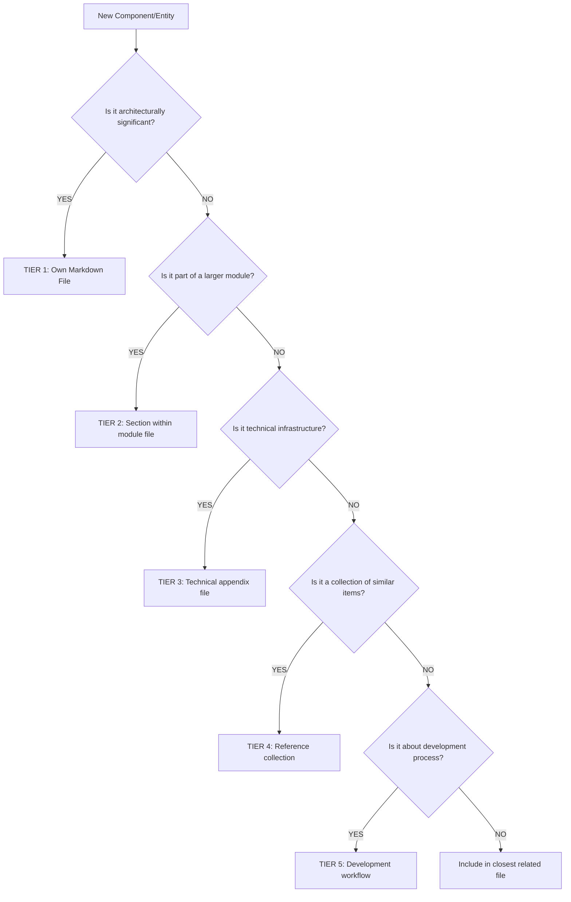

---
# ===== MODULE IDENTITY =====
title: "Project Architecture - Component Categorization Framework"
module_id: "project_architecture"
type: "documentation"
category: "documentation"

# ===== SYSTEMATIC SCAFFOLDING =====
lifecycle: "prod"
state: "complete"
seat: "mvp"

# ===== AVAILABILITY AND ACCESS =====
phase_availability: "always"
priority: "critical"
agent_accessible: false
user_configurable: true

# ===== PROMOTION GATES =====
promotion_gates:
  to_intermediate_i1:
    - "Core functionality implemented and tested"
    - "Basic security requirements met"
    - "Documentation complete"
  to_intermediate_i2:
    - "Reliability and UX improvements complete"
    - "Performance benchmarks met"
    - "Advanced features implemented"
  to_intermediate_i3:
    - "Integration breadth achieved"
    - "Advanced capabilities operational"
    - "Comprehensive testing completed"
  to_complete:
    - "Production deployment validated"
    - "All features fully operational"
    - "Performance SLA met"

# ===== OBSERVABILITY =====
observability:
  metrics:
    - "project_architecture.operation.success_rate"
    - "project_architecture.performance.response_time_ms"
  alerts:
    - "project_architecture.error_rate_high"
    - "project_architecture.performance_degraded"
  dashboards:
    - "project_architecture_health"
    - "project_architecture_performance"

# ===== SECURITY REQUIREMENTS =====
security:
  authentication_required: false
  authorization_level: "public"
  data_classification: "public"
  encryption_at_rest: false
  encryption_in_transit: true
  audit_logging: false
  rate_limiting: false
  input_validation: "basic"

# ===== TECHNICAL METADATA =====
dependencies: []
integrations: []
api_contracts: []
last_updated: "2025-09-28"
version: "1.0.0"
maintainer: "Orchestra.blue Team"

# ===== AGENTIC INTEGRATION =====
agent_capabilities:
  can_read: true
  can_write: false
  can_propose_changes: false
  requires_approval: false

agent_boundaries:
  allowed_operations: ["basic_operations"]
  forbidden_operations: ["unauthorized_access", "security_bypass"]
  escalation_triggers: ["security_violation", "performance_degradation"]
---


# 📁 PROJECT ARCHITECTURE - COMPONENT CATEGORIZATION FRAMEWORK
**Complete Guide for Organizing Orchestra.blue Components**

## Purpose
This document provides **clear rules and examples** for categorizing ALL components in the Orchestra.blue project. Every agent working on this project should refer to this guide to understand:

## State Progression Scaffolding

### Current State: complete

### Minimal State
**Definition:** Basic categorization framework
**Requirements:**
- [x] Basic tier structure defined
- [x] Decision tree created
- [x] Core categorization rules established
- [x] Agent guidelines framework

### Intermediate I1 State
**Definition:** Comprehensive categorization system
**Requirements:**
- [x] All minimal requirements completed
- [x] Categorization framework defined
- [x] Decision tree documented
- [x] Basic tier structure established
- [x] Examples provided

### Intermediate I2 State
**Definition:** Advanced organization patterns
**Requirements:**
- [x] All I1 requirements completed
- [x] Complete categorization rules documented
- [x] Agent guidelines established
- [x] Examples and templates provided
- [x] Cross-reference system documented

### Intermediate I3 State
**Definition:** Production-ready architecture guide
**Requirements:**
- [x] All I2 requirements completed
- [x] Advanced organization patterns documented
- [x] Cross-reference system active
- [x] Maintenance procedures established
- [x] Comprehensive testing completed

### Complete State
**Definition:** Fully operational architecture framework
**Requirements:**
- [x] All I3 requirements completed
- [x] Architecture guide fully operational
- [x] All patterns documented
- [x] Agent adoption complete
- [x] Framework consistency achieved

## **PURPOSE OF THIS DOCUMENT**

This document provides clear rules and examples for categorizing ALL components in the Orchestra.blue project. Every agent working on this project should refer to this guide to understand:

1. **What gets its own markdown file** (architectural significance)
2. **What gets grouped into sections** (supporting components)
3. **Where to place technical details** (configuration, utilities, etc.)
4. **How to maintain consistency** across the entire project

---

## **CATEGORIZATION DECISION TREE**



---

## **TIER 1: MARKDOWN FILES (Architectural Components)**

### **Criteria for Own Markdown File:**

1. **🏗️ ARCHITECTURAL SIGNIFICANCE**
   - Has independent functionality describable in isolation
   - Has defined inputs/outputs/contracts
   - Can be developed by a specialized agent
   - Has its own success criteria and testing requirements

2. **👤 USER-FACING PRESENCE**
   - Appears in Grid View or Chip View as distinct component
   - Has its own UI interface or visual representation
   - Users can interact with it directly
   - Has configurable behavior or settings

3. **🔧 DEVELOPMENT MODULARITY**
   - Can be built/tested/deployed independently
   - Has its own development lifecycle
   - Requires specialized knowledge or expertise
   - Can be assigned to specific agent or team

4. **📊 DATA CONTRACTS**
   - Consumes or produces specific data types
   - Participates in Event Bus (Pub/Sub)
   - Creates or modifies Change-Sets
   - Has observability/monitoring requirements

### **Examples of Components That GET Own Markdown File:**
✅ **Dashboard Indicators** - Primary KPIs with drill-down functionality
✅ **Agent Console** - Complete control center for financial agents
✅ **Data Pool** - Omnipresent structural module (poker table)
✅ **Revenue Summary** - Income tracking with AI explanations
✅ **Tax Engine** - Brazilian compliance calculations
✅ **Marketplace Engine** - Economic transaction processing

---

## **TIER 2: SPECIFICATION SECTIONS (Within Markdown Files)**

### **Criteria for Section Within Larger File:**
- Important but contained within larger architectural component
- Provides supporting functionality to main module
- Cannot function independently outside parent module

### **Standard Sections Within Module Files:**
```yaml
module_structure:
  ## Purpose
  ## Contracts (Input/Output)
  ## UI Specification
  ## Sub-Components          # ← Buttons, inputs, modals
  ## Utilities               # ← Formatters, validators, helpers
  ## State Management        # ← Loading, error, interaction states
  ## Integration Points
  ## Success Criteria
  ## Agent Integration
```

### **Examples of Components That Become SECTIONS:**
✅ **Agent Status Button** → Section in `21_AGENT_CONSOLE.md`
✅ **Currency Formatter** → Section in parent module using it
✅ **Loading Spinner** → Section in `## State Management`
✅ **Upload Modal** → Section in `01_HEADER_COMPONENT.md`
✅ **Approval Button** → Section in `22_APPROVAL_TRAY.md`

---

## **TIER 3: TECHNICAL APPENDICES (Dedicated Support Files)**

### **Criteria for Technical Appendix:**
- Technical infrastructure supporting multiple modules
- Configuration or contract definitions
- Build/deployment specifications
- Not user-facing but architecturally important

### **Technical Appendix Files:**
```yaml
configuration_management:
  file: "90_PACKAGE_CONFIGURATION.md"
  contents: [package.json, tsconfig.json, tailwind.config.ts, next.config.js]

build_system:
  file: "91_BUILD_SYSTEM.md"
  contents: [webpack_config, build_artifacts, deployment_pipeline, env_variables]

api_contracts:
  file: "93_API_CONTRACTS.md"
  contents: [endpoint_specs, request_response_schemas, error_patterns, rate_limits]

database_schemas:
  file: "94_DATABASE_SCHEMAS.md"
  contents: [table_structures, relationships, indexes, migrations]

event_contracts:
  file: "95_EVENT_CONTRACTS.md"
  contents: [pubsub_topics, payload_schemas, subscription_patterns]
```

### **Examples of Technical Infrastructure:**
✅ **FastAPI Endpoints** → `93_API_CONTRACTS.md`
✅ **PostgreSQL Tables** → `94_DATABASE_SCHEMAS.md`
✅ **TypeScript Config** → `90_PACKAGE_CONFIGURATION.md`
✅ **Docker Compose** → `91_BUILD_SYSTEM.md`
✅ **Event Bus Topics** → `95_EVENT_CONTRACTS.md`

---

## **TIER 4: REFERENCE COLLECTIONS (Centralized Libraries)**

### **Criteria for Reference Collection:**
- Collection of similar items used across multiple modules
- Shared resources that need centralized maintenance
- Standards and guidelines applied system-wide

### **Reference Collection Files:**
```yaml
design_system:
  file: "80_DESIGN_SYSTEM_REFERENCE.md"
  contents: [oklch_palette, typography_scale, spacing_system, animation_timing, icon_library]

utility_registry:
  file: "81_UTILITY_FUNCTION_REGISTRY.md"
  contents: [currency_formatters, date_formatters, validation_functions, calculations]

component_library:
  file: "82_COMPONENT_LIBRARY.md"
  contents: [button_variants, input_types, modal_patterns, loading_styles, error_templates]

brazilian_compliance:
  file: "83_BRAZILIAN_STANDARDS.md"
  contents: [tax_rates, banking_codes, cpf_cnpj_validation, address_formats]
```

### **Examples of Reference Collections:**
✅ **OKLCH Color Tokens** → `80_DESIGN_SYSTEM_REFERENCE.md`
✅ **BRL Currency Formatter** → `81_UTILITY_FUNCTION_REGISTRY.md`
✅ **Button Variants** → `82_COMPONENT_LIBRARY.md`
✅ **Brazilian Tax Rates** → `83_BRAZILIAN_STANDARDS.md`

---

## **TIER 5: DEVELOPMENT WORKFLOWS (Process Documentation)**

### **Criteria for Workflow Documentation:**
- Describes HOW we build, not WHAT we build
- Process guidance for agents and developers
- Quality gates and procedures

### **Workflow Files:**
```yaml
development_process:
  file: "85_DEVELOPMENT_WORKFLOW.md"
  contents: [phase_progression, agent_assignment, quality_gates, testing_requirements]

agent_guide:
  file: "86_AGENT_DEVELOPMENT_GUIDE.md"
  contents: [specification_usage, contract_enforcement, integration_patterns, deployment]

obsidian_usage:
  file: "87_OBSIDIAN_CANVAS_USAGE.md"
  contents: [canvas_visualization, module_mapping, progress_tracking, relationship_diagrams]
```

---

## **COMPLETE OBSIDIAN-FINOPS FOLDER STRUCTURE**

```
obsidian-orchestra/
├── PROJECT_ARCHITECTURE.md                    # This guide
├── COMPLETE_FINANCIAL_INTELLIGENCE_PLATFORM_SPECIFICATION.md

├── 00-09_STRUCTURAL/
│   ├── 00_MAIN_PAGE.md                        # Single page app shell
│   ├── 01_HEADER_COMPONENT.md                 # Nav, search, theme, upload
│   ├── 02_SIDEBAR_COMPONENT.md                # Module nav, agent panel
│   ├── 03_FOOTER_COMPONENT.md                 # Status, seats display
│   ├── 04_GRID_VIEW_CANVAS.md                 # Living widgets, responsive
│   ├── 05_CHIP_VIEW_CANVAS.md                 # Electronic board, fixed
│   └── 06_MARKETPLACE_PAGE.md                 # Secondary page, economy

├── 10-19_PRIMITIVE/
│   ├── 10_DATA_POOL.md                        # Omnipresent poker table
│   ├── 11_AI_LAYER.md                         # Onboarding & orchestration
│   ├── 12_AGENT_LAYER.md                      # Economic actors & runtime
│   ├── 13_USER_IDENTITY.md                    # Auth & entity scoping
│   ├── 14_NERVOUS_SYSTEM.md                   # Event bus & Change-Set ledger
│   └── 15_SECURITY_FABRIC.md                  # Compliance & protection

├── 20-29_FIRST_DEGREE/
│   ├── 20_DASHBOARD_INDICATORS.md             # Primary KPIs
│   ├── 21_AGENT_CONSOLE.md                    # Agent control center
│   └── 22_APPROVAL_TRAY.md                    # Change-Set approvals

├── 30-39_DEFAULT/
│   ├── 30_REVENUE_SUMMARY.md                  # Income tracking
│   ├── 31_EXPENSE_ANALYSIS.md                 # Spending categorization
│   ├── 32_BANK_ACCOUNTS.md                    # Account management
│   └── 33_TRANSACTION_VIEWER.md               # Real-time feed

├── 40-49_ADVANCED/
│   ├── 40_CALENDAR_HEATMAP.md                 # Spending visualization
│   ├── 41_FORECAST_ENGINE.md                  # Financial projections
│   ├── 42_BUDGET_VIEWER.md                    # Budget tracking
│   ├── 43_CHART_VIEWER.md                     # Data visualization
│   ├── 44_DATABASE_VIEWER.md                  # Raw data access
│   ├── 45_CATEGORY_MANAGER.md                 # Categorization rules
│   └── 46_DATA_POOL_VISUALIZER.md             # Direct pool manipulation

├── 50-59_BACKEND/
│   ├── 50_DATA_POOL_ENGINE.md                 # Central data management
│   ├── 51_AGENT_RUNTIME.md                    # Agent execution environment
│   ├── 52_MARKETPLACE_ENGINE.md               # Economic transactions
│   ├── 53_INTELLIGENCE_LAYER.md               # AI insights & automation
│   ├── 54_TAX_ENGINE.md                       # Brazilian compliance
│   ├── 55_BANKING_INTEGRATION.md              # Open Finance Brasil
│   └── 56_OCR_SERVICE.md                      # Document processing

├── 60-69_AGENTIC/
│   ├── 60_AGENT_BUILDER.md                    # Agent creation interface
│   ├── 61_WALLET_MANAGEMENT.md                # Crypto/fiat integration
│   ├── 62_EXTERNAL_ADAPTERS.md                # Web/API connectors
│   ├── 63_POLICY_ENFORCEMENT.md               # Spending caps & approvals
│   └── 64_MARKETPLACE_CATALOG.md              # Agent/workflow marketplace

├── 70-79_FOUNDATION/
│   ├── 70_OKLCH_DESIGN_SYSTEM.md              # Color tokens & theming
│   ├── 71_EVENT_BUS_CONTRACTS.md              # Pub/Sub specifications
│   ├── 72_CHANGESET_SYSTEM.md                 # Audit trail & approvals
│   ├── 73_BRAZILIAN_COMPLIANCE.md             # Tax & regulatory
│   └── 74_PERFORMANCE_MONITORING.md           # Observability

├── 80-89_REFERENCE/
│   ├── 80_DESIGN_SYSTEM_REFERENCE.md          # OKLCH palette, typography
│   ├── 81_UTILITY_FUNCTION_REGISTRY.md        # Shared functions
│   ├── 82_COMPONENT_LIBRARY.md                # Button variants, inputs
│   └── 83_BRAZILIAN_STANDARDS.md              # Tax rates, banking codes

├── 90-99_TECHNICAL/
│   ├── 90_PACKAGE_CONFIGURATION.md            # package.json, tsconfig
│   ├── 91_BUILD_SYSTEM.md                     # Webpack, deployment
│   ├── 92_DEVELOPMENT_TOOLING.md              # ESLint, testing
│   ├── 93_API_CONTRACTS.md                    # Endpoint specifications
│   ├── 94_DATABASE_SCHEMAS.md                 # Table structures
│   └── 95_EVENT_CONTRACTS.md                  # Pub/Sub definitions

└── 85-87_WORKFLOWS/
    ├── 85_DEVELOPMENT_WORKFLOW.md              # Phase progression
    ├── 86_AGENT_DEVELOPMENT_GUIDE.md           # How agents use specs
    └── 87_OBSIDIAN_CANVAS_USAGE.md             # Canvas visualization
```

---

## **COMPONENT CATEGORIZATION RULES**

### **RULE 1: ARCHITECTURAL SIGNIFICANCE TEST**
**Question:** "Can this component be described independently with its own contracts, success criteria, and development lifecycle?"

**✅ Gets Own Markdown File:**
- Dashboard Indicators (complete KPI system)
- Agent Console (full control center)
- Data Pool (omnipresent structural module)
- Revenue Summary (income tracking system)

**❌ Becomes Section:**
- Status button (part of Agent Console)
- Currency formatter (utility within module)
- Loading spinner (state within module)

### **RULE 2: USER INTERACTION TEST**
**Question:** "Do users interact with this as a distinct, recognizable interface element?"

**✅ Gets Own Markdown File:**
- Budget Viewer (complete budget interface)
- Chart Viewer (visualization system)
- Marketplace Page (full economic interface)

**❌ Becomes Section:**
- Approve button (part of Approval Tray)
- Search input (part of Header)
- Theme toggle (part of Header)

### **RULE 3: DEVELOPMENT INDEPENDENCE TEST**
**Question:** "Can a specialized agent work on this component without deep knowledge of other components?"

**✅ Gets Own Markdown File:**
- Tax Engine (specialized Brazilian compliance)
- OCR Service (document processing system)
- Wallet Management (crypto/fiat integration)

**❌ Becomes Section:**
- Error handling (integrated into each module)
- Validation functions (utilities within modules)

### **RULE 4: DATA CONTRACT TEST**
**Question:** "Does this component have its own data contracts and participate independently in the Event Bus?"

**✅ Gets Own Markdown File:**
- Banking Integration (Open Finance data contracts)
- Forecast Engine (projection data contracts)
- Marketplace Engine (economic transaction contracts)

**❌ Becomes Section:**
- Display formatters (no data contracts)
- UI state (local to component)

---

## **TIER SPECIFICATIONS WITH EXAMPLES**

### **TIER 1: ARCHITECTURAL COMPONENTS (Own Files)**

#### **Example: Agent Console Module**
```yaml
file: "21_AGENT_CONSOLE.md"
why_own_file:
  - complete_agent_control_interface
  - independent_data_contracts
  - specialized_agent_development_required
  - distinct_user_interaction_paradigm

contracts:
  input: [FinancialAgent[], AgentAction[], AgentWallet[]]
  output: [agent_commands, approval_requests]
  events: [agent.status_changed, agent.action_proposed]

development:
  assignable_to: agent_specialist
  testing: independent_test_suite
  deployment: can_be_updated_independently
```

#### **Example: Header Component**
```yaml
file: "01_HEADER_COMPONENT.md"
why_own_file:
  - fixed_structural_element
  - contains_multiple_distinct_features
  - affects_entire_app_navigation
  - requires_responsive_design_expertise

sub_components:
  - navigation_menu
  - search_input
  - theme_toggle
  - upload_button
  - agent_status_indicator
```

### **TIER 2: SECTIONS (Within Parent Files)**

#### **Example: Theme Toggle in Header**
```yaml
parent_file: "01_HEADER_COMPONENT.md"
section: "## Sub-Components → Theme Toggle"
why_not_own_file:
  - integral_part_of_header_functionality
  - cannot_exist_independently
  - shares_header_responsive_behavior
  - no_independent_data_contracts

specification_within_header:
  purpose: "OKLCH theme switching (Auto/Light/Dark)"
  behavior: "localStorage persistence, smooth transitions"
  integration: "Uses design system tokens"
```

#### **Example: Agent Status Button**
```yaml
parent_file: "21_AGENT_CONSOLE.md"
section: "## Sub-Components → Status Display"
why_not_own_file:
  - part_of_larger_agent_interface
  - data_comes_from_agent_console_contracts
  - no_independent_functionality
  - visual_element_only

specification_within_console:
  purpose: "Visual agent status indicator"
  states: [idle, monitoring, executing, awaiting_approval]
  behavior: "Real-time status updates with color coding"
```

### **TIER 3: TECHNICAL APPENDICES**

#### **Example: API Contracts**
```yaml
file: "93_API_CONTRACTS.md"
why_technical_appendix:
  - supports_multiple_modules
  - technical_infrastructure
  - contract_definitions
  - not_user_facing_but_critical

contents:
  transaction_endpoints:
    - "GET /api/transactions"
    - "POST /api/transactions"
    - "PUT /api/transactions/{id}"

  agent_endpoints:
    - "POST /api/agents/action"
    - "GET /api/agents/status"

  marketplace_endpoints:
    - "GET /api/marketplace/catalog"
    - "POST /api/marketplace/purchase"
```

### **TIER 4: REFERENCE COLLECTIONS**

#### **Example: Utility Function Registry**
```yaml
file: "81_UTILITY_FUNCTION_REGISTRY.md"
why_reference_collection:
  - collection_of_similar_items
  - used_across_multiple_modules
  - needs_centralized_maintenance
  - shared_standards

organized_by_category:
  currency_formatting:
    - formatBRL(amount): "R$ 1.234,56"
    - formatUSD(amount): "$1,234.56"
    - parseAmount(text): number

  date_formatting:
    - formatBrazilianDate(date): "27/09/2025"
    - parseDate(text): Date
    - calculateBusinessDays(start, end): number

  validation:
    - validateCPF(cpf): boolean
    - validateCNPJ(cnpj): boolean
    - validateAmount(amount): boolean
```

### **TIER 5: DEVELOPMENT WORKFLOWS**

#### **Example: Agent Development Guide**
```yaml
file: "86_AGENT_DEVELOPMENT_GUIDE.md"
why_workflow_documentation:
  - describes_how_we_build
  - process_guidance_for_agents
  - quality_gates_and_procedures
  - not_what_we_build_but_how

contents:
  agent_assignment_process:
    - how_to_claim_module_development
    - specification_interpretation_guide
    - contract_enforcement_requirements
    - integration_testing_patterns

  development_lifecycle:
    - specification_review_phase
    - implementation_phase
    - testing_and_validation_phase
    - deployment_and_monitoring_phase
```

---

## **BORDERLINE CASE RESOLUTION EXAMPLES**

### **Case 1: Explanation Panel**
```yaml
component: explanation_panel
decision: "Part of 11_AI_LAYER.md"
reasoning:
  - ai_generated_content
  - shared_across_multiple_modules
  - owned_by_ai_layer_architecturally
  - provides_ai_explanation_functionality

placement: "## Sub-Components → Explanation Panel"
```

### **Case 2: Upload Modal**
```yaml
component: upload_modal
decision: "Part of 01_HEADER_COMPONENT.md"
reasoning:
  - triggered_by_header_upload_button
  - integral_to_header_functionality
  - cannot_exist_without_header_context
  - shares_header_responsive_behavior

placement: "## Sub-Components → Upload Modal"
```

### **Case 3: Change-Set Builder**
```yaml
component: changeset_builder
decision: "Part of 72_CHANGESET_SYSTEM.md"
reasoning:
  - core_utility_for_changeset_creation
  - technical_infrastructure
  - not_user_facing_directly
  - supports_multiple_modules

placement: "## Implementation → Builder Pattern"
```

---

## **AGENT DEVELOPMENT GUIDELINES**

### **For New Agents Joining the Project:**

#### **Step 1: Understand the Architecture**
1. Read `PROJECT_ARCHITECTURE.md` (this file)
2. Review `COMPLETE_FINANCIAL_INTELLIGENCE_PLATFORM_SPECIFICATION.md`
3. Understand the 6 primitive substrate modules
4. Learn the Grid/Chip view philosophy

#### **Step 2: Categorize Your Component**
1. Apply the decision tree to your assigned component
2. Determine the appropriate tier (1-5)
3. Check existing examples for similar components
4. Validate placement with project architecture

#### **Step 3: Create/Update Documentation**
1. Use the appropriate template for your tier
2. Include all required sections (contracts, success criteria, etc.)
3. Link to related modules and dependencies
4. Add YAML frontmatter for Obsidian organization

#### **Step 4: Validate Integration**
1. Ensure component respects modular DNA
2. Verify Event Bus and Change-Set integration
3. Check agent integration points
4. Validate security and compliance requirements

---

## **CONSISTENCY ENFORCEMENT**

### **Mandatory Elements for ALL Markdown Files:**
```yaml
required_yaml_frontmatter:
  - title: "Human readable name"
  - module_id: "unique_identifier"
  - type: "frontend|backend|structural|agentic|technical|reference"
  - phase_availability: "always|post_onboarding|unlockable|expert"
  - last_updated: "YYYY-MM-DD"

required_sections:
  - "## Purpose" (why this exists)
  - "## Contracts" (inputs/outputs if applicable)
  - "## Integration Points" (how it connects to other modules)
  - "## Success Criteria" (how to validate it works)
```

### **Quality Gates:**
- Every component must fit into exactly one tier
- No orphaned functionality without proper categorization
- All contracts must be documented
- Integration points must be explicit

---

## **EXAMPLES OF PROPER CATEGORIZATION**

### **✅ CORRECT CATEGORIZATION:**

**Dashboard Indicators Module:**
- **Tier:** 1 (Own markdown file)
- **File:** `20_DASHBOARD_INDICATORS.md`
- **Reason:** Complete KPI system with independent contracts and UI

**Currency Formatter Function:**
- **Tier:** 4 (Reference collection)
- **File:** `81_UTILITY_FUNCTION_REGISTRY.md`
- **Section:** Currency Formatting
- **Reason:** Shared utility used across multiple modules

**API Endpoint Definitions:**
- **Tier:** 3 (Technical appendix)
- **File:** `93_API_CONTRACTS.md`
- **Reason:** Technical infrastructure supporting multiple modules

### **❌ INCORRECT CATEGORIZATION:**

**Don't create separate files for:**
- Individual buttons (part of parent module)
- Utility functions (go in registry)
- Configuration values (go in technical appendix)
- Temporary UI states (go in module state management section)

---

## **MAINTENANCE AND EVOLUTION**

### **Adding New Components:**
1. Apply decision tree criteria
2. Check for similar existing components
3. Validate tier assignment
4. Create/update appropriate documentation
5. Update this architecture guide if new patterns emerge

### **Refactoring Components:**
1. Re-evaluate tier assignment
2. Check if component has grown to need promotion (section → own file)
3. Update all references and dependencies
4. Maintain backward compatibility in contracts

---

## **🚀 PRODUCTION IMPLEMENTATION (ChatGPT-5 Excellence)**

### **🔧 Documentation Framework Implementation**
```typescript
export interface ArchitectureDocumentationImplementation {
  initialize(): Promise<void>
  validate(): Promise<ValidationResult>
  generate(): Promise<DocumentationResult>
  maintain(): Promise<MaintenanceResult>
}

export class ProductionProjectArchitecture implements ArchitectureDocumentationImplementation {
  async initialize() {
    await this.validateArchitecturalFramework()
    await this.setupComponentCategorization()
    await this.initializeConsistencyEnforcement()
  }

  async validate(): Promise<ValidationResult> {
    return {
      architecturalAccuracy: await this.validateArchitecture(),
      componentCategorization: await this.validateCategorization(),
      consistencyEnforcement: await this.validateConsistency()
    }
  }
}
```

### **🔒 Documentation Security**
- Architectural framework validation and protection
- Component categorization integrity verification
- Consistency enforcement security controls

### **📊 Documentation Monitoring**
- Architecture framework accuracy tracking
- Component categorization validation
- Consistency enforcement monitoring

**This framework ensures every component in the Orchestra.blue has a proper place in our Obsidian-based specification system while maintaining clarity, consistency, and agent-friendly development workflows.**
## Promotion Gates
- **Minimal→I1:** Core functionality working, documentation complete
- **I1→I2:** Reliability improvements, performance baseline
- **I2→I3:** Advanced features, monitoring operational
- **I3→Complete:** Production deployment, all features operational

---

## Related Modules

### **Dependencies:**
- **Foundational:** ALL technical modules implement this architecture
- **Strategic:** [[ULTIMATE_IMPLEMENTATION_ROADMAP]], [[SECURITY_TESTING_STRATEGY]]

### **Guides Implementation For:**
- **Core Infrastructure:** [[10_DATA_POOL]], [[14_NERVOUS_SYSTEM]], [[15_SECURITY_FABRIC]]
- **Orchestration:** [[0.3_ORCHESTRATOR_MAESTRO]], [[0.2_MODULE_AGENTS_TRIFACE]]
- **All Module Categories:** UI, AI, Financial, Analytics, External, Design

### **Implementation Coordination:**
- **Orchestrated By:** Development methodology and architectural principles
- **Coordinates With:** [[ULTIMATE_IMPLEMENTATION_ROADMAP]], [[MONOREPO_ARCHITECTURE]]

### **Development Journey:**
- **Previous Step:** Strategic planning and system design
- **Next Step:** [[ULTIMATE_IMPLEMENTATION_ROADMAP]] (execution planning)

### **Implementation Order:**
- **Build After:** System requirements gathering
- **Build Before:** ANY module development begins

## See Also
- **Strategy:** [[ULTIMATE_IMPLEMENTATION_ROADMAP]], [[MONOREPO_ARCHITECTURE]]
- **Security:** [[POLICY_AS_CODE]], [[SECURITY_TESTING_STRATEGY]]
- **Implementation:** ALL module specifications

---